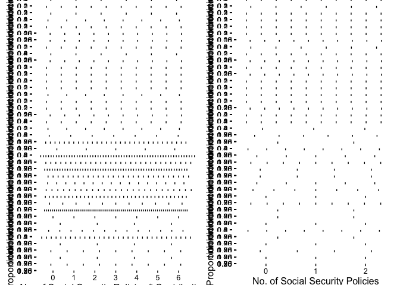

# CapstoneProject
Vivek Appadurai  
February 20, 2016  

Loaing Libraries


```r
library(dplyr)
```

```
## 
## Attaching package: 'dplyr'
```

```
## The following objects are masked from 'package:stats':
## 
##     filter, lag
```

```
## The following objects are masked from 'package:base':
## 
##     intersect, setdiff, setequal, union
```

```r
library(ggplot2)
library(reshape2)
```

Reading Data


```r
variableInfo <- read.table("Names.txt", 
                           header = T, 
                           sep = "\t", 
                           fill = NA, 
                           quote = "",
                           stringsAsFactors = FALSE)
L0 <- read.table("L0.txt", header = T, sep = "\t", fill = NA, quote = "")
L1 <- read.table("L1.txt", header = F, sep = "\t", fill = NA, quote = "")
L2 <- read.table("L2.txt", header = F, sep = "\t", fill = NA, quote = "")
L3 <- read.table("L3.txt", header = F, sep = "\t", fill = NA, quote = "")
L4 <- read.table("L4.txt", header = F, sep = "\t", fill = NA, quote = "")
ticDataTraining <- read.table("ticdata2000.txt", 
                              header = F, 
                              sep = "\t", 
                              fill = NA, 
                              quote = "", 
                              stringsAsFactors = FALSE)
ticDataTest <- read.table("ticeval2000.txt", 
                          header = F, 
                          sep = "\t", 
                          fill = NA, 
                          quote = "",
                          stringsAsFactors = FALSE)
```


```r
colNames <- variableInfo %>% select(Name) %>% unlist()
names(ticDataTraining) <- colNames
names(ticDataTest) <- colNames[1:85]
ticDataTest$CARAVAN <- NA
ticData <- rbind(ticDataTraining, ticDataTest)
ticData <- left_join(ticData, L0, by = c("MOSTYPE"= "Value"))
ticData <- ticData %>% rename(MOSTYPE2 = Label)
names(L1) <- c("MGEMLEEF", "MGEMLEEF2")
names(L2) <- c("MOSHOOFD","MOSHOOFD2")
names(L3) <- c("MGODRK", "MGODRK2")
names(L4) <- c("PWAPART", "PWAPART2")
ticData <- left_join(ticData, L1)
```

```
## Joining by: "MGEMLEEF"
```

```r
ticData <- left_join(ticData, L2)
```

```
## Joining by: "MOSHOOFD"
```

```r
ticData <- left_join(ticData, L3)
```

```
## Joining by: "MGODRK"
```

```r
ticData <- left_join(ticData, L4)
```

```
## Joining by: "PWAPART"
```


```r
ggplot(ticData, aes(x = MAANTHUI, y = CARAVAN)) + geom_point()
```

```
## Warning: Removed 4000 rows containing missing values (geom_point).
```


