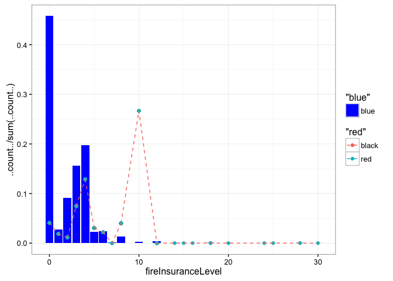
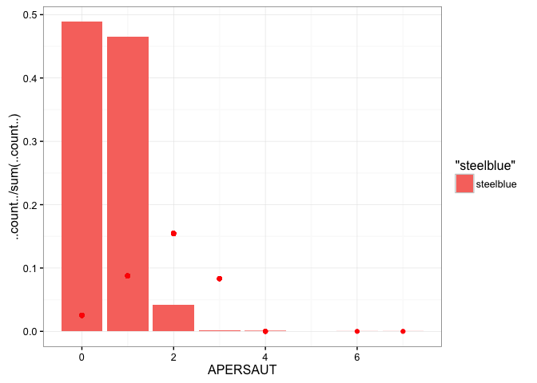
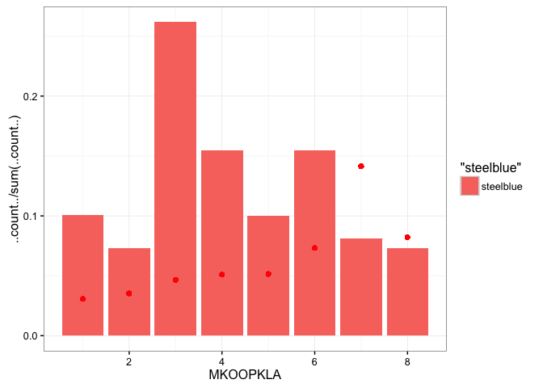

# CapstoneProject
Vivek Appadurai  
February 20, 2016  

## Loading Libraries


```r
library(dplyr)
library(ggplot2)
library(scales)
library(reshape2)
library(knitr)
```

## Reading Data


```r
variableInfo <- read.table("Names.txt", 
                           header = T, 
                           sep = "\t", 
                           fill = NA, 
                           quote = "",
                           stringsAsFactors = FALSE)
L0 <- read.table("L0.txt", header = T, sep = "\t", fill = NA, quote = "")
L1 <- read.table("L1.txt", header = F, sep = "\t", fill = NA, quote = "")
L2 <- read.table("L2.txt", header = F, sep = "\t", fill = NA, quote = "")
L3 <- read.table("L3.txt", header = F, sep = "\t", fill = NA, quote = "")
L4 <- read.table("L4.txt", header = F, sep = "\t", fill = NA, quote = "")
ticDataTraining <- read.table("ticdata2000.txt", 
                              header = F, 
                              sep = "\t", 
                              fill = NA, 
                              quote = "", 
                              stringsAsFactors = FALSE)
ticDataTest <- read.table("ticeval2000.txt", 
                          header = F, 
                          sep = "\t", 
                          fill = NA, 
                          quote = "",
                          stringsAsFactors = FALSE)
```

## Data Cleaning


```r
colNames <- variableInfo %>% select(Name) %>% unlist()
names(ticDataTraining) <- colNames
names(ticDataTest) <- colNames[1:85]
ticDataTest$CARAVAN <- NA
ticData <- rbind(ticDataTraining, ticDataTest)
ticData <- left_join(ticData, L0, by = c("MOSTYPE"= "Value"))
ticData <- ticData %>% rename(MOSTYPE2 = Label)
names(L2) <- c("MOSHOOFD","MOSHOOFD2")
ticData <- left_join(ticData, L2)
```

```
## Joining by: "MOSHOOFD"
```

```r
ticData <- ticData %>% mutate(thirdPartyInsuranceLevel = AWAPART * PWAPART)
ticData <- ticData %>% mutate(thirdPartyInsuranceLevelFirm = AWABEDR * PWABEDR)
ticData <- ticData %>% mutate(thirdPartyInsuranceLevelAgriculture = AWALAND * PWALAND)
ticData <- ticData %>% mutate(carPolicyLevel = APERSAUT * PPERSAUT)
ticData <- ticData %>% mutate(vanPolicyLevel = ABESAUT * PBESAUT)
ticData <- ticData %>% mutate(scooterPolicyLevel = AMOTSCO * PMOTSCO)
ticData <- ticData %>% mutate(lorryPolicyLevel = AVRAAUT * PVRAAUT)
ticData <- ticData %>% mutate(trailerPolicyLevel = AAANHANG * PAANHANG)
ticData <- ticData %>% mutate(tractorPolicyLevel = ATRACTOR * PTRACTOR)
ticData <- ticData %>% mutate(agriMachinePolicyLevel = AWERKT * PWERKT)
ticData <- ticData %>% mutate(mopedPolicyLevel = ABROM * PBROM)
ticData <- ticData %>% mutate(lifeInsuranceLevel = ALEVEN * PLEVEN)
ticData <- ticData %>% mutate(pvtAccidentInsuranceLevel = APERSONG * PPERSONG)
ticData <- ticData %>% mutate(famAccidentInsuranceLevel = AGEZONG * PGEZONG)
ticData <- ticData %>% mutate(disabilityInsuranceLevel = AWAOREG * PWAOREG)
ticData <- ticData %>% mutate(fireInsuranceLevel = ABRAND * PBRAND)
ticData <- ticData %>% mutate(surfInsuranceLevel = AZEILPL * PZEILPL)
ticData <- ticData %>% mutate(boatInusaranceLevel = APLEZIER * PPLEZIER)
ticData <- ticData %>% mutate(bikeInsuranceLevel = AFIETS * PFIETS)
ticData <- ticData %>% mutate(propertyInsuranceLevel = AINBOED * PINBOED)
ticData <- ticData %>% mutate(SocSecInsurancelevel = ABYSTAND * PBYSTAND)

ticData <- ticData %>% 
    filter(!is.na(CARAVAN)) %>%
    group_by(fireInsuranceLevel) %>% 
    mutate(percent_caravan_fire = sum(CARAVAN)/n())

ticData <- ticData %>% 
    filter(!is.na(CARAVAN)) %>%
    group_by(APERSAUT) %>% 
    mutate(percent_caravan_car = sum(CARAVAN)/n())

ticData <- ticData %>% 
    filter(!is.na(CARAVAN)) %>%
    group_by(APERSAUT) %>% 
    mutate(percent_caravan_car = sum(CARAVAN)/n())

ticData <- ticData %>%
    filter(!is.na(CARAVAN)) %>%
    group_by(MKOOPKLA) %>%
    mutate(percent_caravan_power = sum(CARAVAN)/n())
```

## Exploratory Data Analysis


```r
#ggplot(ticData, aes(x = fireInsuranceLevel, y = percent_caravan_fire)) +
 #   geom_bar(stat = "identity") +
  #  geom_point() + 
   # geom_line() +
    #theme_bw() +
    #scale_x_continuous(breaks = seq(0, max(ticData$fireInsuranceLevel), 1))

#ggplot(ticData, aes(x = APERSAUT, y = percent_caravan_car)) +
 #   geom_bar(stat = "identity")
 #   geom_point() + 
  #  geom_line() +
   # theme_bw() +
   # scale_x_continuous(breaks = seq(0, max(ticData$APERSAUT), 1))
```


```r
ggplot(ticData, aes(x = fireInsuranceLevel, y = percent_caravan_fire)) +
    geom_point() +
    theme_bw()
```


```r
ggplot(ticData, aes(x = fireInsuranceLevel)) +
    geom_bar(aes(y = ..count../sum(..count..), fill = "blue")) +
    scale_fill_manual(values = c("blue")) +
    geom_point(aes(y = percent_caravan_fire, color = "red")) +
    geom_line(aes(y = percent_caravan_fire, color = "black"), linetype = 2) +
    theme_bw()
```



```r
ggplot(ticData, aes(x = APERSAUT)) +
    geom_bar(aes(y = ..count../sum(..count..), fill = "steelblue")) +
    geom_point(aes(y = percent_caravan_car), color = "red") +
    theme_bw()
```



```r
ggplot(ticData, aes(x = MKOOPKLA)) +
    geom_bar(aes(y = ..count../sum(..count..), fill = "steelblue")) +
    geom_point(aes(y = percent_caravan_power), color = "red") +
    theme_bw()
```


