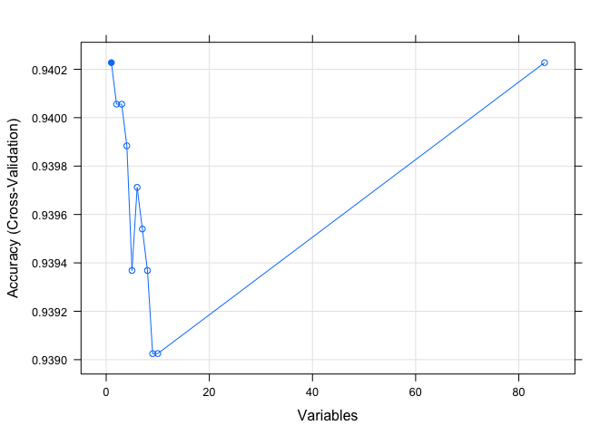

# CapstoneProject
Vivek Appadurai  
February 20, 2016  

## Loading Libraries


```r
library(dplyr)
library(ggplot2)
library(scales)
```

## Reading Data


```r
variableInfo <- read.table("Names.txt", 
                           header = T, 
                           sep = "\t", 
                           fill = NA, 
                           quote = "",
                           stringsAsFactors = FALSE)
L0 <- read.table("L0.txt", header = T, sep = "\t", fill = NA, quote = "")
L1 <- read.table("L1.txt", header = F, sep = "\t", fill = NA, quote = "")
L2 <- read.table("L2.txt", header = F, sep = "\t", fill = NA, quote = "")
L3 <- read.table("L3.txt", header = F, sep = "\t", fill = NA, quote = "")
L4 <- read.table("L4.txt", header = F, sep = "\t", fill = NA, quote = "")
ticDataTraining <- read.table("ticdata2000.txt", 
                              header = F, 
                              sep = "\t", 
                              fill = NA, 
                              quote = "", 
                              stringsAsFactors = FALSE)
ticDataTest <- read.table("ticeval2000.txt", 
                          header = F, 
                          sep = "\t", 
                          fill = NA, 
                          quote = "",
                          stringsAsFactors = FALSE)
```

## Data Cleaning


```r
colNames <- variableInfo %>% select(Name) %>% unlist()
names(ticDataTraining) <- colNames
names(ticDataTest) <- colNames[1:85]
ticDataTest$CARAVAN <- NA
ticData <- rbind(ticDataTraining, ticDataTest)
ticData <- left_join(ticData, L0, by = c("MOSTYPE"= "Value"))
ticData <- ticData %>% rename(MOSTYPE2 = Label)
names(L1) <- c("MGEMLEEF", "MGEMLEEF2")
names(L2) <- c("MOSHOOFD","MOSHOOFD2")
names(L3) <- c("MGODRK", "MGODRK2")
names(L4) <- c("PWAPART", "PWAPART2")
ticData <- left_join(ticData, L1)
```

```
## Joining by: "MGEMLEEF"
```

```r
ticData <- left_join(ticData, L2)
```

```
## Joining by: "MOSHOOFD"
```

```r
ticData <- left_join(ticData, L3)
```

```
## Joining by: "MGODRK"
```

```r
ticData <- left_join(ticData, L4)
```

```
## Joining by: "PWAPART"
```

```r
ticData$CARAVAN <- factor(ticData$CARAVAN)
```

## Exploratory Data Analysis

### Customer Subtype


```r
ggplot(ticData %>% filter(!is.na(CARAVAN)), aes(x = MOSTYPE2, fill = CARAVAN)) + 
    geom_bar(position = "fill") +
    xlab("Customer SubType") +
    ylab("Proportion") +
    theme_bw() + 
    coord_flip() +
    scale_y_continuous(labels = percent)
```


### Customer Maintype


```r
ggplot(ticData %>% filter(!is.na(CARAVAN)), aes(x = MOSHOOFD2, fill = CARAVAN)) + 
    geom_bar(position = "fill") +
    xlab("Customer MainType") +
    ylab("Proportion") +
    theme_bw() + 
    coord_flip() +
    scale_y_continuous(labels = percent)
```


### Percentage of Roman Catholics by ZipCode


```r
ggplot(ticData %>% filter(!is.na(CARAVAN)), aes(x = MGODRK2, fill = CARAVAN)) + 
    geom_bar(position = "fill") +
    xlab("Percentage Roman Catholics by ZipCode") +
    ylab("Proportion") +
    theme_bw() + 
    coord_flip() +
    scale_y_continuous(labels = percent) + 
    scale_x_discrete(labels = c("0%", "1-10%", "11-23%", "24-36%", "37-49%", "50-62%", "63-75%", "76-88%", "89-99%", "100%"))
```


### Contribution to Private Third Party Insurance


```r
ggplot(ticData %>% filter(!is.na(CARAVAN)), aes(x = PWAPART2, fill = CARAVAN)) + 
    geom_bar(position = "fill") +
    xlab("Private Third Party Insurance Contribution") +
    ylab("Proportion") +
    theme_bw() + 
    coord_flip() +
    scale_y_continuous(labels = percent) +
    scale_x_discrete(labels = c("0", "1-49", "50-99", "100-199", 
                                "200-499", "500-999", "1000-4999", 
                                "5000-9999", "10,000-19,999", ">20,000"))
```


### Average Age


```r
ggplot(ticData %>% filter(!is.na(CARAVAN)), aes(x = MGEMLEEF2, fill = CARAVAN)) + 
    geom_bar(position = "fill") +
    xlab("Average Age") +
    ylab("Proportion") +
    theme_bw() + 
    coord_flip() +
    scale_y_continuous(labels = percent)
```


### Purchasing Power Class


```r
ggplot(ticData %>% filter(!is.na(CARAVAN)), aes(x = CARAVAN, y = MKOOPKLA, fill = CARAVAN)) +
    geom_boxplot() +
    theme_bw() +
    xlab("CARAVAN") +
    ylab("Purchasing Power Class") +
    coord_flip()
```


### High Status


```r
ggplot(ticData %>% filter(!is.na(CARAVAN)), aes(x = CARAVAN, y = MBERHOOG, fill = CARAVAN)) +
    geom_boxplot() +
    theme_bw() +
    xlab("CARAVAN") +
    ylab("Number of High Status people") +
    coord_flip()
```


