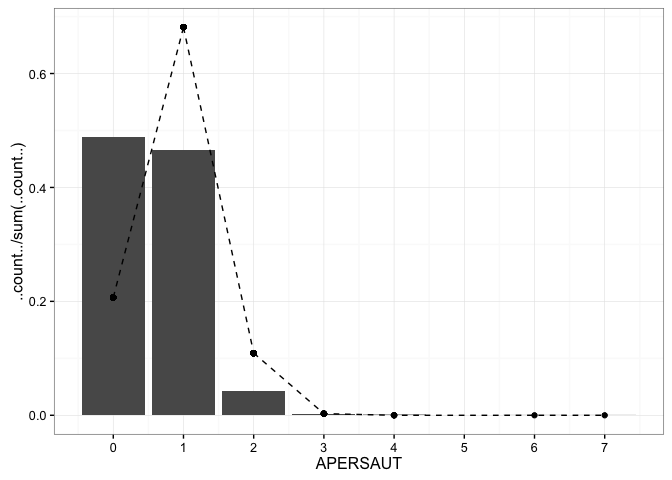

# CapstoneProject
Vivek Appadurai  
February 20, 2016  

## Loading Libraries


```r
library(dplyr)
library(ggplot2)
library(scales)
library(reshape2)
library(knitr)
```

## Reading Data


```r
variableInfo <- read.table("Names.txt", 
                           header = T, 
                           sep = "\t", 
                           fill = NA, 
                           quote = "",
                           stringsAsFactors = FALSE)
L0 <- read.table("L0.txt", header = T, sep = "\t", fill = NA, quote = "")
L1 <- read.table("L1.txt", header = F, sep = "\t", fill = NA, quote = "")
L2 <- read.table("L2.txt", header = F, sep = "\t", fill = NA, quote = "")
L3 <- read.table("L3.txt", header = F, sep = "\t", fill = NA, quote = "")
L4 <- read.table("L4.txt", header = F, sep = "\t", fill = NA, quote = "")
ticDataTraining <- read.table("ticdata2000.txt", 
                              header = F, 
                              sep = "\t", 
                              fill = NA, 
                              quote = "", 
                              stringsAsFactors = FALSE)
ticDataTest <- read.table("ticeval2000.txt", 
                          header = F, 
                          sep = "\t", 
                          fill = NA, 
                          quote = "",
                          stringsAsFactors = FALSE)
```

## Data Cleaning


```r
colNames <- variableInfo %>% select(Name) %>% unlist()
names(ticDataTraining) <- colNames
names(ticDataTest) <- colNames[1:85]
ticDataTest$CARAVAN <- NA
ticData <- rbind(ticDataTraining, ticDataTest)
ticData <- left_join(ticData, L0, by = c("MOSTYPE"= "Value"))
ticData <- ticData %>% rename(MOSTYPE2 = Label)
names(L1) <- c("MGEMLEEF", "MGEMLEEF2")
names(L2) <- c("MOSHOOFD","MOSHOOFD2")
names(L3) <- c("MGODRK", "MGODRK2")
names(L4) <- c("PWAPART", "PWAPART2")
ticData <- left_join(ticData, L1)
```

```
## Joining by: "MGEMLEEF"
```

```r
ticData <- left_join(ticData, L2)
```

```
## Joining by: "MOSHOOFD"
```

```r
ticData <- left_join(ticData, L3)
```

```
## Joining by: "MGODRK"
```

```r
ticData <- left_join(ticData, L4)
```

```
## Joining by: "PWAPART"
```

```r
ticData$CARAVAN <- factor(ticData$CARAVAN)

ticDataDerived <- ticData[,c(1:44,86:91)]

ticData <- ticData %>% 
    mutate(totalThirdPartyInsurancePolicies = AWAPART + AWABEDR + AWALAND)

ticData <- ticData %>% 
    mutate(totalThirdPartyInsuranceContributions = PWAPART + PWABEDR + PWALAND)

ticData <- ticData %>% 
    mutate(totalAutoPolicies = APERSAUT + ABESAUT + AMOTSCO + AVRAAUT + AAANHANG + ATRACTOR +  AWERKT + ABROM)

ticData <- ticData %>% 
    mutate(totalAutoPolicyContributions = PPERSAUT + PBESAUT + PMOTSCO + PVRAAUT + PAANHANG + PTRACTOR + PWERKT + PBROM)

ticData <- ticData %>% 
    mutate(totalPersonalInsurancePolicies = ALEVEN + APERSONG + AGEZONG + AWAOREG + ABRAND + AINBOED + ABYSTAND)

ticData <- ticData %>% 
    mutate(totalPersonalInsuranceContributions = PLEVEN + PPERSONG + PGEZONG + PWAOREG + PBRAND + PINBOED + PBYSTAND)

ticData <- ticData %>% 
    mutate(totalLeasurePolicies = AZEILPL + APLEZIER + AFIETS)

ticData <- ticData %>% 
    mutate(totalLeasurePolicyContributions = PZEILPL + PPLEZIER + PFIETS)

ticDataDerived <- ticData[,c(1:44, 86:99)]

ticDataDerived <- ticDataDerived %>% 
    melt(id.vars = c("MOSTYPE", "MOSTYPE2", "MGEMLEEF", "MGEMLEEF2", "MOSHOOFD", "MOSHOOFD2", "MGODRK", "MGODRK2", "PWAPART", "PWAPART2", "CARAVAN"))
```

## Exploratory Data Analysis

### Customer Subtype


```r
table(ticData %>% filter(!is.na(CARAVAN)) %>% select(MOSTYPE2))
```

```
## 
##              Affluentseniorapartments 
##                                    52 
##                 Affluentyoungfamilies 
##                                   111 
##                    Careerandchildcare 
##                                   119 
## Coupleswithteens'Marriedwithchildren' 
##                                   225 
##           Dinki's(doubleincomenokids) 
##                                    44 
##                      Etnicallydiverse 
##                                    25 
##                        Familystarters 
##                                   153 
##                 Freshmastersinthecity 
##                                     9 
##             HighIncome,expensivechild 
##                                   124 
##                     Highstatusseniors 
##                                   249 
##                    Juniorcosmopolitan 
##                                     0 
##             Largefamily,employedchild 
##                                   182 
##                      Largefamilyfarms 
##                                    71 
##                 Largereligousfamilies 
##                                   328 
##               Lowerclasslargefamilies 
##                                   810 
##                    Lowincomecatholics 
##                                   205 
##                   Middleclassfamilies 
##                                   339 
##                Mixedapartmentdwellers 
##                                    98 
##                           Mixedrurals 
##                                   205 
##                          Mixedseniors 
##                                   186 
##                Mixedsmalltowndwellers 
##                                   132 
##               Modern,completefamilies 
##                                   278 
##                        Ownhomeelderly 
##                                    48 
##          Porchlessseniors:nofrontyard 
##                                    86 
##               Religiouselderlysingles 
##                                   118 
##                    Residentialelderly 
##                                    25 
##                   Seniorcosmopolitans 
##                                     5 
##                   Seniorsinapartments 
##                                    50 
##                           Singleyouth 
##                                    19 
##                          Stablefamily 
##                                   165 
##                  Studentsinapartments 
##                                    16 
##                         Suburbanyouth 
##                                     3 
##                   Traditionalfamilies 
##                                   339 
##              VeryImportantProvincials 
##                                    82 
##                       Villagefamilies 
##                                   214 
##                     Young,loweducated 
##                                   180 
##                Youngallamericanfamily 
##                                   179 
##                        Youngandrising 
##                                   251 
##                 Youngseniorsinthecity 
##                                    82 
##                   Youngurbanhave-nots 
##                                    15
```

```r
ggplot(ticData %>% filter(!is.na(CARAVAN)), aes(x = MOSTYPE2, fill = CARAVAN)) + 
    geom_bar(stat = "count") +
    xlab("Customer SubType") +
    ylab("Count") +
    theme_bw() + 
    coord_flip()
```


```r
ggplot(ticData %>% filter(!is.na(CARAVAN)), aes(x = MOSTYPE2, fill = CARAVAN)) + 
    geom_bar(position = "fill") +
    xlab("Customer SubType") +
    ylab("Proportion") +
    theme_bw() + 
    coord_flip() +
    scale_y_continuous(labels = percent)
```



### Customer Maintype


```r
ggplot(ticData %>% filter(!is.na(CARAVAN)), aes(x = MOSHOOFD2, fill = CARAVAN)) + 
    geom_bar(stat = "count") +
    xlab("Customer MainType") +
    ylab("Count") +
    theme_bw() + 
    coord_flip()
```


```r
ggplot(ticData %>% filter(!is.na(CARAVAN)), aes(x = MOSHOOFD2, fill = CARAVAN)) + 
    geom_bar(position = "fill") +
    xlab("Customer MainType") +
    ylab("Proportion") +
    theme_bw() + 
    coord_flip() +
    scale_y_continuous(labels = percent)
```


### Percentage of Roman Catholics by ZipCode


```r
ggplot(ticData %>% filter(!is.na(CARAVAN)), aes(x = MGODRK2, fill = CARAVAN)) + 
    geom_bar(stat = "count") +
    xlab("Percentage Roman Catholics by ZipCode") +
    ylab("Count") +
    theme_bw() + 
    coord_flip() +
    scale_x_discrete(labels = c("0%", "1-10%", "11-23%", "24-36%", "37-49%", "50-62%", "63-75%", "76-88%", "89-99%", "100%"))
```


```r
ggplot(ticData %>% filter(!is.na(CARAVAN)), aes(x = MGODRK2, fill = CARAVAN)) + 
    geom_bar(position = "fill") +
    xlab("Percentage Roman Catholics by ZipCode") +
    ylab("Proportion") +
    theme_bw() + 
    coord_flip() +
    scale_x_discrete(labels = c("0%", "1-10%", "11-23%", "24-36%", "37-49%", "50-62%", "63-75%", "76-88%", "89-99%", "100%")) +
    scale_y_continuous(labels = percent)
```


### Contribution to Private Third Party Insurance


```r
ggplot(ticData %>% filter(!is.na(CARAVAN)), aes(x = PWAPART2, fill = CARAVAN)) + 
    geom_bar(stat = "count") +
    xlab("Amount") +
    ylab("Count") +
    theme_bw() + 
    coord_flip() +
    scale_x_discrete(labels = c("0", "1-49", "50-99", "100-199", 
                                "200-499", "500-999", "1,000-4,999", 
                                "5,000-9,999", "10,000-19,999", ">20,000"))
```


```r
ggplot(ticData %>% filter(!is.na(CARAVAN)), aes(x = PWAPART2, fill = CARAVAN)) + 
    geom_bar(position = "fill") +
    xlab("Amount") +
    ylab("Proportion") +
    theme_bw() + 
    coord_flip() +
    scale_x_discrete(labels = c("0", "1-49", "50-99", "100-199", 
                                "200-499", "500-999", "1,000-4,999", 
                                "5,000-9,999", "10,000-19,999", ">20,000")) +
    scale_y_continuous(labels = percent)
```


### Average Age


```r
ggplot(ticData %>% filter(!is.na(CARAVAN)), aes(x = MGEMLEEF2, fill = CARAVAN)) + 
    geom_bar(stat = "count") +
    xlab("Average Age") +
    ylab("Count") +
    theme_bw() + 
    coord_flip()
```


```r
ggplot(ticData %>% filter(!is.na(CARAVAN)), aes(x = MGEMLEEF2, fill = CARAVAN)) + 
    geom_bar(position = "fill") +
    xlab("Average Age") +
    ylab("Proportion") +
    theme_bw() + 
    coord_flip() +
    scale_y_continuous(labels = percent)
```


### Investigating Numeric Variables


```r
label_names <- list('MAANTHUI' = "Number of Houses",
                    'MGEMOMV'  = "Avg. Household Size",
                    'MGODPR'   = "Protestants",
                    'MGODOV'   = "Other Religion",
                    'MGODGE'   = "No Religion",
                    'MRELGE'   = "Married",
                    'MRELSA'   = "Living Together",
                    'MRELOV'   = "Other Relation",
                    'MFALLEEN' = "Singles",
                    'MFGEKIND' = "No. Child Households",
                    'MFWEKIND' = "Child Households",
                    'MOPLHOOG' = "High Level Ed",
                    'MOPLMIDD' = "Med. Level Ed",
                    'MOPLLAAG' = "Low. Level Ed",
                    'MBERHOOG' = "High Status",
                    'MBERZELF' = "Entrepreneur",
                    'MBERBOER' = "Farmer",
                    'MBERMIDD' = "Mid. Management",
                    'MBERARBG' = "Skilled Labor",
                    'MBERARBO' = "Unskilled Labor",
                    'MSKA'     = "Social Class A",
                    'MSKB1'    = "Social Class B1",
                    'MSKB2'    = "Social Class B2",
                    'MSKC'     = "Social Class C",
                    'MSKD'     = "Social Class D",
                    'MHHUUR'   = "Rented House",
                    'MHKOOP'   = "Home Owners",
                    'MAUT1'    = "1 CAR",
                    'MAUT2'    = "2 CAR",
                    'MAUT0'    = "No CAR",
                    'MZFONDS'  = "Nat. Health Service",
                    'MZPART'   = "Pvt. Health Insurance",
                    'MINKM30'  = "Income < 30k",
                    'MINK3045' = "30k < Income < 40k",
                    'MINK4575' = "45k < Income < 75k",
                    'MINK7512' = "75k < Income < 122k",
                    'MINK123M' = "Income > 123k",
                    'MINKGEM'  = "Avg. Income",
                    'MKOOPKLA' = "Purchasing Power",
                    'totalThirdPartyInsurancePolicies' = "Total 3rd Party Policies",
                    'totalThirdPartyInsuranceContributions' = "3rd Party Contributions",
                    'totalAutoPolicies' = "Total Auto Policies",
                    'totalAutoPolicyContributions' = "Auto Policy Contributions",
                    'totalPersonalInsurancePolicies' = "Personal Policies",
                    'totalPersonalInsurancePolicyContributions' = "Personal Contributions",
                    'totalLeisurePolicies' = "Total Leisure Policies",
                    'totalLeisurePolicyContributions' = "Leisure Contributions")

facet_labeller <- function(variable,value)
                  {
                    return(label_names[value])
                  }

ggplot(ticDataDerived %>% filter(!is.na(CARAVAN)), aes(x = CARAVAN, y = value, fill = CARAVAN)) +
    geom_boxplot() +
    facet_wrap(~ variable, ncol = 3, scales = "free", labeller = facet_labeller) +
    scale_y_continuous(breaks = seq(1,25,1)) +
    theme_bw()
```


