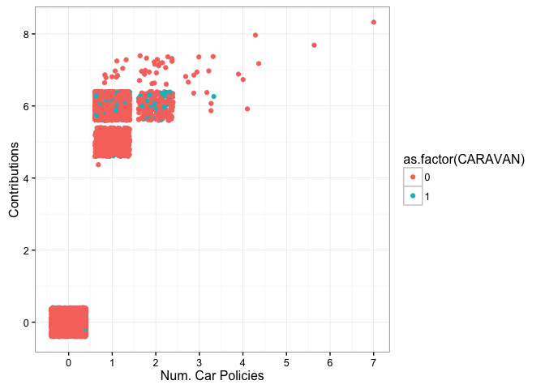

# CapstoneProject
Vivek Appadurai  
February 20, 2016  

## Loading Libraries


```r
library(dplyr)
library(ggplot2)
library(knitr)
library(gridExtra)
library(pROC)
library(leaps)
library(MASS)
library(e1071)
library(mlbench)
library(caret)
library(randomForest)
library(rpart)
library(ROCR)
```

## Reading Data


```r
variableInfo <- read.table("Names.txt", 
                           header = T, 
                           sep = "\t", 
                           fill = NA, 
                           quote = "",
                           stringsAsFactors = FALSE)

ticDataTraining <- read.table("ticdata2000.txt", 
                              header = F, 
                              sep = "\t", 
                              fill = NA, 
                              quote = "", 
                              stringsAsFactors = FALSE)

ticDataTest <- read.table("ticeval2000.txt", 
                          header = F, 
                          sep = "\t", 
                          fill = NA, 
                          quote = "",
                          stringsAsFactors = FALSE)

targets <- read.table("tictgts2000.txt",
                              header = F,
                              stringsAsFactors = FALSE)
```

## Data Cleaning


```r
colNames <- as.vector(variableInfo$Name)
names(ticDataTraining) <- colNames
ticDataTest <- cbind(ticDataTest, targets)
names(ticDataTest) <- colNames

ticDataTraining <- ticDataTraining %>% mutate(totalCaravanPolicies = sum(CARAVAN))
```

## Exploratory Data Analysis

Since the number of caravan policy holders within the training data is very low (348/5822 or apprxomiately 6%), 
its best to explore the assocaitions within the data by looking at the fraction of policy holders at each value 
for the varaibles along with the proportion of population at that particular value


```r
ticDataTraining <- ticDataTraining %>% 
    group_by(MAANTHUI) %>%
    mutate(percent_caravan = sum(CARAVAN) / totalCaravanPolicies) %>%
    ungroup()

plotHomesOwned <- ggplot(data = ticDataTraining, aes(x = MAANTHUI)) +
    geom_bar(aes(y = ..count../sum(..count..))) +
    geom_point(aes(y = percent_caravan)) +
    geom_line(aes(y = percent_caravan), linetype = 2) +
    scale_x_continuous(breaks = seq(0, max(ticDataTraining$MAANTHUI), 1)) +
    xlab("Number of Homes Owned") +
    ylab("Proportion") +
    theme_bw()

ticDataTraining <- ticDataTraining %>% 
    group_by(MGEMOMV) %>%
    mutate(percent_caravan = sum(CARAVAN) / totalCaravanPolicies) %>%
    ungroup()

plotHouseHoldSize <- ggplot(data = ticDataTraining, aes(x = MGEMOMV)) +
    geom_bar(aes(y = ..count../sum(..count..))) +
    geom_point(aes(y = percent_caravan)) +
    geom_line(aes(y = percent_caravan), linetype = 2) +
    scale_x_continuous(breaks = seq(0, max(ticDataTraining$MGEMOMV), 1)) +
    xlab("Average Household Size") +
    ylab("Proportion") +
    theme_bw()

ticDataTraining <- ticDataTraining %>% 
    group_by(MGEMLEEF) %>%
    mutate(percent_caravan = sum(CARAVAN) / totalCaravanPolicies) %>%
    ungroup()

PlotAvgAge <- ggplot(data = ticDataTraining, aes(x = MGEMLEEF)) +
    geom_bar(aes(y = ..count../sum(..count..))) +
    geom_point(aes(y = percent_caravan)) +
    geom_line(aes(y = percent_caravan), linetype = 2) +
    scale_x_continuous(breaks = seq(0, max(ticDataTraining$MGEMLEEF), 1)) +
    xlab("Average Age") +
    ylab("Proportion") +
    theme_bw()

ticDataTraining <- ticDataTraining %>% 
    group_by(MGODRK) %>%
    mutate(percent_caravan = sum(CARAVAN) / totalCaravanPolicies) %>%
    ungroup()

plotRomanCatholics <- ggplot(data = ticDataTraining, aes(x = MGODRK)) +
    geom_bar(aes(y = ..count../sum(..count..))) +
    geom_point(aes(y = percent_caravan)) +
    geom_line(aes(y = percent_caravan), linetype = 2) +
    scale_x_continuous(breaks = seq(0, max(ticDataTraining$MGODRK), 1)) +
    xlab("Roman Catholics") +
    ylab("Proportion") +
    theme_bw()

ticDataTraining <- ticDataTraining %>% 
    group_by(MGODPR) %>%
    mutate(percent_caravan = sum(CARAVAN) / totalCaravanPolicies) %>%
    ungroup()

plotProtestants <- ggplot(data = ticDataTraining, aes(x = MGODPR)) +
    geom_bar(aes(y = ..count../sum(..count..))) +
    geom_point(aes(y = percent_caravan)) +
    geom_line(aes(y = percent_caravan), linetype = 2) +
    scale_x_continuous(breaks = seq(0, max(ticDataTraining$MGODPR), 1)) +
    xlab("Protestants") +
    ylab("Proportion") +
    theme_bw()

ticDataTraining <- ticDataTraining %>% 
    group_by(MGODOV) %>%
    mutate(percent_caravan = sum(CARAVAN) / totalCaravanPolicies) %>%
    ungroup()

plotOtherReligion <- ggplot(data = ticDataTraining, aes(x = MGODOV)) +
    geom_bar(aes(y = ..count../sum(..count..))) +
    geom_point(aes(y = percent_caravan)) +
    geom_line(aes(y = percent_caravan), linetype = 2) +
    scale_x_continuous(breaks = seq(0, max(ticDataTraining$MGODOV), 1)) +
    xlab("Other Religion") +
    ylab("Proportion") +
    theme_bw()

ticDataTraining <- ticDataTraining %>%
    group_by(MGODGE) %>%
    mutate(percent_caravan = sum(CARAVAN) / totalCaravanPolicies) %>%
    ungroup()

plotNoReligion <- ggplot(data = ticDataTraining, aes(x = MGODGE)) +
    geom_bar(aes(y = ..count../sum(..count..))) +
    geom_point(aes(y = percent_caravan)) +
    geom_line(aes(y = percent_caravan), linetype = 2) +
    scale_x_continuous(breaks = seq(0, max(ticDataTraining$MGODGE), 1)) +
    xlab("No Religion") +
    ylab("Proportion") +
    theme_bw()

ticDataTraining <- ticDataTraining %>%
    group_by(MRELGE) %>%
    mutate(percent_caravan = sum(CARAVAN) / totalCaravanPolicies) %>%
    ungroup()

plotMarried <- ggplot(data = ticDataTraining, aes(x = MRELGE)) +
    geom_bar(aes(y = ..count../sum(..count..))) +
    geom_point(aes(y = percent_caravan)) +
    geom_line(aes(y = percent_caravan), linetype = 2) +
    scale_x_continuous(breaks = seq(0, max(ticDataTraining$MRELGE), 1)) +
    xlab("Married") +
    ylab("Proportion") +
    theme_bw()

ticDataTraining <- ticDataTraining %>%
    group_by(MRELSA) %>%
    mutate(percent_caravan = sum(CARAVAN) / totalCaravanPolicies) %>%
    ungroup()

plotLivingTogether <- ggplot(data = ticDataTraining, aes(x = MRELSA)) +
    geom_bar(aes(y = ..count../sum(..count..))) +
    geom_point(aes(y = percent_caravan)) +
    geom_line(aes(y = percent_caravan), linetype = 2) +
    scale_x_continuous(breaks = seq(0, max(ticDataTraining$MRELSA), 1)) +
    xlab("Living Together") +
    ylab("Proportion") +
    theme_bw()

ticDataTraining <- ticDataTraining %>%
    group_by(MRELOV) %>%
    mutate(percent_caravan = sum(CARAVAN) / totalCaravanPolicies) %>%
    ungroup()

plotOtherRelation <- ggplot(data = ticDataTraining, aes(x = MRELOV)) +
    geom_bar(aes(y = ..count../sum(..count..))) +
    geom_point(aes(y = percent_caravan)) +
    geom_line(aes(y = percent_caravan), linetype = 2) +
    scale_x_continuous(breaks = seq(0, max(ticDataTraining$MRELOV), 1)) +
    xlab("Other Relation") +
    ylab("Proportion") +
    theme_bw()

ticDataTraining <- ticDataTraining %>%
    group_by(MFALLEEN) %>%
    mutate(percent_caravan = sum(CARAVAN) / totalCaravanPolicies) %>%
    ungroup()

plotSingles <- ggplot(data = ticDataTraining, aes(x = MFALLEEN)) +
    geom_bar(aes(y = ..count../sum(..count..))) +
    geom_point(aes(y = percent_caravan)) +
    geom_line(aes(y = percent_caravan), linetype = 2) +
    scale_x_continuous(breaks = seq(0, max(ticDataTraining$MFALLEEN), 1)) +
    xlab("Singles") +
    ylab("Proportion") +
    theme_bw()

ticDataTraining <- ticDataTraining %>%
    group_by(MFGEKIND) %>%
    mutate(percent_caravan = sum(CARAVAN) / totalCaravanPolicies) %>%
    ungroup()

plotHouseholdNoChild <- ggplot(data = ticDataTraining, aes(x = MFGEKIND)) +
    geom_bar(aes(y = ..count../sum(..count..))) +
    geom_point(aes(y = percent_caravan)) +
    geom_line(aes(y = percent_caravan), linetype = 2) +
    scale_x_continuous(breaks = seq(0, max(ticDataTraining$MFGEKIND), 1)) +
    xlab("Household No Children") +
    ylab("Proportion") +
    theme_bw()

ticDataTraining <- ticDataTraining %>%
    group_by(MFWEKIND) %>%
    mutate(percent_caravan = sum(CARAVAN) / totalCaravanPolicies) %>%
    ungroup()

plotHouseholdWithChild <- ggplot(data = ticDataTraining, aes(x = MFWEKIND)) +
    geom_bar(aes(y = ..count../sum(..count..))) +
    geom_point(aes(y = percent_caravan)) +
    geom_line(aes(y = percent_caravan), linetype = 2) +
    scale_x_continuous(breaks = seq(0, max(ticDataTraining$MFWEKIND), 1)) +
    xlab("Household With Children") +
    ylab("Proportion") +
    theme_bw()

ticDataTraining <- ticDataTraining %>%
    group_by(MOPLHOOG) %>%
    mutate(percent_caravan = sum(CARAVAN) / totalCaravanPolicies) %>%
    ungroup()

plotHouseholdHighEd <- ggplot(data = ticDataTraining, aes(x = MOPLHOOG)) +
    geom_bar(aes(y = ..count../sum(..count..))) +
    geom_point(aes(y = percent_caravan)) +
    geom_line(aes(y = percent_caravan), linetype = 2) +
    scale_x_continuous(breaks = seq(0, max(ticDataTraining$MOPLHOOG), 1)) +
    xlab("High Level Education") +
    ylab("Proportion") +
    theme_bw()

ticDataTraining <- ticDataTraining %>%
    group_by(MOPLMIDD) %>%
    mutate(percent_caravan = sum(CARAVAN) / totalCaravanPolicies) %>%
    ungroup()

plotHouseholdMidEd <- ggplot(data = ticDataTraining, aes(x = MOPLMIDD)) +
    geom_bar(aes(y = ..count../sum(..count..))) +
    geom_point(aes(y = percent_caravan)) +
    geom_line(aes(y = percent_caravan), linetype = 2) +
    scale_x_continuous(breaks = seq(0, max(ticDataTraining$MOPLMIDD), 1)) +
    xlab("Mid Level Education") +
    ylab("Proportion") +
    theme_bw()

ticDataTraining <- ticDataTraining %>%
    group_by(MOPLLAAG) %>%
    mutate(percent_caravan = sum(CARAVAN) / totalCaravanPolicies) %>%
    ungroup()

plotHouseholdLowEd <- ggplot(data = ticDataTraining, aes(x = MOPLLAAG)) +
    geom_bar(aes(y = ..count../sum(..count..))) +
    geom_point(aes(y = percent_caravan)) +
    geom_line(aes(y = percent_caravan), linetype = 2) +
    scale_x_continuous(breaks = seq(0, max(ticDataTraining$MOPLLAAG), 1)) +
    xlab("Low Level Education") +
    ylab("Proportion") +
    theme_bw()

ticDataTraining <- ticDataTraining %>%
    group_by(MBERHOOG) %>%
    mutate(percent_caravan = sum(CARAVAN) / totalCaravanPolicies) %>%
    ungroup()

plotHighStatus <- ggplot(data = ticDataTraining, aes(x = MBERHOOG)) +
    geom_bar(aes(y = ..count../sum(..count..))) +
    geom_point(aes(y = percent_caravan)) +
    geom_line(aes(y = percent_caravan), linetype = 2) +
    scale_x_continuous(breaks = seq(0, max(ticDataTraining$MBERHOOG), 1)) +
    xlab("High Status") +
    ylab("Proportion") +
    theme_bw()

ticDataTraining <- ticDataTraining %>%
    group_by(MBERZELF) %>%
    mutate(percent_caravan = sum(CARAVAN) / totalCaravanPolicies) %>%
    ungroup()

plotEntrepreneur <- ggplot(data = ticDataTraining, aes(x = MBERZELF)) +
    geom_bar(aes(y = ..count../sum(..count..))) +
    geom_point(aes(y = percent_caravan)) +
    geom_line(aes(y = percent_caravan), linetype = 2) +
    scale_x_continuous(breaks = seq(0, max(ticDataTraining$MBERZELF), 1)) +
    xlab("Entrepreneur") +
    ylab("Proportion") +
    theme_bw()

ticDataTraining <- ticDataTraining %>%
    group_by(MBERBOER) %>%
    mutate(percent_caravan = sum(CARAVAN) / totalCaravanPolicies) %>%
    ungroup()

plotFarmer <- ggplot(data = ticDataTraining, aes(x = MBERBOER)) +
    geom_bar(aes(y = ..count../sum(..count..))) +
    geom_point(aes(y = percent_caravan)) +
    geom_line(aes(y = percent_caravan), linetype = 2) +
    scale_x_continuous(breaks = seq(0, max(ticDataTraining$MBERBOER), 1)) +
    xlab("Farmer") +
    ylab("Proportion") +
    theme_bw()

ticDataTraining <- ticDataTraining %>%
    group_by(MBERMIDD) %>%
    mutate(percent_caravan = sum(CARAVAN) / totalCaravanPolicies) %>%
    ungroup()

plotMidManagement <- ggplot(data = ticDataTraining, aes(x = MBERMIDD)) +
    geom_bar(aes(y = ..count../sum(..count..))) +
    geom_point(aes(y = percent_caravan)) +
    geom_line(aes(y = percent_caravan), linetype = 2) +
    scale_x_continuous(breaks = seq(0, max(ticDataTraining$MBERMIDD), 1)) +
    xlab("Middle Management") +
    ylab("Proportion") +
    theme_bw()

ticDataTraining <- ticDataTraining %>%
    group_by(MBERARBG) %>%
    mutate(percent_caravan = sum(CARAVAN) / totalCaravanPolicies) %>%
    ungroup()

plotSkilledLabor <- ggplot(data = ticDataTraining, aes(x = MBERARBG)) +
    geom_bar(aes(y = ..count../sum(..count..))) +
    geom_point(aes(y = percent_caravan)) +
    geom_line(aes(y = percent_caravan), linetype = 2) +
    scale_x_continuous(breaks = seq(0, max(ticDataTraining$MBERARBG), 1)) +
    xlab("Skilled Laborers") +
    ylab("Proportion") +
    theme_bw()

ticDataTraining <- ticDataTraining %>%
    group_by(MBERARBO) %>%
    mutate(percent_caravan = sum(CARAVAN) / totalCaravanPolicies) %>%
    ungroup()

plotUnskilledLabor <- ggplot(data = ticDataTraining, aes(x = MBERARBO)) +
    geom_bar(aes(y = ..count../sum(..count..))) +
    geom_point(aes(y = percent_caravan)) +
    geom_line(aes(y = percent_caravan), linetype = 2) +
    scale_x_continuous(breaks = seq(0, max(ticDataTraining$MBERARBO), 1)) +
    xlab("Unskilled Laborers") +
    ylab("Proportion") +
    theme_bw()

ticDataTraining <- ticDataTraining %>%
    group_by(MSKA) %>%
    mutate(percent_caravan = sum(CARAVAN) / totalCaravanPolicies) %>%
    ungroup()

plotSocialA <- ggplot(data = ticDataTraining, aes(x = MSKA)) +
    geom_bar(aes(y = ..count../sum(..count..))) +
    geom_point(aes(y = percent_caravan)) +
    geom_line(aes(y = percent_caravan), linetype = 2) +
    scale_x_continuous(breaks = seq(0, max(ticDataTraining$MSKA), 1)) +
    xlab("Social Class A") +
    ylab("Proportion") +
    theme_bw()

ticDataTraining <- ticDataTraining %>%
    group_by(MSKB1) %>%
    mutate(percent_caravan = sum(CARAVAN) / totalCaravanPolicies) %>%
    ungroup()

plotSocialB1 <- ggplot(data = ticDataTraining, aes(x = MSKB1)) +
    geom_bar(aes(y = ..count../sum(..count..))) +
    geom_point(aes(y = percent_caravan)) +
    geom_line(aes(y = percent_caravan), linetype = 2) +
    scale_x_continuous(breaks = seq(0, max(ticDataTraining$MSKB1), 1)) +
    xlab("Social Class B1") +
    ylab("Proportion") +
    theme_bw()

ticDataTraining <- ticDataTraining %>%
    group_by(MSKB2) %>%
    mutate(percent_caravan = sum(CARAVAN) / totalCaravanPolicies) %>%
    ungroup()

plotSocialB2 <- ggplot(data = ticDataTraining, aes(x = MSKB2)) +
    geom_bar(aes(y = ..count../sum(..count..))) +
    geom_point(aes(y = percent_caravan)) +
    geom_line(aes(y = percent_caravan), linetype = 2) +
    scale_x_continuous(breaks = seq(0, max(ticDataTraining$MSKB2), 1)) +
    xlab("Social Class B2") +
    ylab("Proportion") +
    theme_bw()

ticDataTraining <- ticDataTraining %>%
    group_by(MSKC) %>%
    mutate(percent_caravan = sum(CARAVAN) / totalCaravanPolicies) %>%
    ungroup()

plotSocialC <- ggplot(data = ticDataTraining, aes(x = MSKC)) +
    geom_bar(aes(y = ..count../sum(..count..))) +
    geom_point(aes(y = percent_caravan)) +
    geom_line(aes(y = percent_caravan), linetype = 2) +
    scale_x_continuous(breaks = seq(0, max(ticDataTraining$MSKC), 1)) +
    xlab("Social Class C") +
    ylab("Proportion") +
    theme_bw()

ticDataTraining <- ticDataTraining %>%
    group_by(MSKD) %>%
    mutate(percent_caravan = sum(CARAVAN) / totalCaravanPolicies) %>%
    ungroup()

plotSocialD <- ggplot(data = ticDataTraining, aes(x = MSKD)) +
    geom_bar(aes(y = ..count../sum(..count..))) +
    geom_point(aes(y = percent_caravan)) +
    geom_line(aes(y = percent_caravan), linetype = 2) +
    scale_x_continuous(breaks = seq(0, max(ticDataTraining$MSKD), 1)) +
    xlab("Social Class D") +
    ylab("Proportion") +
    theme_bw()

ticDataTraining <- ticDataTraining %>%
    group_by(MHHUUR) %>%
    mutate(percent_caravan = sum(CARAVAN) / totalCaravanPolicies) %>%
    ungroup()

plotRentHouse <- ggplot(data = ticDataTraining, aes(x = MHHUUR)) +
    geom_bar(aes(y = ..count../sum(..count..))) +
    geom_point(aes(y = percent_caravan)) +
    geom_line(aes(y = percent_caravan), linetype = 2) +
    scale_x_continuous(breaks = seq(0, max(ticDataTraining$MHHUUR), 1)) +
    xlab("Rented House") +
    ylab("Proportion") +
    theme_bw()

ticDataTraining <- ticDataTraining %>%
    group_by(MHKOOP) %>%
    mutate(percent_caravan = sum(CARAVAN) / totalCaravanPolicies) %>%
    ungroup()

plotOwnHome <- ggplot(data = ticDataTraining, aes(x = MHKOOP)) +
    geom_bar(aes(y = ..count../sum(..count..))) +
    geom_point(aes(y = percent_caravan)) +
    geom_line(aes(y = percent_caravan), linetype = 2) +
    scale_x_continuous(breaks = seq(0, max(ticDataTraining$MHKOOP), 1)) +
    xlab("Home Owners") +
    ylab("Proportion") +
    theme_bw()

ticDataTraining <- ticDataTraining %>%
    group_by(MAUT1) %>%
    mutate(percent_caravan = sum(CARAVAN) / totalCaravanPolicies) %>%
    ungroup()

plotOneCar <- ggplot(data = ticDataTraining, aes(x = MAUT1)) +
    geom_bar(aes(y = ..count../sum(..count..))) +
    geom_point(aes(y = percent_caravan)) +
    geom_line(aes(y = percent_caravan), linetype = 2) +
    scale_x_continuous(breaks = seq(0, max(ticDataTraining$MAUT1), 1)) +
    xlab("Owns One Car") +
    ylab("Proportion") +
    theme_bw()

ticDataTraining <- ticDataTraining %>%
    group_by(MAUT2) %>%
    mutate(percent_caravan = sum(CARAVAN) / totalCaravanPolicies) %>%
    ungroup()

plotTwoCars <- ggplot(data = ticDataTraining, aes(x = MAUT2)) +
    geom_bar(aes(y = ..count../sum(..count..))) +
    geom_point(aes(y = percent_caravan)) +
    geom_line(aes(y = percent_caravan), linetype = 2) +
    scale_x_continuous(breaks = seq(0, max(ticDataTraining$MAUT2), 1)) +
    xlab("Owns Two Cars") +
    ylab("Proportion") +
    theme_bw()

ticDataTraining <- ticDataTraining %>%
    group_by(MAUT0) %>%
    mutate(percent_caravan = sum(CARAVAN) / totalCaravanPolicies) %>%
    ungroup()

plotNoCar <- ggplot(data = ticDataTraining, aes(x = MAUT0)) +
    geom_bar(aes(y = ..count../sum(..count..))) +
    geom_point(aes(y = percent_caravan)) +
    geom_line(aes(y = percent_caravan), linetype = 2) +
    scale_x_continuous(breaks = seq(0, max(ticDataTraining$MAUT0), 1)) +
    xlab("No Car Owned") +
    ylab("Proportion") +
    theme_bw()

ticDataTraining <- ticDataTraining %>%
    group_by(MZFONDS) %>%
    mutate(percent_caravan = sum(CARAVAN) / totalCaravanPolicies) %>%
    ungroup()

plotNHS <- ggplot(data = ticDataTraining, aes(x = MZFONDS)) +
    geom_bar(aes(y = ..count../sum(..count..))) +
    geom_point(aes(y = percent_caravan)) +
    geom_line(aes(y = percent_caravan), linetype = 2) +
    scale_x_continuous(breaks = seq(0, max(ticDataTraining$MZFONDS), 1)) +
    xlab("National Health Service") +
    ylab("Proportion") +
    theme_bw()

ticDataTraining <- ticDataTraining %>%
    group_by(MZPART) %>%
    mutate(percent_caravan = sum(CARAVAN) / totalCaravanPolicies) %>%
    ungroup()

plotPHS <- ggplot(data = ticDataTraining, aes(x = MZPART)) +
    geom_bar(aes(y = ..count../sum(..count..))) +
    geom_point(aes(y = percent_caravan)) +
    geom_line(aes(y = percent_caravan), linetype = 2) +
    scale_x_continuous(breaks = seq(0, max(ticDataTraining$MZPART), 1)) +
    xlab("Private Health Insurance") +
    ylab("Proportion") +
    theme_bw()

ticDataTraining <- ticDataTraining %>%
    group_by(MINKM30) %>%
    mutate(percent_caravan = sum(CARAVAN) / totalCaravanPolicies) %>%
    ungroup()

plotIncome30k <- ggplot(data = ticDataTraining, aes(x = MINKM30)) +
    geom_bar(aes(y = ..count../sum(..count..))) +
    geom_point(aes(y = percent_caravan)) +
    geom_line(aes(y = percent_caravan), linetype = 2) +
    scale_x_continuous(breaks = seq(0, max(ticDataTraining$MINKM30), 1)) +
    xlab("Income < 30k") +
    ylab("Proportion") +
    theme_bw()

ticDataTraining <- ticDataTraining %>%
    group_by(MINK3045) %>%
    mutate(percent_caravan = sum(CARAVAN) / totalCaravanPolicies) %>%
    ungroup()

plotIncome30_45k <- ggplot(data = ticDataTraining, aes(x = MINK3045)) +
    geom_bar(aes(y = ..count../sum(..count..))) +
    geom_point(aes(y = percent_caravan)) +
    geom_line(aes(y = percent_caravan), linetype = 2) +
    scale_x_continuous(breaks = seq(0, max(ticDataTraining$MINK3045), 1)) +
    xlab("30k < Income < 45k") +
    ylab("Proportion") +
    theme_bw()

ticDataTraining <- ticDataTraining %>%
    group_by(MINK4575) %>%
    mutate(percent_caravan = sum(CARAVAN) / totalCaravanPolicies) %>%
    ungroup()

plotIncome45_75k <- ggplot(data = ticDataTraining, aes(x = MINK4575)) +
    geom_bar(aes(y = ..count../sum(..count..))) +
    geom_point(aes(y = percent_caravan)) +
    geom_line(aes(y = percent_caravan), linetype = 2) +
    scale_x_continuous(breaks = seq(0, max(ticDataTraining$MINK4575), 1)) +
    xlab("45k < Income < 75k") +
    ylab("Proportion") +
    theme_bw()

ticDataTraining <- ticDataTraining %>%
    group_by(MINK7512) %>%
    mutate(percent_caravan = sum(CARAVAN) / totalCaravanPolicies) %>%
    ungroup()

plotIncome75k_122k <- ggplot(data = ticDataTraining, aes(x = MINK7512)) +
    geom_bar(aes(y = ..count../sum(..count..))) +
    geom_point(aes(y = percent_caravan)) +
    geom_line(aes(y = percent_caravan), linetype = 2) +
    scale_x_continuous(breaks = seq(0, max(ticDataTraining$MINK7512), 1)) +
    xlab("75k < Income < 122k") +
    ylab("Proportion") +
    theme_bw()

ticDataTraining <- ticDataTraining %>%
    group_by(MINK123M) %>%
    mutate(percent_caravan = sum(CARAVAN) / totalCaravanPolicies) %>%
    ungroup()

plotIncome123k <- ggplot(data = ticDataTraining, aes(x = MINK123M)) +
    geom_bar(aes(y = ..count../sum(..count..))) +
    geom_point(aes(y = percent_caravan)) +
    geom_line(aes(y = percent_caravan), linetype = 2) +
    scale_x_continuous(breaks = seq(0, max(ticDataTraining$MINK123M), 1)) +
    xlab("Income > 122k") +
    ylab("Proportion") +
    theme_bw()

ticDataTraining <- ticDataTraining %>%
    group_by(MINKGEM) %>%
    mutate(percent_caravan = sum(CARAVAN) / totalCaravanPolicies) %>%
    ungroup()

plotAvgIncome <- ggplot(data = ticDataTraining, aes(x = MINKGEM)) +
    geom_bar(aes(y = ..count../sum(..count..))) +
    geom_point(aes(y = percent_caravan)) +
    geom_line(aes(y = percent_caravan), linetype = 2) +
    scale_x_continuous(breaks = seq(0, max(ticDataTraining$MINKGEM), 1)) +
    xlab("Average Income Populations") +
    ylab("Proportion") +
    theme_bw()

ticDataTraining <- ticDataTraining %>%
    group_by(MKOOPKLA) %>%
    mutate(percent_caravan = sum(CARAVAN) / totalCaravanPolicies) %>%
    ungroup()

plotPurchasingPower <- ggplot(data = ticDataTraining, aes(x = MKOOPKLA)) +
    geom_bar(aes(y = ..count../sum(..count..))) +
    geom_point(aes(y = percent_caravan)) +
    geom_line(aes(y = percent_caravan), linetype = 2) +
    scale_x_continuous(breaks = seq(0, max(ticDataTraining$MKOOPKLA), 1)) +
    xlab("Purchasing Power") +
    ylab("Proportion") +
    theme_bw()

ticDataTraining <- ticDataTraining %>%
    group_by(AWAPART) %>%
    mutate(percent_caravan = sum(CARAVAN) / totalCaravanPolicies) %>%
    ungroup()

plotNumThirdPartyIns <- ggplot(data = ticDataTraining, aes(x = AWAPART)) +
    geom_bar(aes(y = ..count../sum(..count..))) +
    geom_point(aes(y = percent_caravan)) +
    geom_line(aes(y = percent_caravan), linetype = 2) +
    scale_x_continuous(breaks = seq(0, max(ticDataTraining$AWAPART), 1)) +
    xlab("No. of 3rd Party Insurances") +
    ylab("Proportion") +
    theme_bw()

ticDataTraining <- ticDataTraining %>%
    group_by(PWAPART) %>%
    mutate(percent_caravan = sum(CARAVAN) / totalCaravanPolicies) %>%
    ungroup()

plotNumThirdPartyInsCont <- ggplot(data = ticDataTraining, aes(x = PWAPART)) +
    geom_bar(aes(y = ..count../sum(..count..))) +
    geom_point(aes(y = percent_caravan)) +
    geom_line(aes(y = percent_caravan), linetype = 2) +
    scale_x_continuous(breaks = seq(0, max(ticDataTraining$PWAPART), 1)) +
    xlab("3rd Party Insurance Contributions") +
    ylab("Proportion") +
    theme_bw()

ticDataTraining <- ticDataTraining %>%
    group_by(AWABEDR) %>%
    mutate(percent_caravan = sum(CARAVAN) / totalCaravanPolicies) %>%
    ungroup()

plotNumThirdPartyInsFirm <- ggplot(data = ticDataTraining, aes(x = AWABEDR)) +
    geom_bar(aes(y = ..count../sum(..count..))) +
    geom_point(aes(y = percent_caravan)) +
    geom_line(aes(y = percent_caravan), linetype = 2) +
    scale_x_continuous(breaks = seq(0, max(ticDataTraining$AWABEDR), 1)) +
    xlab("No. of 3rd Party Insurances for FIRMS") +
    ylab("Proportion") +
    theme_bw()

ticDataTraining <- ticDataTraining %>%
    group_by(PWABEDR) %>%
    mutate(percent_caravan = sum(CARAVAN) / totalCaravanPolicies) %>%
    ungroup()

plotNumThirdPartyInsFirmCont <- ggplot(data = ticDataTraining, aes(x = PWABEDR)) +
    geom_bar(aes(y = ..count../sum(..count..))) +
    geom_point(aes(y = percent_caravan)) +
    geom_line(aes(y = percent_caravan), linetype = 2) +
    scale_x_continuous(breaks = seq(0, max(ticDataTraining$PWABEDR), 2)) +
    xlab("3rd Party Insurance Contributions for Firms") +
    ylab("Proportion") +
    theme_bw()

ticDataTraining <- ticDataTraining %>%
    group_by(AWALAND) %>%
    mutate(percent_caravan = sum(CARAVAN) / totalCaravanPolicies) %>%
    ungroup()

plotNumThirdPartyInsAgri <- ggplot(data = ticDataTraining, aes(x = AWALAND)) +
    geom_bar(aes(y = ..count../sum(..count..))) +
    geom_point(aes(y = percent_caravan)) +
    geom_line(aes(y = percent_caravan), linetype = 2) +
    scale_x_continuous(breaks = seq(0, max(ticDataTraining$AWALAND), 1)) +
    xlab("No. of 3rd Party Insurances for Agriculture") +
    ylab("Proportion") +
    theme_bw()

ticDataTraining <- ticDataTraining %>%
    group_by(PWALAND) %>%
    mutate(percent_caravan = sum(CARAVAN) / totalCaravanPolicies) %>%
    ungroup()

plotNumThirdPartyInsAgriCont <- ggplot(data = ticDataTraining, aes(x = PWALAND)) +
    geom_bar(aes(y = ..count../sum(..count..))) +
    geom_point(aes(y = percent_caravan)) +
    geom_line(aes(y = percent_caravan), linetype = 2) +
    scale_x_continuous(breaks = seq(0, max(ticDataTraining$PWALAND), 1)) +
    xlab("3rd Party Insurance Contributions - Agriculture") +
    ylab("Proportion") +
    theme_bw()

ticDataTraining <- ticDataTraining %>%
    group_by(APERSAUT) %>%
    mutate(percent_caravan = sum(CARAVAN) / totalCaravanPolicies) %>%
    ungroup()

plotCarPolicy <- ggplot(data = ticDataTraining, aes(x = APERSAUT)) +
    geom_bar(aes(y = ..count../sum(..count..))) +
    geom_point(aes(y = percent_caravan)) +
    geom_line(aes(y = percent_caravan), linetype = 2) +
    scale_x_continuous(breaks = seq(0, max(ticDataTraining$APERSAUT), 1)) +
    xlab("No. of Car Policies") +
    ylab("Proportion") +
    theme_bw()

ticDataTraining <- ticDataTraining %>%
    group_by(PPERSAUT) %>%
    mutate(percent_caravan = sum(CARAVAN) / totalCaravanPolicies) %>%
    ungroup()

plotCarPolicyCont <- ggplot(data = ticDataTraining, aes(x = PPERSAUT)) +
    geom_bar(aes(y = ..count../sum(..count..))) +
    geom_point(aes(y = percent_caravan)) +
    geom_line(aes(y = percent_caravan), linetype = 2) +
    scale_x_continuous(breaks = seq(0, max(ticDataTraining$PPERSAUT), 4)) +
    xlab("Car Policies Contributions") +
    ylab("Proportion") +
    theme_bw()

ticDataTraining <- ticDataTraining %>%
    group_by(ABESAUT) %>%
    mutate(percent_caravan = sum(CARAVAN) / totalCaravanPolicies) %>%
    ungroup()

plotVanPolicy <- ggplot(data = ticDataTraining, aes(x = ABESAUT)) +
    geom_bar(aes(y = ..count../sum(..count..))) +
    geom_point(aes(y = percent_caravan)) +
    geom_line(aes(y = percent_caravan), linetype = 2) +
    scale_x_continuous(breaks = seq(0, max(ticDataTraining$ABESAUT), 1)) +
    xlab("No. of Delivery Van Policies") +
    ylab("Proportion") +
    theme_bw()

ticDataTraining <- ticDataTraining %>%
    group_by(PBESAUT) %>%
    mutate(percent_caravan = sum(CARAVAN) / totalCaravanPolicies) %>%
    ungroup()

plotVanPolicyCont <- ggplot(data = ticDataTraining, aes(x = PBESAUT)) +
    geom_bar(aes(y = ..count../sum(..count..))) +
    geom_point(aes(y = percent_caravan)) +
    geom_line(aes(y = percent_caravan), linetype = 2) +
    scale_x_continuous(breaks = seq(0, max(ticDataTraining$PBESAUT), 2)) +
    xlab("Van Policies Contributions") +
    ylab("Proportion") +
    theme_bw()

ticDataTraining <- ticDataTraining %>%
    group_by(AMOTSCO) %>%
    mutate(percent_caravan = sum(CARAVAN) / totalCaravanPolicies) %>%
    ungroup()

plotScooterPolicy <- ggplot(data = ticDataTraining, aes(x = AMOTSCO)) +
    geom_bar(aes(y = ..count../sum(..count..))) +
    geom_point(aes(y = percent_caravan)) +
    geom_line(aes(y = percent_caravan), linetype = 2) +
    scale_x_continuous(breaks = seq(0, max(ticDataTraining$AMOTSCO), 1)) +
    xlab("No. of Scooter Policies") +
    ylab("Proportion") +
    theme_bw()

ticDataTraining <- ticDataTraining %>%
    group_by(PMOTSCO) %>%
    mutate(percent_caravan = sum(CARAVAN) / totalCaravanPolicies) %>%
    ungroup()

plotScooterPolicyCont <- ggplot(data = ticDataTraining, aes(x = PMOTSCO)) +
    geom_bar(aes(y = ..count../sum(..count..))) +
    geom_point(aes(y = percent_caravan)) +
    geom_line(aes(y = percent_caravan), linetype = 2) +
    scale_x_continuous(breaks = seq(0, max(ticDataTraining$PMOTSCO), 4)) +
    xlab("Scooter Policies Contributions") +
    ylab("Proportion") +
    theme_bw()

ticDataTraining <- ticDataTraining %>%
    group_by(AVRAAUT) %>%
    mutate(percent_caravan = sum(CARAVAN) / totalCaravanPolicies) %>%
    ungroup()

plotLorryPolicy <- ggplot(data = ticDataTraining, aes(x = AVRAAUT)) +
    geom_bar(aes(y = ..count../sum(..count..))) +
    geom_point(aes(y = percent_caravan)) +
    geom_line(aes(y = percent_caravan), linetype = 2) +
    scale_x_continuous(breaks = seq(0, max(ticDataTraining$AVRAAUT), 1)) +
    xlab("No. of Scooter Policies * Contributions") +
    ylab("Proportion") +
    theme_bw()

ticDataTraining <- ticDataTraining %>%
    group_by(PVRAAUT) %>%
    mutate(percent_caravan = sum(CARAVAN) / totalCaravanPolicies) %>%
    ungroup()

plotLorryPolicyCont <- ggplot(data = ticDataTraining, aes(x = PVRAAUT)) +
    geom_bar(aes(y = ..count../sum(..count..))) +
    geom_point(aes(y = percent_caravan)) +
    geom_line(aes(y = percent_caravan), linetype = 2) +
    scale_x_continuous(breaks = seq(0, max(ticDataTraining$PVRAAUT), 2)) +
    xlab("Lorry Policies Contributions") +
    ylab("Proportion") +
    theme_bw()

ticDataTraining <- ticDataTraining %>%
    group_by(AAANHANG) %>%
    mutate(percent_caravan = sum(CARAVAN) / totalCaravanPolicies) %>%
    ungroup()

plotTrailerPolicy <- ggplot(data = ticDataTraining, aes(x = AAANHANG)) +
    geom_bar(aes(y = ..count../sum(..count..))) +
    geom_point(aes(y = percent_caravan)) +
    geom_line(aes(y = percent_caravan), linetype = 2) +
    scale_x_continuous(breaks = seq(0, max(ticDataTraining$AAANHANG), 1)) +
    xlab("No. of Trailer Policies") +
    ylab("Proportion") +
    theme_bw()

ticDataTraining <- ticDataTraining %>%
    group_by(PAANHANG) %>%
    mutate(percent_caravan = sum(CARAVAN) / totalCaravanPolicies) %>%
    ungroup()

plotTrailerPolicyCont <- ggplot(data = ticDataTraining, aes(x = PAANHANG)) +
    geom_bar(aes(y = ..count../sum(..count..))) +
    geom_point(aes(y = percent_caravan)) +
    geom_line(aes(y = percent_caravan), linetype = 2) +
    scale_x_continuous(breaks = seq(0, max(ticDataTraining$PAANHANG), 1)) +
    xlab("Trailer Policies Contributions") +
    ylab("Proportion") +
    theme_bw()

ticDataTraining <- ticDataTraining %>%
    group_by(ATRACTOR) %>%
    mutate(percent_caravan = sum(CARAVAN) / totalCaravanPolicies) %>%
    ungroup()

plotTractorPolicy <- ggplot(data = ticDataTraining, aes(x = ATRACTOR)) +
    geom_bar(aes(y = ..count../sum(..count..))) +
    geom_point(aes(y = percent_caravan)) +
    geom_line(aes(y = percent_caravan), linetype = 2) +
    scale_x_continuous(breaks = seq(0, max(ticDataTraining$ATRACTOR), 1)) +
    xlab("No. of Tractor Policies") +
    ylab("Proportion") +
    theme_bw()

ticDataTraining <- ticDataTraining %>%
    group_by(PTRACTOR) %>%
    mutate(percent_caravan = sum(CARAVAN) / totalCaravanPolicies) %>%
    ungroup()

plotTractorPolicyCont <- ggplot(data = ticDataTraining, aes(x = PTRACTOR)) +
    geom_bar(aes(y = ..count../sum(..count..))) +
    geom_point(aes(y = percent_caravan)) +
    geom_line(aes(y = percent_caravan), linetype = 2) +
    scale_x_continuous(breaks = seq(0, max(ticDataTraining$PTRACTOR), 2)) +
    xlab("Tractor Policies Contributions") +
    ylab("Proportion") +
    theme_bw()

ticDataTraining <- ticDataTraining %>%
    group_by(AWERKT) %>%
    mutate(percent_caravan = sum(CARAVAN) / totalCaravanPolicies) %>%
    ungroup()

plotAgriMachinePolicy <- ggplot(data = ticDataTraining, aes(x = AWERKT)) +
    geom_bar(aes(y = ..count../sum(..count..))) +
    geom_point(aes(y = percent_caravan)) +
    geom_line(aes(y = percent_caravan), linetype = 2) +
    scale_x_continuous(breaks = seq(0, max(ticDataTraining$AWERKT), 1)) +
    xlab("No. of Agricultural Machine Policies") +
    ylab("Proportion") +
    theme_bw()

ticDataTraining <- ticDataTraining %>%
    group_by(PWERKT) %>%
    mutate(percent_caravan = sum(CARAVAN) / totalCaravanPolicies) %>%
    ungroup()

plotAgriMachinePolicyCont <- ggplot(data = ticDataTraining, aes(x = PWERKT)) +
    geom_bar(aes(y = ..count../sum(..count..))) +
    geom_point(aes(y = percent_caravan)) +
    geom_line(aes(y = percent_caravan), linetype = 2) +
    scale_x_continuous(breaks = seq(0, max(ticDataTraining$PWERKT), 2)) +
    xlab("Agricultural Machine Policies Contributions") +
    ylab("Proportion") +
    theme_bw()

ticDataTraining <- ticDataTraining %>%
    group_by(ABROM) %>%
    mutate(percent_caravan = sum(CARAVAN) / totalCaravanPolicies) %>%
    ungroup()

plotMopedPolicy <- ggplot(data = ticDataTraining, aes(x = ABROM)) +
    geom_bar(aes(y = ..count../sum(..count..))) +
    geom_point(aes(y = percent_caravan)) +
    geom_line(aes(y = percent_caravan), linetype = 2) +
    scale_x_continuous(breaks = seq(0, max(ticDataTraining$ABROM), 1)) +
    xlab("No. of Moped Policies") +
    ylab("Proportion") +
    theme_bw()

ticDataTraining <- ticDataTraining %>%
    group_by(PBROM) %>%
    mutate(percent_caravan = sum(CARAVAN) / totalCaravanPolicies) %>%
    ungroup()

plotMopedPolicyCont <- ggplot(data = ticDataTraining, aes(x = PBROM)) +
    geom_bar(aes(y = ..count../sum(..count..))) +
    geom_point(aes(y = percent_caravan)) +
    geom_line(aes(y = percent_caravan), linetype = 2) +
    scale_x_continuous(breaks = seq(0, max(ticDataTraining$PBROM), 1)) +
    xlab("Moped Policies Contributions") +
    ylab("Proportion") +
    theme_bw()

ticDataTraining <- ticDataTraining %>%
    group_by(ALEVEN) %>%
    mutate(percent_caravan = sum(CARAVAN) / totalCaravanPolicies) %>%
    ungroup()

plotLifePolicy <- ggplot(data = ticDataTraining, aes(x = ALEVEN)) +
    geom_bar(aes(y = ..count../sum(..count..))) +
    geom_point(aes(y = percent_caravan)) +
    geom_line(aes(y = percent_caravan), linetype = 2) +
    scale_x_continuous(breaks = seq(0, max(ticDataTraining$ALEVEN), 1)) +
    xlab("No. of Life Policies") +
    ylab("Proportion") +
    theme_bw()

ticDataTraining <- ticDataTraining %>%
    group_by(PLEVEN) %>%
    mutate(percent_caravan = sum(CARAVAN) / totalCaravanPolicies) %>%
    ungroup()

plotLifePolicyCont <- ggplot(data = ticDataTraining, aes(x = PLEVEN)) +
    geom_bar(aes(y = ..count../sum(..count..))) +
    geom_point(aes(y = percent_caravan)) +
    geom_line(aes(y = percent_caravan), linetype = 4) +
    scale_x_continuous(breaks = seq(0, max(ticDataTraining$PLEVEN), 4)) +
    xlab("Life Policies Contributions") +
    ylab("Proportion") +
    theme_bw()

ticDataTraining <- ticDataTraining %>%
    group_by(APERSONG) %>%
    mutate(percent_caravan = sum(CARAVAN) / totalCaravanPolicies) %>%
    ungroup()

plotPvtAccidentPolicy <- ggplot(data = ticDataTraining, aes(x = APERSONG)) +
    geom_bar(aes(y = ..count../sum(..count..))) +
    geom_point(aes(y = percent_caravan)) +
    geom_line(aes(y = percent_caravan), linetype = 2) +
    scale_x_continuous(breaks = seq(0, max(ticDataTraining$APERSONG), 1)) +
    xlab("No. of Private Accident Policies") +
    ylab("Proportion") +
    theme_bw()

ticDataTraining <- ticDataTraining %>%
    group_by(PPERSONG) %>%
    mutate(percent_caravan = sum(CARAVAN) / totalCaravanPolicies) %>%
    ungroup()

plotPvtAccidentPolicyCont <- ggplot(data = ticDataTraining, aes(x = PPERSONG)) +
    geom_bar(aes(y = ..count../sum(..count..))) +
    geom_point(aes(y = percent_caravan)) +
    geom_line(aes(y = percent_caravan), linetype = 2) +
    scale_x_continuous(breaks = seq(0, max(ticDataTraining$PPERSONG), 1)) +
    xlab("Private Accident Policies Contributions") +
    ylab("Proportion") +
    theme_bw()

ticDataTraining <- ticDataTraining %>%
    group_by(AGEZONG) %>%
    mutate(percent_caravan = sum(CARAVAN) / totalCaravanPolicies) %>%
    ungroup()

plotFamAccidentPolicy <- ggplot(data = ticDataTraining, aes(x = AGEZONG)) +
    geom_bar(aes(y = ..count../sum(..count..))) +
    geom_point(aes(y = percent_caravan)) +
    geom_line(aes(y = percent_caravan), linetype = 2) +
    scale_x_continuous(breaks = seq(0, max(ticDataTraining$AGEZONG), 1)) +
    xlab("No. of Family Accident Policies") +
    ylab("Proportion") +
    theme_bw()

ticDataTraining <- ticDataTraining %>%
    group_by(PGEZONG) %>%
    mutate(percent_caravan = sum(CARAVAN) / totalCaravanPolicies) %>%
    ungroup()

plotFamAccidentPolicyCont <- ggplot(data = ticDataTraining, aes(x = PGEZONG)) +
    geom_bar(aes(y = ..count../sum(..count..))) +
    geom_point(aes(y = percent_caravan)) +
    geom_line(aes(y = percent_caravan), linetype = 2) +
    scale_x_continuous(breaks = seq(0, max(ticDataTraining$PGEZONG), 1)) +
    xlab("Family Accident Policies Contributions") +
    ylab("Proportion") +
    theme_bw()

ticDataTraining <- ticDataTraining %>%
    group_by(AWAOREG) %>%
    mutate(percent_caravan = sum(CARAVAN) / totalCaravanPolicies) %>%
    ungroup()

plotDisabilityPolicy <- ggplot(data = ticDataTraining, aes(x = AWAOREG)) +
    geom_bar(aes(y = ..count../sum(..count..))) +
    geom_point(aes(y = percent_caravan)) +
    geom_line(aes(y = percent_caravan), linetype = 2) +
    scale_x_continuous(breaks = seq(0, max(ticDataTraining$AWAOREG), 1)) +
    xlab("No. of Disability Policies") +
    ylab("Proportion") +
    theme_bw()

ticDataTraining <- ticDataTraining %>%
    group_by(PWAOREG) %>%
    mutate(percent_caravan = sum(CARAVAN) / totalCaravanPolicies) %>%
    ungroup()

plotDisabilityPolicyCont <- ggplot(data = ticDataTraining, aes(x = PWAOREG)) +
    geom_bar(aes(y = ..count../sum(..count..))) +
    geom_point(aes(y = percent_caravan)) +
    geom_line(aes(y = percent_caravan), linetype = 2) +
    scale_x_continuous(breaks = seq(0, max(ticDataTraining$PWAOREG), 1)) +
    xlab("Disability Policies Contributions") +
    ylab("Proportion") +
    theme_bw()

ticDataTraining <- ticDataTraining %>%
    group_by(ABRAND) %>%
    mutate(percent_caravan = sum(CARAVAN) / totalCaravanPolicies) %>%
    ungroup()

plotFirePolicy <- ggplot(data = ticDataTraining, aes(x = ABRAND)) +
    geom_bar(aes(y = ..count../sum(..count..))) +
    geom_point(aes(y = percent_caravan)) +
    geom_line(aes(y = percent_caravan), linetype = 2) +
    scale_x_continuous(breaks = seq(0, max(ticDataTraining$ABRAND), 1)) +
    xlab("No. of Fire Policies") +
    ylab("Proportion") +
    theme_bw()

ticDataTraining <- ticDataTraining %>%
    group_by(PBRAND) %>%
    mutate(percent_caravan = sum(CARAVAN) / totalCaravanPolicies) %>%
    ungroup()

plotFirePolicyCont <- ggplot(data = ticDataTraining, aes(x = PBRAND)) +
    geom_bar(aes(y = ..count../sum(..count..))) +
    geom_point(aes(y = percent_caravan)) +
    geom_line(aes(y = percent_caravan), linetype = 2) +
    scale_x_continuous(breaks = seq(0, max(ticDataTraining$PBRAND), 1)) +
    xlab("Fire Policies Contributions") +
    ylab("Proportion") +
    theme_bw()

ticDataTraining <- ticDataTraining %>%
    group_by(AZEILPL) %>%
    mutate(percent_caravan = sum(CARAVAN) / totalCaravanPolicies) %>%
    ungroup()

plotSurfPolicy <- ggplot(data = ticDataTraining, aes(x = AZEILPL)) +
    geom_bar(aes(y = ..count../sum(..count..))) +
    geom_point(aes(y = percent_caravan)) +
    geom_line(aes(y = percent_caravan), linetype = 2) +
    scale_x_continuous(breaks = seq(0, max(ticDataTraining$AZEILPL), 1)) +
    xlab("No. of SurfBoard Policies") +
    ylab("Proportion") +
    theme_bw()

ticDataTraining <- ticDataTraining %>%
    group_by(PZEILPL) %>%
    mutate(percent_caravan = sum(CARAVAN) / totalCaravanPolicies) %>%
    ungroup()

plotSurfPolicyCont <- ggplot(data = ticDataTraining, aes(x = PZEILPL)) +
    geom_bar(aes(y = ..count../sum(..count..))) +
    geom_point(aes(y = percent_caravan)) +
    geom_line(aes(y = percent_caravan), linetype = 2) +
    scale_x_continuous(breaks = seq(0, max(ticDataTraining$PZEILPL), 1)) +
    xlab("SurfBoard Policies Contributions") +
    ylab("Proportion") +
    theme_bw()

ticDataTraining <- ticDataTraining %>%
    group_by(APLEZIER) %>%
    mutate(percent_caravan = sum(CARAVAN) / totalCaravanPolicies) %>%
    ungroup()

plotBoatPolicy <- ggplot(data = ticDataTraining, aes(x = APLEZIER)) +
    geom_bar(aes(y = ..count../sum(..count..))) +
    geom_point(aes(y = percent_caravan)) +
    geom_line(aes(y = percent_caravan), linetype = 2) +
    scale_x_continuous(breaks = seq(0, max(ticDataTraining$APLEZIER), 1)) +
    xlab("No. of Boat Policies") +
    ylab("Proportion") +
    theme_bw()

ticDataTraining <- ticDataTraining %>%
    group_by(PPLEZIER) %>%
    mutate(percent_caravan = sum(CARAVAN) / totalCaravanPolicies) %>%
    ungroup()

plotBoatPolicyCont <- ggplot(data = ticDataTraining, aes(x = PPLEZIER)) +
    geom_bar(aes(y = ..count../sum(..count..))) +
    geom_point(aes(y = percent_caravan)) +
    geom_line(aes(y = percent_caravan), linetype = 2) +
    scale_x_continuous(breaks = seq(0, max(ticDataTraining$PPLEZIER), 1)) +
    xlab("Boat Policies Contributions") +
    ylab("Proportion") +
    theme_bw()

ticDataTraining <- ticDataTraining %>%
    group_by(AFIETS) %>%
    mutate(percent_caravan = sum(CARAVAN) / totalCaravanPolicies) %>%
    ungroup()

plotBicyclePolicy <- ggplot(data = ticDataTraining, aes(x = AFIETS)) +
    geom_bar(aes(y = ..count../sum(..count..))) +
    geom_point(aes(y = percent_caravan)) +
    geom_line(aes(y = percent_caravan), linetype = 2) +
    scale_x_continuous(breaks = seq(0, max(ticDataTraining$AFIETS), 1)) +
    xlab("No. of Bicycle Policies") +
    ylab("Proportion") +
    theme_bw()

ticDataTraining <- ticDataTraining %>%
    group_by(PFIETS) %>%
    mutate(percent_caravan = sum(CARAVAN) / totalCaravanPolicies) %>%
    ungroup()

plotBicyclePolicyCont <- ggplot(data = ticDataTraining, aes(x = PFIETS)) +
    geom_bar(aes(y = ..count../sum(..count..))) +
    geom_point(aes(y = percent_caravan)) +
    geom_line(aes(y = percent_caravan), linetype = 2) +
    scale_x_continuous(breaks = seq(0, max(ticDataTraining$PFIETS), 1)) +
    xlab("Bicycle Policies Contributions") +
    ylab("Proportion") +
    theme_bw()

ticDataTraining <- ticDataTraining %>%
    group_by(AINBOED) %>%
    mutate(percent_caravan = sum(CARAVAN) / totalCaravanPolicies) %>%
    ungroup()

plotPropertyPolicy <- ggplot(data = ticDataTraining, aes(x = AINBOED)) +
    geom_bar(aes(y = ..count../sum(..count..))) +
    geom_point(aes(y = percent_caravan)) +
    geom_line(aes(y = percent_caravan), linetype = 2) +
    scale_x_continuous(breaks = seq(0, max(ticDataTraining$AINBOED), 1)) +
    xlab("No. of Property Policies") +
    ylab("Proportion") +
    theme_bw()

ticDataTraining <- ticDataTraining %>%
    group_by(PINBOED) %>%
    mutate(percent_caravan = sum(CARAVAN) / totalCaravanPolicies) %>%
    ungroup()

plotPropertyPolicyCont <- ggplot(data = ticDataTraining, aes(x = PINBOED)) +
    geom_bar(aes(y = ..count../sum(..count..))) +
    geom_point(aes(y = percent_caravan)) +
    geom_line(aes(y = percent_caravan), linetype = 2) +
    scale_x_continuous(breaks = seq(0, max(ticDataTraining$PINBOED), 1)) +
    xlab("Property Policies Contributions") +
    ylab("Proportion") +
    theme_bw()

ticDataTraining <- ticDataTraining %>%
    group_by(ABYSTAND) %>%
    mutate(percent_caravan = sum(CARAVAN) / totalCaravanPolicies) %>%
    ungroup()

plotSocialPolicy <- ggplot(data = ticDataTraining, aes(x = ABYSTAND)) +
    geom_bar(aes(y = ..count../sum(..count..))) +
    geom_point(aes(y = percent_caravan)) +
    geom_line(aes(y = percent_caravan), linetype = 2) +
    scale_x_continuous(breaks = seq(0, max(ticDataTraining$ABYSTAND), 1)) +
    xlab("No. of Social Security Policies") +
    ylab("Proportion") +
    theme_bw()

ticDataTraining <- ticDataTraining %>%
    group_by(PBYSTAND) %>%
    mutate(percent_caravan = sum(CARAVAN) / totalCaravanPolicies) %>%
    ungroup()

plotSocialPolicyCont <- ggplot(data = ticDataTraining, aes(x = PBYSTAND)) +
    geom_bar(aes(y = ..count../sum(..count..))) +
    geom_point(aes(y = percent_caravan)) +
    geom_line(aes(y = percent_caravan), linetype = 2) +
    scale_x_continuous(breaks = seq(0, max(ticDataTraining$PBYSTAND), 1)) +
    xlab("Social Security Policies Contributions") +
    ylab("Proportion") +
    theme_bw()
```

#### Plotting Using Grid Arrange


```r
grid.arrange(plotHomesOwned, plotHouseHoldSize, PlotAvgAge, plotRomanCatholics, plotProtestants, plotOtherReligion,
             plotNoReligion, plotMarried, plotLivingTogether, plotOtherRelation, plotSingles, plotHouseholdNoChild,
             plotHouseholdWithChild, plotHouseholdHighEd, plotHouseholdMidEd, plotHouseholdLowEd, plotHighStatus,
             plotEntrepreneur, plotFarmer, plotMidManagement, plotSkilledLabor, plotUnskilledLabor, plotSocialA,
             plotSocialB1, plotSocialB2, plotSocialC, plotSocialD, plotRentHouse, plotOwnHome, plotOneCar, 
             plotTwoCars, plotNoCar, plotNHS, plotPHS, plotIncome30k, plotIncome30_45k, plotIncome45_75k, 
             plotIncome75k_122k, plotIncome123k, plotAvgIncome, plotPurchasingPower, plotNumThirdPartyIns,
             plotNumThirdPartyInsCont, plotNumThirdPartyInsFirm, plotNumThirdPartyInsFirmCont, plotNumThirdPartyInsAgri,
             plotNumThirdPartyInsAgriCont, plotCarPolicy, plotCarPolicyCont, plotVanPolicy, plotVanPolicyCont,
             plotScooterPolicy, plotScooterPolicyCont, plotLorryPolicy, plotLorryPolicyCont, plotTrailerPolicy,
             plotTrailerPolicyCont, plotTractorPolicy, plotTractorPolicyCont, plotAgriMachinePolicy,
             plotAgriMachinePolicyCont, plotMopedPolicy, plotMopedPolicyCont, plotLifePolicy, plotLifePolicyCont,
             plotPvtAccidentPolicy, plotPvtAccidentPolicyCont, plotFamAccidentPolicy, plotFamAccidentPolicyCont,
             plotDisabilityPolicy, plotDisabilityPolicyCont, plotFirePolicy, plotFirePolicyCont, plotSurfPolicy,
             plotSurfPolicyCont, plotBoatPolicy, plotBoatPolicyCont, plotBicyclePolicy, plotBicyclePolicyCont,
             plotPropertyPolicy, plotPropertyPolicyCont, plotSocialPolicy, plotSocialPolicyCont, ncol = 2)
```

#### Observations:

From the plots the following conditions imply a higher proportion of caravan policy owners than expected:

1. Zipcodes with a less number of low level educated people
2. Zipcodes with very high status people
3. Zipcodes with NO FARMERS
4. Zipcodes with low number of laborers (skilled & unskilled)
5. Zipcodes with low number of people belonging to social classes C & D
6. Zipcodes having a very high number of Home Owners
7. Zipcodes with low or no rented homes
8. Zipcodes having a high car ownership
9. Zipcodes having little to no population with income < 30k
10. Zipcodes with average income households
11. Zipcodes with high purchasing power >= 6
12. Individuals that have a private third party insurance
13. Individuals with high contributions to third party insurance
14. Individuals with one or more car policy
15. Individuals with high contributions to their car policies
16. Individuals with Fire Insurance Policy
17. Individuals making high contributions to fire insurance policies

The above factors are worth further investigation to draw more concrete trends


```r
ggplot(ticDataTraining, aes(x = APERSAUT, y = PPERSAUT, color = as.factor(CARAVAN))) +
    geom_jitter() + 
    xlab("Num. Car Policies") +
    ylab("Contributions") +
    theme_bw() +
    scale_x_continuous(breaks =seq(0, max(ticDataTraining$APERSAUT), 1))
```



The plot indicates that people who have a car policy tend to contribute significantly towards it.


```r
ggplot(ticDataTraining, aes(x = AWAPART, y = PWAPART, color = as.factor(CARAVAN))) +
    geom_jitter() + 
    xlab("Private Third Party Insurance") +
    ylab("Contributions") +
    theme_bw() +
    scale_x_continuous(breaks =seq(0, max(ticDataTraining$AWAPART), 1))
```


```r
ggplot(ticDataTraining, aes(x = ABRAND, y = PBRAND, color = as.factor(CARAVAN))) +
    geom_jitter() + 
    xlab("Num. Fire Policies") +
    ylab("Contributions") +
    theme_bw() +
    scale_x_continuous(breaks = seq(0, max(ticDataTraining$ABRAND), 1))
```


### Automatic Variable Selection, Forward and Backward


```r
ticDataTraining <- ticDataTraining[,1:86]
ticDataTraining$MOSTYPE <- as.factor(ticDataTraining$MOSTYPE)
ticDataTest$MOSTYPE <- as.factor(ticDataTest$MOSTYPE)
ticDataTraining$MOSHOOFD <- as.factor(ticDataTraining$MOSHOOFD)
ticDataTest$MOSHOOFD <- as.factor(ticDataTest$MOSHOOFD)
ticDataTraining$CARAVAN <- as.factor(ticDataTraining$CARAVAN)
ticDataTest$CARAVAN <- as.factor(ticDataTest$CARAVAN)

reg_Backward <- regsubsets(CARAVAN ~., data = ticDataTraining, method = "backward")
```

```
## Warning in leaps.setup(x, y, wt = wt, nbest = nbest, nvmax = nvmax,
## force.in = force.in, : 9 linear dependencies found
```

```
## Reordering variables and trying again:
```

```r
reg_Forward <- regsubsets(CARAVAN ~., data = ticDataTraining, method = "forward")
```

```
## Warning in leaps.setup(x, y, wt = wt, nbest = nbest, nvmax = nvmax,
## force.in = force.in, : 9 linear dependencies found
```

```
## Reordering variables and trying again:
```

```r
summary(reg_Backward)
```

```
## Subset selection object
## Call: regsubsets.formula(CARAVAN ~ ., data = ticDataTraining, method = "backward")
## 131 Variables  (and intercept)
##            Forced in Forced out
## MOSTYPE2       FALSE      FALSE
## MOSTYPE3       FALSE      FALSE
## MOSTYPE4       FALSE      FALSE
## MOSTYPE5       FALSE      FALSE
## MOSTYPE6       FALSE      FALSE
## MOSTYPE7       FALSE      FALSE
## MOSTYPE8       FALSE      FALSE
## MOSTYPE9       FALSE      FALSE
## MOSTYPE10      FALSE      FALSE
## MOSTYPE11      FALSE      FALSE
## MOSTYPE12      FALSE      FALSE
## MOSTYPE13      FALSE      FALSE
## MOSTYPE15      FALSE      FALSE
## MOSTYPE16      FALSE      FALSE
## MOSTYPE17      FALSE      FALSE
## MOSTYPE18      FALSE      FALSE
## MOSTYPE19      FALSE      FALSE
## MOSTYPE20      FALSE      FALSE
## MOSTYPE21      FALSE      FALSE
## MOSTYPE22      FALSE      FALSE
## MOSTYPE23      FALSE      FALSE
## MOSTYPE24      FALSE      FALSE
## MOSTYPE25      FALSE      FALSE
## MOSTYPE26      FALSE      FALSE
## MOSTYPE27      FALSE      FALSE
## MOSTYPE28      FALSE      FALSE
## MOSTYPE29      FALSE      FALSE
## MOSTYPE30      FALSE      FALSE
## MOSTYPE31      FALSE      FALSE
## MOSTYPE32      FALSE      FALSE
## MOSTYPE33      FALSE      FALSE
## MOSTYPE34      FALSE      FALSE
## MOSTYPE35      FALSE      FALSE
## MOSTYPE36      FALSE      FALSE
## MOSTYPE37      FALSE      FALSE
## MOSTYPE38      FALSE      FALSE
## MOSTYPE39      FALSE      FALSE
## MOSTYPE40      FALSE      FALSE
## MOSTYPE41      FALSE      FALSE
## MAANTHUI       FALSE      FALSE
## MGEMOMV        FALSE      FALSE
## MGEMLEEF       FALSE      FALSE
## MGODRK         FALSE      FALSE
## MGODPR         FALSE      FALSE
## MGODOV         FALSE      FALSE
## MGODGE         FALSE      FALSE
## MRELGE         FALSE      FALSE
## MRELSA         FALSE      FALSE
## MRELOV         FALSE      FALSE
## MFALLEEN       FALSE      FALSE
## MFGEKIND       FALSE      FALSE
## MFWEKIND       FALSE      FALSE
## MOPLHOOG       FALSE      FALSE
## MOPLMIDD       FALSE      FALSE
## MOPLLAAG       FALSE      FALSE
## MBERHOOG       FALSE      FALSE
## MBERZELF       FALSE      FALSE
## MBERBOER       FALSE      FALSE
## MBERMIDD       FALSE      FALSE
## MBERARBG       FALSE      FALSE
## MBERARBO       FALSE      FALSE
## MSKA           FALSE      FALSE
## MSKB1          FALSE      FALSE
## MSKB2          FALSE      FALSE
## MSKC           FALSE      FALSE
## MSKD           FALSE      FALSE
## MHHUUR         FALSE      FALSE
## MHKOOP         FALSE      FALSE
## MAUT1          FALSE      FALSE
## MAUT2          FALSE      FALSE
## MAUT0          FALSE      FALSE
## MZFONDS        FALSE      FALSE
## MZPART         FALSE      FALSE
## MINKM30        FALSE      FALSE
## MINK3045       FALSE      FALSE
## MINK4575       FALSE      FALSE
## MINK7512       FALSE      FALSE
## MINK123M       FALSE      FALSE
## MINKGEM        FALSE      FALSE
## MKOOPKLA       FALSE      FALSE
## PWAPART        FALSE      FALSE
## PWABEDR        FALSE      FALSE
## PWALAND        FALSE      FALSE
## PPERSAUT       FALSE      FALSE
## PBESAUT        FALSE      FALSE
## PMOTSCO        FALSE      FALSE
## PVRAAUT        FALSE      FALSE
## PAANHANG       FALSE      FALSE
## PTRACTOR       FALSE      FALSE
## PWERKT         FALSE      FALSE
## PBROM          FALSE      FALSE
## PLEVEN         FALSE      FALSE
## PPERSONG       FALSE      FALSE
## PGEZONG        FALSE      FALSE
## PWAOREG        FALSE      FALSE
## PBRAND         FALSE      FALSE
## PZEILPL        FALSE      FALSE
## PPLEZIER       FALSE      FALSE
## PFIETS         FALSE      FALSE
## PINBOED        FALSE      FALSE
## PBYSTAND       FALSE      FALSE
## AWAPART        FALSE      FALSE
## AWABEDR        FALSE      FALSE
## AWALAND        FALSE      FALSE
## APERSAUT       FALSE      FALSE
## ABESAUT        FALSE      FALSE
## AMOTSCO        FALSE      FALSE
## AVRAAUT        FALSE      FALSE
## AAANHANG       FALSE      FALSE
## ATRACTOR       FALSE      FALSE
## AWERKT         FALSE      FALSE
## ABROM          FALSE      FALSE
## ALEVEN         FALSE      FALSE
## APERSONG       FALSE      FALSE
## AGEZONG        FALSE      FALSE
## AWAOREG        FALSE      FALSE
## ABRAND         FALSE      FALSE
## AZEILPL        FALSE      FALSE
## APLEZIER       FALSE      FALSE
## AFIETS         FALSE      FALSE
## AINBOED        FALSE      FALSE
## ABYSTAND       FALSE      FALSE
## MOSHOOFD2      FALSE      FALSE
## MOSHOOFD3      FALSE      FALSE
## MOSHOOFD4      FALSE      FALSE
## MOSHOOFD5      FALSE      FALSE
## MOSHOOFD6      FALSE      FALSE
## MOSHOOFD7      FALSE      FALSE
## MOSHOOFD8      FALSE      FALSE
## MOSHOOFD9      FALSE      FALSE
## MOSHOOFD10     FALSE      FALSE
## 1 subsets of each size up to 9
## Selection Algorithm: backward
##          MOSTYPE2 MOSTYPE3 MOSTYPE4 MOSTYPE5 MOSTYPE6 MOSTYPE7 MOSTYPE8
## 1  ( 1 ) " "      " "      " "      " "      " "      " "      " "     
## 2  ( 1 ) " "      " "      " "      " "      " "      " "      " "     
## 3  ( 1 ) " "      " "      " "      " "      " "      " "      " "     
## 4  ( 1 ) " "      " "      " "      " "      " "      " "      " "     
## 5  ( 1 ) " "      " "      " "      " "      " "      " "      "*"     
## 6  ( 1 ) " "      " "      " "      " "      " "      " "      "*"     
## 7  ( 1 ) " "      " "      " "      " "      " "      " "      "*"     
## 8  ( 1 ) " "      " "      " "      " "      " "      " "      "*"     
## 9  ( 1 ) " "      " "      " "      " "      " "      " "      "*"     
##          MOSTYPE9 MOSTYPE10 MOSTYPE11 MOSTYPE12 MOSTYPE13 MOSTYPE15
## 1  ( 1 ) " "      " "       " "       " "       " "       " "      
## 2  ( 1 ) " "      " "       " "       " "       " "       " "      
## 3  ( 1 ) " "      " "       " "       " "       " "       " "      
## 4  ( 1 ) " "      " "       " "       " "       " "       " "      
## 5  ( 1 ) " "      " "       " "       " "       " "       " "      
## 6  ( 1 ) " "      " "       " "       " "       " "       " "      
## 7  ( 1 ) " "      " "       " "       " "       " "       " "      
## 8  ( 1 ) " "      " "       " "       "*"       " "       " "      
## 9  ( 1 ) " "      " "       " "       "*"       " "       " "      
##          MOSTYPE16 MOSTYPE17 MOSTYPE18 MOSTYPE19 MOSTYPE20 MOSTYPE21
## 1  ( 1 ) " "       " "       " "       " "       " "       " "      
## 2  ( 1 ) " "       " "       " "       " "       " "       " "      
## 3  ( 1 ) " "       " "       " "       " "       " "       " "      
## 4  ( 1 ) " "       " "       " "       " "       " "       " "      
## 5  ( 1 ) " "       " "       " "       " "       " "       " "      
## 6  ( 1 ) " "       " "       " "       " "       " "       " "      
## 7  ( 1 ) " "       " "       " "       " "       " "       " "      
## 8  ( 1 ) " "       " "       " "       " "       " "       " "      
## 9  ( 1 ) " "       " "       " "       " "       " "       " "      
##          MOSTYPE22 MOSTYPE23 MOSTYPE24 MOSTYPE25 MOSTYPE26 MOSTYPE27
## 1  ( 1 ) " "       " "       " "       " "       " "       " "      
## 2  ( 1 ) " "       " "       " "       " "       " "       " "      
## 3  ( 1 ) " "       " "       " "       " "       " "       " "      
## 4  ( 1 ) " "       " "       " "       " "       " "       " "      
## 5  ( 1 ) " "       " "       " "       " "       " "       " "      
## 6  ( 1 ) " "       " "       " "       " "       " "       " "      
## 7  ( 1 ) " "       " "       " "       " "       " "       " "      
## 8  ( 1 ) " "       " "       " "       " "       " "       " "      
## 9  ( 1 ) " "       " "       " "       " "       " "       " "      
##          MOSTYPE28 MOSTYPE29 MOSTYPE30 MOSTYPE31 MOSTYPE32 MOSTYPE33
## 1  ( 1 ) " "       " "       " "       " "       " "       " "      
## 2  ( 1 ) " "       " "       " "       " "       " "       " "      
## 3  ( 1 ) " "       " "       " "       " "       " "       " "      
## 4  ( 1 ) " "       " "       " "       " "       " "       " "      
## 5  ( 1 ) " "       " "       " "       " "       " "       " "      
## 6  ( 1 ) " "       " "       " "       " "       " "       " "      
## 7  ( 1 ) " "       " "       " "       " "       " "       " "      
## 8  ( 1 ) " "       " "       " "       " "       " "       " "      
## 9  ( 1 ) " "       " "       " "       " "       " "       " "      
##          MOSTYPE34 MOSTYPE35 MOSTYPE36 MOSTYPE37 MOSTYPE38 MOSTYPE39
## 1  ( 1 ) " "       " "       " "       " "       " "       " "      
## 2  ( 1 ) " "       " "       " "       " "       " "       " "      
## 3  ( 1 ) " "       " "       " "       " "       " "       " "      
## 4  ( 1 ) " "       " "       " "       " "       " "       " "      
## 5  ( 1 ) " "       " "       " "       " "       " "       " "      
## 6  ( 1 ) " "       " "       " "       " "       " "       " "      
## 7  ( 1 ) " "       " "       " "       " "       " "       " "      
## 8  ( 1 ) " "       " "       " "       " "       " "       " "      
## 9  ( 1 ) " "       " "       " "       " "       " "       " "      
##          MOSTYPE40 MOSTYPE41 MAANTHUI MGEMOMV MGEMLEEF MOSHOOFD2 MOSHOOFD3
## 1  ( 1 ) " "       " "       " "      " "     " "      " "       " "      
## 2  ( 1 ) " "       " "       " "      " "     " "      " "       " "      
## 3  ( 1 ) " "       " "       " "      " "     " "      " "       " "      
## 4  ( 1 ) " "       " "       " "      " "     " "      " "       " "      
## 5  ( 1 ) " "       " "       " "      " "     " "      " "       " "      
## 6  ( 1 ) " "       " "       " "      " "     " "      " "       " "      
## 7  ( 1 ) " "       " "       " "      " "     " "      " "       " "      
## 8  ( 1 ) " "       " "       " "      " "     " "      " "       " "      
## 9  ( 1 ) " "       " "       " "      " "     " "      " "       " "      
##          MOSHOOFD4 MOSHOOFD5 MOSHOOFD6 MOSHOOFD7 MOSHOOFD8 MOSHOOFD9
## 1  ( 1 ) " "       " "       " "       " "       " "       " "      
## 2  ( 1 ) " "       " "       " "       " "       " "       " "      
## 3  ( 1 ) " "       " "       " "       " "       " "       " "      
## 4  ( 1 ) " "       " "       " "       " "       " "       " "      
## 5  ( 1 ) " "       " "       " "       " "       " "       " "      
## 6  ( 1 ) " "       " "       " "       " "       " "       " "      
## 7  ( 1 ) " "       " "       " "       " "       " "       " "      
## 8  ( 1 ) " "       " "       " "       " "       " "       " "      
## 9  ( 1 ) " "       " "       " "       " "       " "       " "      
##          MOSHOOFD10 MGODRK MGODPR MGODOV MGODGE MRELGE MRELSA MRELOV
## 1  ( 1 ) " "        " "    " "    " "    " "    " "    " "    " "   
## 2  ( 1 ) " "        " "    " "    " "    " "    " "    " "    " "   
## 3  ( 1 ) " "        " "    " "    " "    " "    " "    " "    " "   
## 4  ( 1 ) " "        " "    " "    " "    " "    " "    " "    " "   
## 5  ( 1 ) " "        " "    " "    " "    " "    " "    " "    " "   
## 6  ( 1 ) " "        " "    " "    " "    " "    "*"    " "    " "   
## 7  ( 1 ) " "        " "    " "    " "    " "    "*"    " "    " "   
## 8  ( 1 ) " "        " "    " "    " "    " "    "*"    " "    " "   
## 9  ( 1 ) " "        " "    " "    " "    " "    "*"    " "    " "   
##          MFALLEEN MFGEKIND MFWEKIND MOPLHOOG MOPLMIDD MOPLLAAG MBERHOOG
## 1  ( 1 ) " "      " "      " "      " "      " "      " "      " "     
## 2  ( 1 ) " "      " "      " "      " "      " "      " "      " "     
## 3  ( 1 ) " "      " "      " "      " "      " "      "*"      " "     
## 4  ( 1 ) " "      " "      " "      " "      " "      "*"      " "     
## 5  ( 1 ) " "      " "      " "      " "      " "      "*"      " "     
## 6  ( 1 ) " "      " "      " "      " "      " "      "*"      " "     
## 7  ( 1 ) " "      " "      " "      " "      " "      "*"      " "     
## 8  ( 1 ) " "      " "      " "      " "      " "      "*"      " "     
## 9  ( 1 ) " "      " "      " "      " "      " "      "*"      " "     
##          MBERZELF MBERBOER MBERMIDD MBERARBG MBERARBO MSKA MSKB1 MSKB2
## 1  ( 1 ) " "      " "      " "      " "      " "      " "  " "   " "  
## 2  ( 1 ) " "      " "      " "      " "      " "      " "  " "   " "  
## 3  ( 1 ) " "      " "      " "      " "      " "      " "  " "   " "  
## 4  ( 1 ) " "      " "      " "      " "      " "      " "  " "   " "  
## 5  ( 1 ) " "      " "      " "      " "      " "      " "  " "   " "  
## 6  ( 1 ) " "      " "      " "      " "      " "      " "  " "   " "  
## 7  ( 1 ) " "      " "      " "      " "      " "      " "  " "   " "  
## 8  ( 1 ) " "      " "      " "      " "      " "      " "  " "   " "  
## 9  ( 1 ) " "      " "      " "      " "      " "      " "  " "   " "  
##          MSKC MSKD MHHUUR MHKOOP MAUT1 MAUT2 MAUT0 MZFONDS MZPART MINKM30
## 1  ( 1 ) " "  " "  " "    " "    " "   " "   " "   " "     " "    " "    
## 2  ( 1 ) " "  " "  " "    " "    " "   " "   " "   " "     " "    " "    
## 3  ( 1 ) " "  " "  " "    " "    " "   " "   " "   " "     " "    " "    
## 4  ( 1 ) " "  " "  " "    " "    " "   " "   " "   " "     " "    " "    
## 5  ( 1 ) " "  " "  " "    " "    " "   " "   " "   " "     " "    " "    
## 6  ( 1 ) " "  " "  " "    " "    " "   " "   " "   " "     " "    " "    
## 7  ( 1 ) " "  " "  " "    " "    " "   " "   " "   " "     " "    " "    
## 8  ( 1 ) " "  " "  " "    " "    " "   " "   " "   " "     " "    " "    
## 9  ( 1 ) " "  " "  " "    " "    " "   " "   " "   " "     " "    " "    
##          MINK3045 MINK4575 MINK7512 MINK123M MINKGEM MKOOPKLA PWAPART
## 1  ( 1 ) " "      " "      " "      " "      " "     " "      " "    
## 2  ( 1 ) " "      " "      " "      " "      " "     " "      " "    
## 3  ( 1 ) " "      " "      " "      " "      " "     " "      " "    
## 4  ( 1 ) " "      " "      " "      " "      " "     " "      " "    
## 5  ( 1 ) " "      " "      " "      " "      " "     " "      " "    
## 6  ( 1 ) " "      " "      " "      " "      " "     " "      " "    
## 7  ( 1 ) " "      " "      " "      " "      " "     " "      " "    
## 8  ( 1 ) " "      " "      " "      " "      " "     " "      " "    
## 9  ( 1 ) " "      " "      " "      " "      " "     " "      " "    
##          PWABEDR PWALAND PPERSAUT PBESAUT PMOTSCO PVRAAUT PAANHANG
## 1  ( 1 ) " "     " "     "*"      " "     " "     " "     " "     
## 2  ( 1 ) " "     " "     "*"      " "     " "     " "     " "     
## 3  ( 1 ) " "     " "     "*"      " "     " "     " "     " "     
## 4  ( 1 ) " "     " "     "*"      " "     " "     " "     " "     
## 5  ( 1 ) " "     " "     "*"      " "     " "     " "     " "     
## 6  ( 1 ) " "     " "     "*"      " "     " "     " "     " "     
## 7  ( 1 ) " "     "*"     "*"      " "     " "     " "     " "     
## 8  ( 1 ) " "     "*"     "*"      " "     " "     " "     " "     
## 9  ( 1 ) " "     "*"     "*"      " "     " "     " "     " "     
##          PTRACTOR PWERKT PBROM PLEVEN PPERSONG PGEZONG PWAOREG PBRAND
## 1  ( 1 ) " "      " "    " "   " "    " "      " "     " "     " "   
## 2  ( 1 ) " "      " "    " "   " "    " "      " "     " "     " "   
## 3  ( 1 ) " "      " "    " "   " "    " "      " "     " "     " "   
## 4  ( 1 ) " "      " "    " "   " "    " "      " "     " "     "*"   
## 5  ( 1 ) " "      " "    " "   " "    " "      " "     " "     "*"   
## 6  ( 1 ) " "      " "    " "   " "    " "      " "     " "     "*"   
## 7  ( 1 ) " "      " "    " "   " "    " "      " "     " "     "*"   
## 8  ( 1 ) " "      " "    " "   " "    " "      " "     " "     "*"   
## 9  ( 1 ) " "      " "    " "   " "    " "      " "     " "     "*"   
##          PZEILPL PPLEZIER PFIETS PINBOED PBYSTAND AWAPART AWABEDR AWALAND
## 1  ( 1 ) " "     " "      " "    " "     " "      " "     " "     " "    
## 2  ( 1 ) " "     " "      " "    " "     " "      " "     " "     " "    
## 3  ( 1 ) " "     " "      " "    " "     " "      " "     " "     " "    
## 4  ( 1 ) " "     " "      " "    " "     " "      " "     " "     " "    
## 5  ( 1 ) " "     " "      " "    " "     " "      " "     " "     " "    
## 6  ( 1 ) " "     " "      " "    " "     " "      " "     " "     " "    
## 7  ( 1 ) " "     " "      " "    " "     " "      " "     " "     " "    
## 8  ( 1 ) " "     " "      " "    " "     " "      " "     " "     " "    
## 9  ( 1 ) " "     " "      " "    " "     " "      " "     " "     " "    
##          APERSAUT ABESAUT AMOTSCO AVRAAUT AAANHANG ATRACTOR AWERKT ABROM
## 1  ( 1 ) " "      " "     " "     " "     " "      " "      " "    " "  
## 2  ( 1 ) " "      " "     " "     " "     " "      " "      " "    " "  
## 3  ( 1 ) " "      " "     " "     " "     " "      " "      " "    " "  
## 4  ( 1 ) " "      " "     " "     " "     " "      " "      " "    " "  
## 5  ( 1 ) " "      " "     " "     " "     " "      " "      " "    " "  
## 6  ( 1 ) " "      " "     " "     " "     " "      " "      " "    " "  
## 7  ( 1 ) " "      " "     " "     " "     " "      " "      " "    " "  
## 8  ( 1 ) " "      " "     " "     " "     " "      " "      " "    " "  
## 9  ( 1 ) " "      " "     " "     " "     " "      " "      " "    " "  
##          ALEVEN APERSONG AGEZONG AWAOREG ABRAND AZEILPL APLEZIER AFIETS
## 1  ( 1 ) " "    " "      " "     " "     " "    " "     " "      " "   
## 2  ( 1 ) " "    " "      " "     " "     " "    " "     "*"      " "   
## 3  ( 1 ) " "    " "      " "     " "     " "    " "     "*"      " "   
## 4  ( 1 ) " "    " "      " "     " "     " "    " "     "*"      " "   
## 5  ( 1 ) " "    " "      " "     " "     " "    " "     "*"      " "   
## 6  ( 1 ) " "    " "      " "     " "     " "    " "     "*"      " "   
## 7  ( 1 ) " "    " "      " "     " "     " "    " "     "*"      " "   
## 8  ( 1 ) " "    " "      " "     " "     " "    " "     "*"      " "   
## 9  ( 1 ) " "    " "      " "     " "     " "    " "     "*"      " "   
##          AINBOED ABYSTAND
## 1  ( 1 ) " "     " "     
## 2  ( 1 ) " "     " "     
## 3  ( 1 ) " "     " "     
## 4  ( 1 ) " "     " "     
## 5  ( 1 ) " "     " "     
## 6  ( 1 ) " "     " "     
## 7  ( 1 ) " "     " "     
## 8  ( 1 ) " "     " "     
## 9  ( 1 ) " "     "*"
```

```r
summary(reg_Forward)
```

```
## Subset selection object
## Call: regsubsets.formula(CARAVAN ~ ., data = ticDataTraining, method = "forward")
## 131 Variables  (and intercept)
##            Forced in Forced out
## MOSTYPE2       FALSE      FALSE
## MOSTYPE3       FALSE      FALSE
## MOSTYPE4       FALSE      FALSE
## MOSTYPE5       FALSE      FALSE
## MOSTYPE6       FALSE      FALSE
## MOSTYPE7       FALSE      FALSE
## MOSTYPE8       FALSE      FALSE
## MOSTYPE9       FALSE      FALSE
## MOSTYPE10      FALSE      FALSE
## MOSTYPE11      FALSE      FALSE
## MOSTYPE12      FALSE      FALSE
## MOSTYPE13      FALSE      FALSE
## MOSTYPE15      FALSE      FALSE
## MOSTYPE16      FALSE      FALSE
## MOSTYPE17      FALSE      FALSE
## MOSTYPE18      FALSE      FALSE
## MOSTYPE19      FALSE      FALSE
## MOSTYPE20      FALSE      FALSE
## MOSTYPE21      FALSE      FALSE
## MOSTYPE22      FALSE      FALSE
## MOSTYPE23      FALSE      FALSE
## MOSTYPE24      FALSE      FALSE
## MOSTYPE25      FALSE      FALSE
## MOSTYPE26      FALSE      FALSE
## MOSTYPE27      FALSE      FALSE
## MOSTYPE28      FALSE      FALSE
## MOSTYPE29      FALSE      FALSE
## MOSTYPE30      FALSE      FALSE
## MOSTYPE31      FALSE      FALSE
## MOSTYPE32      FALSE      FALSE
## MOSTYPE33      FALSE      FALSE
## MOSTYPE34      FALSE      FALSE
## MOSTYPE35      FALSE      FALSE
## MOSTYPE36      FALSE      FALSE
## MOSTYPE37      FALSE      FALSE
## MOSTYPE38      FALSE      FALSE
## MOSTYPE39      FALSE      FALSE
## MOSTYPE40      FALSE      FALSE
## MOSTYPE41      FALSE      FALSE
## MAANTHUI       FALSE      FALSE
## MGEMOMV        FALSE      FALSE
## MGEMLEEF       FALSE      FALSE
## MGODRK         FALSE      FALSE
## MGODPR         FALSE      FALSE
## MGODOV         FALSE      FALSE
## MGODGE         FALSE      FALSE
## MRELGE         FALSE      FALSE
## MRELSA         FALSE      FALSE
## MRELOV         FALSE      FALSE
## MFALLEEN       FALSE      FALSE
## MFGEKIND       FALSE      FALSE
## MFWEKIND       FALSE      FALSE
## MOPLHOOG       FALSE      FALSE
## MOPLMIDD       FALSE      FALSE
## MOPLLAAG       FALSE      FALSE
## MBERHOOG       FALSE      FALSE
## MBERZELF       FALSE      FALSE
## MBERBOER       FALSE      FALSE
## MBERMIDD       FALSE      FALSE
## MBERARBG       FALSE      FALSE
## MBERARBO       FALSE      FALSE
## MSKA           FALSE      FALSE
## MSKB1          FALSE      FALSE
## MSKB2          FALSE      FALSE
## MSKC           FALSE      FALSE
## MSKD           FALSE      FALSE
## MHHUUR         FALSE      FALSE
## MHKOOP         FALSE      FALSE
## MAUT1          FALSE      FALSE
## MAUT2          FALSE      FALSE
## MAUT0          FALSE      FALSE
## MZFONDS        FALSE      FALSE
## MZPART         FALSE      FALSE
## MINKM30        FALSE      FALSE
## MINK3045       FALSE      FALSE
## MINK4575       FALSE      FALSE
## MINK7512       FALSE      FALSE
## MINK123M       FALSE      FALSE
## MINKGEM        FALSE      FALSE
## MKOOPKLA       FALSE      FALSE
## PWAPART        FALSE      FALSE
## PWABEDR        FALSE      FALSE
## PWALAND        FALSE      FALSE
## PPERSAUT       FALSE      FALSE
## PBESAUT        FALSE      FALSE
## PMOTSCO        FALSE      FALSE
## PVRAAUT        FALSE      FALSE
## PAANHANG       FALSE      FALSE
## PTRACTOR       FALSE      FALSE
## PWERKT         FALSE      FALSE
## PBROM          FALSE      FALSE
## PLEVEN         FALSE      FALSE
## PPERSONG       FALSE      FALSE
## PGEZONG        FALSE      FALSE
## PWAOREG        FALSE      FALSE
## PBRAND         FALSE      FALSE
## PZEILPL        FALSE      FALSE
## PPLEZIER       FALSE      FALSE
## PFIETS         FALSE      FALSE
## PINBOED        FALSE      FALSE
## PBYSTAND       FALSE      FALSE
## AWAPART        FALSE      FALSE
## AWABEDR        FALSE      FALSE
## AWALAND        FALSE      FALSE
## APERSAUT       FALSE      FALSE
## ABESAUT        FALSE      FALSE
## AMOTSCO        FALSE      FALSE
## AVRAAUT        FALSE      FALSE
## AAANHANG       FALSE      FALSE
## ATRACTOR       FALSE      FALSE
## AWERKT         FALSE      FALSE
## ABROM          FALSE      FALSE
## ALEVEN         FALSE      FALSE
## APERSONG       FALSE      FALSE
## AGEZONG        FALSE      FALSE
## AWAOREG        FALSE      FALSE
## ABRAND         FALSE      FALSE
## AZEILPL        FALSE      FALSE
## APLEZIER       FALSE      FALSE
## AFIETS         FALSE      FALSE
## AINBOED        FALSE      FALSE
## ABYSTAND       FALSE      FALSE
## MOSHOOFD2      FALSE      FALSE
## MOSHOOFD3      FALSE      FALSE
## MOSHOOFD4      FALSE      FALSE
## MOSHOOFD5      FALSE      FALSE
## MOSHOOFD6      FALSE      FALSE
## MOSHOOFD7      FALSE      FALSE
## MOSHOOFD8      FALSE      FALSE
## MOSHOOFD9      FALSE      FALSE
## MOSHOOFD10     FALSE      FALSE
## 1 subsets of each size up to 9
## Selection Algorithm: forward
##          MOSTYPE2 MOSTYPE3 MOSTYPE4 MOSTYPE5 MOSTYPE6 MOSTYPE7 MOSTYPE8
## 1  ( 1 ) " "      " "      " "      " "      " "      " "      " "     
## 2  ( 1 ) " "      " "      " "      " "      " "      " "      " "     
## 3  ( 1 ) " "      " "      " "      " "      " "      " "      " "     
## 4  ( 1 ) " "      " "      " "      " "      " "      " "      " "     
## 5  ( 1 ) " "      " "      " "      " "      " "      " "      "*"     
## 6  ( 1 ) " "      " "      " "      " "      " "      " "      "*"     
## 7  ( 1 ) " "      " "      " "      " "      " "      " "      "*"     
## 8  ( 1 ) " "      " "      " "      " "      " "      " "      "*"     
## 9  ( 1 ) " "      " "      " "      " "      " "      " "      "*"     
##          MOSTYPE9 MOSTYPE10 MOSTYPE11 MOSTYPE12 MOSTYPE13 MOSTYPE15
## 1  ( 1 ) " "      " "       " "       " "       " "       " "      
## 2  ( 1 ) " "      " "       " "       " "       " "       " "      
## 3  ( 1 ) " "      " "       " "       " "       " "       " "      
## 4  ( 1 ) " "      " "       " "       " "       " "       " "      
## 5  ( 1 ) " "      " "       " "       " "       " "       " "      
## 6  ( 1 ) " "      " "       " "       " "       " "       " "      
## 7  ( 1 ) " "      " "       " "       " "       " "       " "      
## 8  ( 1 ) " "      " "       " "       " "       " "       " "      
## 9  ( 1 ) " "      " "       " "       " "       " "       " "      
##          MOSTYPE16 MOSTYPE17 MOSTYPE18 MOSTYPE19 MOSTYPE20 MOSTYPE21
## 1  ( 1 ) " "       " "       " "       " "       " "       " "      
## 2  ( 1 ) " "       " "       " "       " "       " "       " "      
## 3  ( 1 ) " "       " "       " "       " "       " "       " "      
## 4  ( 1 ) " "       " "       " "       " "       " "       " "      
## 5  ( 1 ) " "       " "       " "       " "       " "       " "      
## 6  ( 1 ) " "       " "       " "       " "       " "       " "      
## 7  ( 1 ) " "       " "       " "       " "       " "       " "      
## 8  ( 1 ) " "       " "       " "       " "       " "       " "      
## 9  ( 1 ) " "       " "       " "       " "       " "       " "      
##          MOSTYPE22 MOSTYPE23 MOSTYPE24 MOSTYPE25 MOSTYPE26 MOSTYPE27
## 1  ( 1 ) " "       " "       " "       " "       " "       " "      
## 2  ( 1 ) " "       " "       " "       " "       " "       " "      
## 3  ( 1 ) " "       " "       " "       " "       " "       " "      
## 4  ( 1 ) " "       " "       " "       " "       " "       " "      
## 5  ( 1 ) " "       " "       " "       " "       " "       " "      
## 6  ( 1 ) " "       " "       " "       " "       " "       " "      
## 7  ( 1 ) " "       " "       " "       " "       " "       " "      
## 8  ( 1 ) " "       " "       " "       " "       " "       " "      
## 9  ( 1 ) " "       " "       " "       " "       " "       " "      
##          MOSTYPE28 MOSTYPE29 MOSTYPE30 MOSTYPE31 MOSTYPE32 MOSTYPE33
## 1  ( 1 ) " "       " "       " "       " "       " "       " "      
## 2  ( 1 ) " "       " "       " "       " "       " "       " "      
## 3  ( 1 ) " "       " "       " "       " "       " "       " "      
## 4  ( 1 ) " "       " "       " "       " "       " "       " "      
## 5  ( 1 ) " "       " "       " "       " "       " "       " "      
## 6  ( 1 ) " "       " "       " "       " "       " "       " "      
## 7  ( 1 ) " "       " "       " "       " "       " "       " "      
## 8  ( 1 ) " "       " "       " "       " "       " "       " "      
## 9  ( 1 ) " "       " "       " "       " "       " "       " "      
##          MOSTYPE34 MOSTYPE35 MOSTYPE36 MOSTYPE37 MOSTYPE38 MOSTYPE39
## 1  ( 1 ) " "       " "       " "       " "       " "       " "      
## 2  ( 1 ) " "       " "       " "       " "       " "       " "      
## 3  ( 1 ) " "       " "       " "       " "       " "       " "      
## 4  ( 1 ) " "       " "       " "       " "       " "       " "      
## 5  ( 1 ) " "       " "       " "       " "       " "       " "      
## 6  ( 1 ) " "       " "       " "       " "       " "       " "      
## 7  ( 1 ) " "       " "       " "       " "       " "       " "      
## 8  ( 1 ) " "       " "       " "       " "       " "       " "      
## 9  ( 1 ) " "       " "       " "       " "       " "       " "      
##          MOSTYPE40 MOSTYPE41 MAANTHUI MGEMOMV MGEMLEEF MOSHOOFD2 MOSHOOFD3
## 1  ( 1 ) " "       " "       " "      " "     " "      " "       " "      
## 2  ( 1 ) " "       " "       " "      " "     " "      " "       " "      
## 3  ( 1 ) " "       " "       " "      " "     " "      " "       " "      
## 4  ( 1 ) " "       " "       " "      " "     " "      " "       " "      
## 5  ( 1 ) " "       " "       " "      " "     " "      " "       " "      
## 6  ( 1 ) " "       " "       " "      " "     " "      " "       " "      
## 7  ( 1 ) " "       " "       " "      " "     " "      " "       " "      
## 8  ( 1 ) " "       " "       " "      " "     " "      " "       " "      
## 9  ( 1 ) " "       " "       " "      " "     " "      " "       " "      
##          MOSHOOFD4 MOSHOOFD5 MOSHOOFD6 MOSHOOFD7 MOSHOOFD8 MOSHOOFD9
## 1  ( 1 ) " "       " "       " "       " "       " "       " "      
## 2  ( 1 ) " "       " "       " "       " "       " "       " "      
## 3  ( 1 ) " "       " "       " "       " "       " "       " "      
## 4  ( 1 ) " "       " "       " "       " "       " "       " "      
## 5  ( 1 ) " "       " "       " "       " "       " "       " "      
## 6  ( 1 ) " "       " "       " "       " "       " "       " "      
## 7  ( 1 ) " "       " "       " "       " "       " "       " "      
## 8  ( 1 ) " "       " "       " "       " "       " "       " "      
## 9  ( 1 ) " "       " "       " "       " "       " "       " "      
##          MOSHOOFD10 MGODRK MGODPR MGODOV MGODGE MRELGE MRELSA MRELOV
## 1  ( 1 ) " "        " "    " "    " "    " "    " "    " "    " "   
## 2  ( 1 ) " "        " "    " "    " "    " "    " "    " "    " "   
## 3  ( 1 ) " "        " "    " "    " "    " "    " "    " "    " "   
## 4  ( 1 ) " "        " "    " "    " "    " "    " "    " "    " "   
## 5  ( 1 ) " "        " "    " "    " "    " "    " "    " "    " "   
## 6  ( 1 ) " "        " "    " "    " "    " "    " "    " "    " "   
## 7  ( 1 ) " "        " "    " "    " "    " "    "*"    " "    " "   
## 8  ( 1 ) " "        " "    " "    " "    " "    "*"    " "    " "   
## 9  ( 1 ) " "        " "    " "    " "    " "    "*"    " "    " "   
##          MFALLEEN MFGEKIND MFWEKIND MOPLHOOG MOPLMIDD MOPLLAAG MBERHOOG
## 1  ( 1 ) " "      " "      " "      " "      " "      " "      " "     
## 2  ( 1 ) " "      " "      " "      " "      " "      " "      " "     
## 3  ( 1 ) " "      " "      " "      " "      " "      " "      " "     
## 4  ( 1 ) " "      " "      " "      " "      " "      " "      " "     
## 5  ( 1 ) " "      " "      " "      " "      " "      " "      " "     
## 6  ( 1 ) " "      " "      " "      " "      " "      "*"      " "     
## 7  ( 1 ) " "      " "      " "      " "      " "      "*"      " "     
## 8  ( 1 ) " "      " "      " "      " "      " "      "*"      " "     
## 9  ( 1 ) " "      " "      " "      " "      " "      "*"      " "     
##          MBERZELF MBERBOER MBERMIDD MBERARBG MBERARBO MSKA MSKB1 MSKB2
## 1  ( 1 ) " "      " "      " "      " "      " "      " "  " "   " "  
## 2  ( 1 ) " "      " "      " "      " "      " "      " "  " "   " "  
## 3  ( 1 ) " "      " "      " "      " "      " "      " "  " "   " "  
## 4  ( 1 ) " "      " "      " "      " "      " "      " "  " "   " "  
## 5  ( 1 ) " "      " "      " "      " "      " "      " "  " "   " "  
## 6  ( 1 ) " "      " "      " "      " "      " "      " "  " "   " "  
## 7  ( 1 ) " "      " "      " "      " "      " "      " "  " "   " "  
## 8  ( 1 ) " "      " "      " "      " "      " "      " "  " "   " "  
## 9  ( 1 ) " "      " "      " "      " "      " "      " "  " "   " "  
##          MSKC MSKD MHHUUR MHKOOP MAUT1 MAUT2 MAUT0 MZFONDS MZPART MINKM30
## 1  ( 1 ) " "  " "  " "    " "    " "   " "   " "   " "     " "    " "    
## 2  ( 1 ) " "  " "  " "    " "    " "   " "   " "   " "     " "    " "    
## 3  ( 1 ) " "  " "  " "    " "    " "   " "   " "   " "     " "    " "    
## 4  ( 1 ) " "  " "  " "    " "    " "   " "   " "   " "     " "    " "    
## 5  ( 1 ) " "  " "  " "    " "    " "   " "   " "   " "     " "    " "    
## 6  ( 1 ) " "  " "  " "    " "    " "   " "   " "   " "     " "    " "    
## 7  ( 1 ) " "  " "  " "    " "    " "   " "   " "   " "     " "    " "    
## 8  ( 1 ) " "  " "  " "    " "    " "   " "   " "   " "     " "    " "    
## 9  ( 1 ) " "  " "  " "    " "    " "   " "   " "   " "     " "    " "    
##          MINK3045 MINK4575 MINK7512 MINK123M MINKGEM MKOOPKLA PWAPART
## 1  ( 1 ) " "      " "      " "      " "      " "     " "      " "    
## 2  ( 1 ) " "      " "      " "      " "      " "     " "      " "    
## 3  ( 1 ) " "      " "      " "      " "      " "     "*"      " "    
## 4  ( 1 ) " "      " "      " "      " "      " "     "*"      "*"    
## 5  ( 1 ) " "      " "      " "      " "      " "     "*"      "*"    
## 6  ( 1 ) " "      " "      " "      " "      " "     "*"      "*"    
## 7  ( 1 ) " "      " "      " "      " "      " "     "*"      "*"    
## 8  ( 1 ) " "      " "      " "      " "      " "     "*"      "*"    
## 9  ( 1 ) " "      " "      " "      " "      " "     "*"      "*"    
##          PWABEDR PWALAND PPERSAUT PBESAUT PMOTSCO PVRAAUT PAANHANG
## 1  ( 1 ) " "     " "     "*"      " "     " "     " "     " "     
## 2  ( 1 ) " "     " "     "*"      " "     " "     " "     " "     
## 3  ( 1 ) " "     " "     "*"      " "     " "     " "     " "     
## 4  ( 1 ) " "     " "     "*"      " "     " "     " "     " "     
## 5  ( 1 ) " "     " "     "*"      " "     " "     " "     " "     
## 6  ( 1 ) " "     " "     "*"      " "     " "     " "     " "     
## 7  ( 1 ) " "     " "     "*"      " "     " "     " "     " "     
## 8  ( 1 ) " "     " "     "*"      " "     " "     " "     " "     
## 9  ( 1 ) " "     " "     "*"      " "     " "     " "     " "     
##          PTRACTOR PWERKT PBROM PLEVEN PPERSONG PGEZONG PWAOREG PBRAND
## 1  ( 1 ) " "      " "    " "   " "    " "      " "     " "     " "   
## 2  ( 1 ) " "      " "    " "   " "    " "      " "     " "     " "   
## 3  ( 1 ) " "      " "    " "   " "    " "      " "     " "     " "   
## 4  ( 1 ) " "      " "    " "   " "    " "      " "     " "     " "   
## 5  ( 1 ) " "      " "    " "   " "    " "      " "     " "     " "   
## 6  ( 1 ) " "      " "    " "   " "    " "      " "     " "     " "   
## 7  ( 1 ) " "      " "    " "   " "    " "      " "     " "     " "   
## 8  ( 1 ) " "      " "    " "   " "    " "      " "     " "     "*"   
## 9  ( 1 ) " "      " "    " "   " "    " "      " "     " "     "*"   
##          PZEILPL PPLEZIER PFIETS PINBOED PBYSTAND AWAPART AWABEDR AWALAND
## 1  ( 1 ) " "     " "      " "    " "     " "      " "     " "     " "    
## 2  ( 1 ) " "     " "      " "    " "     " "      " "     " "     " "    
## 3  ( 1 ) " "     " "      " "    " "     " "      " "     " "     " "    
## 4  ( 1 ) " "     " "      " "    " "     " "      " "     " "     " "    
## 5  ( 1 ) " "     " "      " "    " "     " "      " "     " "     " "    
## 6  ( 1 ) " "     " "      " "    " "     " "      " "     " "     " "    
## 7  ( 1 ) " "     " "      " "    " "     " "      " "     " "     " "    
## 8  ( 1 ) " "     " "      " "    " "     " "      " "     " "     " "    
## 9  ( 1 ) " "     " "      " "    " "     " "      " "     " "     " "    
##          APERSAUT ABESAUT AMOTSCO AVRAAUT AAANHANG ATRACTOR AWERKT ABROM
## 1  ( 1 ) " "      " "     " "     " "     " "      " "      " "    " "  
## 2  ( 1 ) " "      " "     " "     " "     " "      " "      " "    " "  
## 3  ( 1 ) " "      " "     " "     " "     " "      " "      " "    " "  
## 4  ( 1 ) " "      " "     " "     " "     " "      " "      " "    " "  
## 5  ( 1 ) " "      " "     " "     " "     " "      " "      " "    " "  
## 6  ( 1 ) " "      " "     " "     " "     " "      " "      " "    " "  
## 7  ( 1 ) " "      " "     " "     " "     " "      " "      " "    " "  
## 8  ( 1 ) " "      " "     " "     " "     " "      " "      " "    " "  
## 9  ( 1 ) " "      " "     " "     " "     " "      " "      " "    " "  
##          ALEVEN APERSONG AGEZONG AWAOREG ABRAND AZEILPL APLEZIER AFIETS
## 1  ( 1 ) " "    " "      " "     " "     " "    " "     " "      " "   
## 2  ( 1 ) " "    " "      " "     " "     " "    " "     "*"      " "   
## 3  ( 1 ) " "    " "      " "     " "     " "    " "     "*"      " "   
## 4  ( 1 ) " "    " "      " "     " "     " "    " "     "*"      " "   
## 5  ( 1 ) " "    " "      " "     " "     " "    " "     "*"      " "   
## 6  ( 1 ) " "    " "      " "     " "     " "    " "     "*"      " "   
## 7  ( 1 ) " "    " "      " "     " "     " "    " "     "*"      " "   
## 8  ( 1 ) " "    " "      " "     " "     " "    " "     "*"      " "   
## 9  ( 1 ) " "    " "      " "     " "     " "    " "     "*"      " "   
##          AINBOED ABYSTAND
## 1  ( 1 ) " "     " "     
## 2  ( 1 ) " "     " "     
## 3  ( 1 ) " "     " "     
## 4  ( 1 ) " "     " "     
## 5  ( 1 ) " "     " "     
## 6  ( 1 ) " "     " "     
## 7  ( 1 ) " "     " "     
## 8  ( 1 ) " "     " "     
## 9  ( 1 ) " "     "*"
```

### SVM Classifier Using Linear and Radial Kernels


```r
ticData.SVM.Linear <- svm(CARAVAN ~ ., data = ticDataTraining, kernel = "linear", probability = TRUE)
ticData.SVM.Radial <- svm(CARAVAN ~ ., data = ticDataTraining, kernel = "radial", probability = TRUE)
ticData.SVM.Linear.Pred <- predict(ticData.SVM.Linear, newdata = ticDataTest[-86], probability = TRUE)
ticData.SVM.Radial.Pred <- predict(ticData.SVM.Radial, newdata = ticDataTest[-86], probability = TRUE)
```

### Naive Bayes Classifier


```r
ticData.NB <- naiveBayes(data = ticDataTraining, CARAVAN ~ ., laplace = 3)
ticData.NB.pred <- predict(ticData.NB, ticDataTest[-86], type = "raw")
```

### Decision Tree Classifier


```r
ticData.Tree <- rpart(CARAVAN ~ ., data = ticDataTraining, method = "class", 
                      control = rpart.control(minsplit=2, minbucket=1, cp=0.001))
ticData.PrunedTree <- prune(ticData.Tree, 0.0045, control = rpart.control(minsplit=2, minbucket=1))
plot(ticData.PrunedTree, uniform = TRUE, margin = 0.1)
text(ticData.PrunedTree, use.n = T, cex = 0.8)
```


```r
ticDataTraining.PredictTree <- predict(ticData.PrunedTree)
ticDataTest.PredictTree <- predict(ticData.PrunedTree, ticDataTest[-86])
```

### Random Forest Classifier


```r
ticData.RF <- randomForest(CARAVAN ~ ., 
                                   data = ticDataTraining, 
                                   nTree = 100,
                                   importance = TRUE,
                                   proximity = TRUE)

round(importance(ticData.RF),2)
```

```
##              0     1 MeanDecreaseAccuracy MeanDecreaseGini
<<<<<<< HEAD
## MOSTYPE   2.58  0.47                 2.73            41.77
## MAANTHUI  1.57  0.45                 1.72             2.34
## MGEMOMV   6.60 -3.97                 5.93             5.32
## MGEMLEEF  5.39 -2.48                 4.88             6.62
## MOSHOOFD  8.10 -0.48                 8.59            13.34
## MGODRK    3.31 -4.03                 2.26             5.77
## MGODPR    6.91 -2.20                 6.31            10.31
## MGODOV    3.58 -1.11                 3.31             8.17
## MGODGE    2.82  0.44                 2.91            10.44
## MRELGE   10.41 -2.80                10.10             8.86
## MRELSA    4.95 -2.96                 4.20             5.46
## MRELOV   11.36 -5.51                10.91             7.60
## MFALLEEN  8.62 -4.67                 8.05             8.08
## MFGEKIND  6.13 -2.76                 5.44            10.25
## MFWEKIND  9.53 -4.40                 8.73            10.62
## MOPLHOOG  9.39 -3.71                 9.22             9.89
## MOPLMIDD  9.75 -1.74                 9.66            11.80
## MOPLLAAG  8.79 -2.76                 8.62            10.99
## MBERHOOG  7.17 -1.23                 7.20             9.13
## MBERZELF  5.00  0.17                 4.91             5.07
## MBERBOER  5.52 -2.40                 5.35             3.91
## MBERMIDD  8.27  0.54                 8.47            11.22
## MBERARBG  7.55 -1.27                 7.57            10.01
## MBERARBO  9.41 -4.24                 8.54             9.92
## MSKA      9.76 -2.09                 9.81             8.82
## MSKB1     5.22 -1.77                 4.89             8.82
## MSKB2     6.25 -0.69                 6.09             9.11
## MSKC      6.76 -3.95                 6.32            10.39
## MSKD      6.74 -2.24                 6.65             6.15
## MHHUUR    7.31 -2.89                 6.94             9.46
## MHKOOP    6.81 -4.47                 6.13             9.44
## MAUT1     7.34 -2.20                 7.09             8.51
## MAUT2     6.44 -1.75                 6.12             7.37
## MAUT0     8.26 -1.60                 8.14             7.39
## MZFONDS   6.89 -3.04                 6.52             8.81
## MZPART    6.62 -5.02                 5.70             8.97
## MINKM30   7.48 -0.33                 7.52             8.86
## MINK3045  5.27 -1.78                 4.95            10.11
## MINK4575  5.66 -1.58                 5.62             9.81
## MINK7512  7.36  0.89                 7.73             8.51
## MINK123M  2.31 -1.06                 2.09             2.87
## MINKGEM   7.51 -0.22                 7.73             8.80
## MKOOPKLA  6.80  1.90                 7.47             9.73
## PWAPART   4.64  2.14                 5.38            10.89
## PWABEDR   0.13 -0.89                -0.11             1.10
## PWALAND   2.46 -1.73                 2.23             0.30
## PPERSAUT -3.94 15.92                 0.93            17.96
## PBESAUT  -0.01 -1.26                -0.25             0.65
## PMOTSCO  -0.68  0.57                -0.47             3.62
## PVRAAUT   0.00  0.00                 0.00             0.02
## PAANHANG  1.70 -0.52                 1.55             1.47
## PTRACTOR  3.42 -1.57                 3.11             1.76
## PWERKT    0.00  0.00                 0.00             0.03
## PBROM    10.23 -4.96                 9.22             3.04
## PLEVEN   -2.25  0.58                -2.05             4.88
## PPERSONG -0.65  0.00                -0.65             0.16
## PGEZONG  -0.67  1.50                -0.08             1.91
## PWAOREG   1.85  3.44                 2.94             1.65
## PBRAND    0.86  8.34                 3.14            19.34
## PZEILPL  -0.27 -1.00                -0.50             0.28
## PPLEZIER  6.29 11.29                10.18             5.82
## PFIETS    1.86 -2.13                 1.25             2.78
## PINBOED   0.90 -1.41                 0.55             1.21
## PBYSTAND  2.38  1.86                 2.85             3.79
## AWAPART   3.01  1.62                 3.42             8.14
## AWABEDR  -0.06  0.98                 0.12             0.97
## AWALAND   0.42 -0.83                 0.16             0.28
## APERSAUT -4.83 13.18                -1.58            17.22
## ABESAUT  -1.31 -0.54                -1.34             0.74
## AMOTSCO   0.24  0.34                 0.37             3.21
## AVRAAUT   0.00  0.00                 0.00             0.00
## AAANHANG  1.19  0.64                 1.26             1.26
## ATRACTOR  1.62 -1.96                 0.96             0.93
## AWERKT    0.00  0.00                 0.00             0.03
## ABROM     6.76 -3.59                 6.10             2.45
## ALEVEN   -3.51  1.65                -2.86             5.91
## APERSONG  0.54 -1.00                 0.40             0.17
## AGEZONG  -0.20  0.53                 0.00             1.44
## AWAOREG   2.74  3.03                 3.48             1.65
## ABRAND    1.80  1.61                 2.24             7.99
## AZEILPL  -1.27 -1.00                -1.39             0.21
## APLEZIER  7.45 12.67                11.64             5.38
## AFIETS    1.90 -1.91                 1.26             4.62
## AINBOED   0.91 -2.71                 0.30             1.20
## ABYSTAND  0.70  2.13                 1.33             3.30
=======
## MOSTYPE   1.54 -1.41                 1.28            41.73
## MAANTHUI -0.04  1.65                 0.53             2.23
## MGEMOMV   4.93 -1.91                 4.63             5.31
## MGEMLEEF  5.88 -3.23                 4.97             6.46
## MOSHOOFD  8.21  0.82                 8.56            13.16
## MGODRK    2.74  0.41                 2.88             5.80
## MGODPR    6.04 -2.30                 5.62            10.43
## MGODOV    6.86 -1.87                 6.41             7.90
## MGODGE    3.25 -0.70                 3.09            11.10
## MRELGE    9.06 -3.02                 8.41             8.35
## MRELSA    3.51 -2.57                 2.89             5.51
## MRELOV    8.66 -4.83                 7.80             7.56
## MFALLEEN  8.46 -3.37                 8.11             7.62
## MFGEKIND  5.11 -2.06                 4.54             9.84
## MFWEKIND  9.48 -2.65                 8.78            10.88
## MOPLHOOG 11.18 -1.23                11.44             9.73
## MOPLMIDD  6.03 -1.08                 5.89            11.34
## MOPLLAAG  9.37 -1.82                 9.77            10.87
## MBERHOOG  5.71 -0.49                 5.80             9.11
## MBERZELF  5.58 -0.34                 5.55             5.03
## MBERBOER  6.21 -1.71                 5.80             3.83
## MBERMIDD  7.29  0.85                 7.77            11.41
## MBERARBG  8.37 -2.02                 8.29             9.99
## MBERARBO  7.61 -5.18                 6.58             9.46
## MSKA      9.37 -3.46                 9.09             8.84
## MSKB1     5.87 -2.08                 5.37             8.98
## MSKB2     7.64 -2.02                 7.02             9.26
## MSKC      8.24 -3.02                 8.10            10.04
## MSKD      7.98 -2.99                 7.19             6.44
## MHHUUR    6.94 -2.38                 6.67             9.52
## MHKOOP    8.57 -2.31                 8.22             9.70
## MAUT1     7.29 -3.35                 6.77             8.28
## MAUT2     7.11 -2.67                 6.41             7.33
## MAUT0     8.81 -4.07                 8.52             7.56
## MZFONDS   8.21 -4.03                 7.77             8.78
## MZPART    7.88 -5.29                 7.17             8.75
## MINKM30   7.09 -1.91                 6.79             8.99
## MINK3045  7.11 -0.74                 7.09            10.30
## MINK4575  5.43 -2.26                 5.10             9.82
## MINK7512  7.39 -1.10                 7.22             8.01
## MINK123M  3.20 -1.54                 2.72             3.08
## MINKGEM   8.33 -0.20                 8.62             8.55
## MKOOPKLA  8.00  0.96                 8.53            10.21
## PWAPART   4.90  3.46                 5.91            11.42
## PWABEDR   1.02 -2.48                 0.43             1.04
## PWALAND   2.18 -0.45                 2.01             0.34
## PPERSAUT -3.28 16.73                 1.42            17.83
## PBESAUT  -1.62 -3.05                -2.45             0.73
## PMOTSCO  -0.23 -0.80                -0.47             3.63
## PVRAAUT   0.00  0.00                 0.00             0.02
## PAANHANG  2.11 -1.54                 1.80             1.38
## PTRACTOR  0.93 -0.33                 0.80             1.54
## PWERKT    1.00  0.00                 1.00             0.02
## PBROM     9.19 -3.53                 8.41             3.18
## PLEVEN   -1.60  0.10                -1.52             5.01
## PPERSONG  1.01  0.00                 1.01             0.18
## PGEZONG  -1.97  1.50                -1.39             1.86
## PWAOREG  -0.04  2.25                 0.55             1.66
## PBRAND    1.44  7.93                 3.97            19.45
## PZEILPL  -1.74  0.00                -1.74             0.20
## PPLEZIER  6.40 11.32                10.50             5.67
## PFIETS    1.66  0.55                 1.73             3.12
## PINBOED  -0.40 -0.08                -0.40             1.25
## PBYSTAND  0.65  1.45                 1.17             4.07
## AWAPART   1.82  3.12                 2.78             8.30
## AWABEDR  -0.95 -0.21                -1.02             0.96
## AWALAND   0.47  1.00                 0.57             0.27
## APERSAUT -5.88 12.44                -2.53            17.18
## ABESAUT   1.02 -0.49                 0.91             0.74
## AMOTSCO  -1.66 -0.07                -1.61             3.35
## AVRAAUT   0.00  0.00                 0.00             0.01
## AAANHANG  0.34  0.31                 0.39             1.22
## ATRACTOR  1.21  0.90                 1.48             0.86
## AWERKT    0.00  0.00                 0.00             0.02
## ABROM     8.09 -3.06                 7.39             2.37
## ALEVEN   -3.46  2.85                -2.33             6.10
## APERSONG  0.17  0.00                 0.17             0.18
## AGEZONG  -0.49  0.58                -0.18             1.32
## AWAOREG   1.21  2.91                 1.88             1.74
## ABRAND    0.65  0.27                 0.76             8.20
## AZEILPL  -1.00  0.00                -1.00             0.23
## APLEZIER  8.54 13.19                12.68             5.82
## AFIETS    1.11 -0.89                 0.81             4.31
## AINBOED   1.60 -0.94                 1.36             1.18
## ABYSTAND  1.69  2.39                 2.46             3.21
>>>>>>> fb493825c307a75e75779267d996a428a113298a
```

```r
ticData.RF.pred <- predict(ticData.RF, newdata = ticDataTest[-86], type = "prob")
```

### Building a Logistic Regression Model Using Variables from forward/backward variable selection


```r
ticDataLogitModel.FB.Var <- glm(data = ticDataTraining, CARAVAN ~ 
                             MRELGE +
                             MOPLLAAG +
                             MBERBOER +
                             MKOOPKLA +
                             PWALAND +
                             PWAPART +
                             PPERSAUT +
                             PBRAND +
                             APLEZIER +
                             ABYSTAND,
                         family = binomial)

summary(ticDataLogitModel.FB.Var)
```

```
## 
## Call:
## glm(formula = CARAVAN ~ MRELGE + MOPLLAAG + MBERBOER + MKOOPKLA + 
##     PWALAND + PWAPART + PPERSAUT + PBRAND + APLEZIER + ABYSTAND, 
##     family = binomial, data = ticDataTraining)
## 
## Deviance Residuals: 
##     Min       1Q   Median       3Q      Max  
## -1.5394  -0.3801  -0.2600  -0.1810   3.1463  
## 
## Coefficients:
##             Estimate Std. Error z value Pr(>|z|)    
## (Intercept) -4.64557    0.32427 -14.326  < 2e-16 ***
## MRELGE       0.11724    0.03409   3.439 0.000584 ***
## MOPLLAAG    -0.10254    0.02893  -3.545 0.000393 ***
## MBERBOER    -0.19961    0.07603  -2.625 0.008655 ** 
## MKOOPKLA     0.06913    0.03390   2.039 0.041434 *  
## PWALAND     -0.34127    0.18259  -1.869 0.061623 .  
## PWAPART      0.11602    0.07226   1.606 0.108340    
## PPERSAUT     0.22713    0.02397   9.475  < 2e-16 ***
## PBRAND       0.14865    0.03831   3.880 0.000105 ***
## APLEZIER     2.04064    0.37439   5.451 5.02e-08 ***
## ABYSTAND     0.53728    0.29867   1.799 0.072033 .  
## ---
## Signif. codes:  0 '***' 0.001 '**' 0.01 '*' 0.05 '.' 0.1 ' ' 1
## 
## (Dispersion parameter for binomial family taken to be 1)
## 
##     Null deviance: 2635.5  on 5821  degrees of freedom
## Residual deviance: 2335.5  on 5811  degrees of freedom
## AIC: 2357.5
## 
## Number of Fisher Scoring iterations: 6
```

```r
anova(ticDataLogitModel.FB.Var, test = "Chisq")
```

```
## Analysis of Deviance Table
## 
## Model: binomial, link: logit
## 
## Response: CARAVAN
## 
## Terms added sequentially (first to last)
## 
## 
##          Df Deviance Resid. Df Resid. Dev  Pr(>Chi)    
## NULL                      5821     2635.5              
## MRELGE    1   30.780      5820     2604.8 2.890e-08 ***
## MOPLLAAG  1   39.989      5819     2564.8 2.554e-10 ***
## MBERBOER  1   13.470      5818     2551.3 0.0002424 ***
## MKOOPKLA  1    7.598      5817     2543.7 0.0058429 ** 
## PWALAND   1    0.997      5816     2542.7 0.3179563    
## PWAPART   1   46.805      5815     2495.9 7.842e-12 ***
## PPERSAUT  1  115.138      5814     2380.8 < 2.2e-16 ***
## PBRAND    1   16.372      5813     2364.4 5.204e-05 ***
## APLEZIER  1   25.977      5812     2338.4 3.454e-07 ***
## ABYSTAND  1    2.936      5811     2335.5 0.0866288 .  
## ---
## Signif. codes:  0 '***' 0.001 '**' 0.01 '*' 0.05 '.' 0.1 ' ' 1
```

```r
ticData.Logit.FB.Pred <- predict(ticDataLogitModel.FB.Var, newdata = ticDataTest[-86], type = "response")

table(ticDataTest$CARAVAN, ticData.Logit.FB.Pred > 0.15)
```

```
##    
##     FALSE TRUE
##   0  3521  241
##   1   175   63
```

```r
table(ticDataTest$CARAVAN, ticData.Logit.FB.Pred > 0.14)
```

```
##    
##     FALSE TRUE
##   0  3484  278
##   1   167   71
```

```r
table(ticDataTest$CARAVAN, ticData.Logit.FB.Pred > 0.13)
```

```
##    
##     FALSE TRUE
##   0  3429  333
##   1   160   78
```

```r
table(ticDataTest$CARAVAN, ticData.Logit.FB.Pred > 0.12)
```

```
##    
##     FALSE TRUE
##   0  3357  405
##   1   153   85
```

```r
table(ticDataTest$CARAVAN, ticData.Logit.FB.Pred > 0.11)
```

```
##    
##     FALSE TRUE
##   0  3287  475
##   1   146   92
```

```r
table(ticDataTest$CARAVAN, ticData.Logit.FB.Pred > 0.10)
```

```
##    
##     FALSE TRUE
##   0  3202  560
##   1   134  104
```

### Logit Model 2 Using Variable importance table from Random Forest Classifier


```r
ticDataLogitModel.RF.Var <- glm(data = ticDataTraining, CARAVAN ~ 
                             MOSTYPE +
                             MKOOPKLA +
                             PBRAND +
                             APERSAUT +
                             PWAPART +
                             PPERSAUT,
                         family = binomial)

summary(ticDataLogitModel.RF.Var)
```

```
## 
## Call:
## glm(formula = CARAVAN ~ MOSTYPE + MKOOPKLA + PBRAND + APERSAUT + 
##     PWAPART + PPERSAUT, family = binomial, data = ticDataTraining)
## 
## Deviance Residuals: 
##     Min       1Q   Median       3Q      Max  
## -0.9183  -0.3919  -0.2642  -0.1770   3.1818  
## 
## Coefficients:
##               Estimate Std. Error z value Pr(>|z|)    
## (Intercept)   -3.28789    2.48298  -1.324  0.18545    
## MOSTYPE2      -0.29252    0.80459  -0.364  0.71619    
## MOSTYPE3      -0.14718    0.71219  -0.207  0.83627    
## MOSTYPE4      -1.09918    1.01036  -1.088  0.27663    
## MOSTYPE5      -0.83886    1.70879  -0.491  0.62349    
## MOSTYPE6       0.06964    0.43492   0.160  0.87279    
## MOSTYPE7      -0.54002    0.88981  -0.607  0.54392    
## MOSTYPE8       0.35892    0.44901   0.799  0.42409    
## MOSTYPE9      -0.85158    1.29158  -0.659  0.50968    
## MOSTYPE10     -0.73360    0.46040  -1.593  0.11107    
## MOSTYPE11     -0.79308    0.74884  -1.059  0.28956    
## MOSTYPE12      0.37819    0.50620   0.747  0.45499    
## MOSTYPE13     -0.40194    0.71853  -0.559  0.57589    
## MOSTYPE15    -14.58408 1760.05879  -0.008  0.99339    
## MOSTYPE16    -15.24145  949.21601  -0.016  0.98719    
## MOSTYPE17    -15.57129 1281.65024  -0.012  0.99031    
## MOSTYPE18    -14.98577  879.39062  -0.017  0.98640    
## MOSTYPE19    -15.49185 2250.94446  -0.007  0.99451    
## MOSTYPE20     -0.13385    1.98290  -0.068  0.94618    
## MOSTYPE21    -15.09940 1001.40416  -0.015  0.98797    
## MOSTYPE22     -1.14799    1.91877  -0.598  0.54964    
## MOSTYPE23     -1.98517    1.63275  -1.216  0.22404    
## MOSTYPE24     -1.39614    1.92557  -0.725  0.46842    
## MOSTYPE25     -1.59390    2.26596  -0.703  0.48180    
## MOSTYPE26     -1.45627    2.39568  -0.608  0.54327    
## MOSTYPE27     -1.60755    2.39901  -0.670  0.50280    
## MOSTYPE28    -15.03856  763.95252  -0.020  0.98429    
## MOSTYPE29     -1.68373    1.71811  -0.980  0.32709    
## MOSTYPE30     -1.21062    1.96219  -0.617  0.53725    
## MOSTYPE31     -1.44060    2.20883  -0.652  0.51427    
## MOSTYPE32     -0.73567    2.19665  -0.335  0.73769    
## MOSTYPE33     -0.79068    1.56938  -0.504  0.61439    
## MOSTYPE34     -0.80328    0.76657  -1.048  0.29469    
## MOSTYPE35     -1.01850    1.03422  -0.985  0.32472    
## MOSTYPE36     -0.47862    1.58526  -0.302  0.76271    
## MOSTYPE37     -0.22672    1.27586  -0.178  0.85896    
## MOSTYPE38     -0.49501    1.31942  -0.375  0.70753    
## MOSTYPE39     -0.70893    0.99738  -0.711  0.47721    
## MOSTYPE40    -15.45689  449.28245  -0.034  0.97256    
## MOSTYPE41     -1.67492    1.33799  -1.252  0.21063    
## MKOOPKLA      -0.02319    0.30662  -0.076  0.93972    
## PBRAND         0.10340    0.03706   2.790  0.00527 ** 
## APERSAUT       0.07149    0.17501   0.409  0.68289    
## PWAPART        0.19843    0.07004   2.833  0.00461 ** 
## PPERSAUT       0.21320    0.04147   5.141 2.74e-07 ***
## ---
## Signif. codes:  0 '***' 0.001 '**' 0.01 '*' 0.05 '.' 0.1 ' ' 1
## 
## (Dispersion parameter for binomial family taken to be 1)
## 
##     Null deviance: 2635.5  on 5821  degrees of freedom
## Residual deviance: 2342.9  on 5777  degrees of freedom
## AIC: 2432.9
## 
## Number of Fisher Scoring iterations: 16
```

```r
anova(ticDataLogitModel.RF.Var, test = "Chisq")
```

```
## Analysis of Deviance Table
## 
## Model: binomial, link: logit
## 
## Response: CARAVAN
## 
## Terms added sequentially (first to last)
## 
## 
##          Df Deviance Resid. Df Resid. Dev  Pr(>Chi)    
## NULL                      5821     2635.5              
## MOSTYPE  39  123.169      5782     2512.4 1.168e-10 ***
## MKOOPKLA  1    0.447      5781     2511.9 0.5035663    
## PBRAND    1   38.972      5780     2472.9 4.298e-10 ***
## APERSAUT  1   87.158      5779     2385.8 < 2.2e-16 ***
## PWAPART   1   13.158      5778     2372.6 0.0002863 ***
## PPERSAUT  1   29.782      5777     2342.8 4.834e-08 ***
## ---
## Signif. codes:  0 '***' 0.001 '**' 0.01 '*' 0.05 '.' 0.1 ' ' 1
```

```r
ticData.Logit.RF.Pred <- predict(ticDataLogitModel.RF.Var, newdata = ticDataTest[-86], type = "response")
```

### Comparing the Classifier Models:


```r
c.legend <- c("Decision Tree AUC = ", 
              "Random Forest AUC = ", 
              "Naive Bayes AUC = ",
              "SVM Linear AUC = ",
              "SVM Radial AUC = ",
              "Logit with Fwd/Back Variable Selection AUC = ",
              "Logit with Random Forest Variable Selection AUC = ")

# ROC For Decision Tree

pred <- prediction(ticDataTest.PredictTree[,2], ticDataTest$CARAVAN)
perf <- performance(pred, "tpr", "fpr")
plot(perf, col = "red", lwd = 2)
c.legend[1] <- paste(c.legend[1], round((performance(pred, 'auc')@y.values)[[1]],3))

# ROC For Random Forest

pred <- prediction(ticData.RF.pred[,2], ticDataTest$CARAVAN)
perf <- performance(pred, "tpr", "fpr")
plot(perf, add = TRUE, col = "green", lwd = 2)
c.legend[2] <- paste(c.legend[2], round((performance(pred, 'auc')@y.values)[[1]],3))

#ROC For Naive Bayes

pred <- prediction(ticData.NB.pred[,2], ticDataTest$CARAVAN)
perf <- performance(pred, "tpr", "fpr")
plot(perf, add = TRUE, col = "blue", lwd = 2)
c.legend[3] <- paste(c.legend[3], round((performance(pred, 'auc')@y.values)[[1]],3))

#ROC For SVM Linear Kernel

pred <- prediction(attr(ticData.SVM.Linear.Pred, "probabilities")[,1], ticDataTest$CARAVAN)
perf <- performance(pred, "tpr", "fpr")
plot(perf, add = TRUE, col = "purple", lwd = 2)
c.legend[4] <- paste(c.legend[4], round((performance(pred, 'auc')@y.values)[[1]],3))

#ROC For SVM Radial Kernel

pred <- prediction(attr(ticData.SVM.Radial.Pred, "probabilities")[,2], ticDataTest$CARAVAN)
perf <- performance(pred, "tpr", "fpr")
plot(perf, add = TRUE, col = "black", lwd = 2)
c.legend[5] <- paste(c.legend[5], round((performance(pred, 'auc')@y.values)[[1]],3))

#ROC For Logit with Forward/Backward variable selection

pred <- prediction(ticData.Logit.FB.Pred, ticDataTest$CARAVAN)
perf <- performance(pred, "tpr", "fpr")
plot(perf, add = TRUE, col = "cyan", lwd = 2)
c.legend[6] <- paste(c.legend[6], round((performance(pred, 'auc')@y.values)[[1]],3))

#ROC For Logit with Random Forest variable selection

pred <- prediction(ticData.Logit.RF.Pred, ticDataTest$CARAVAN)
perf <- performance(pred, "tpr", "fpr")
plot(perf, add = TRUE, col = "pink", lwd = 2)
c.legend[7] <- paste(c.legend[7], round((performance(pred, 'auc')@y.values)[[1]],3))

legend("bottomright", 
       c.legend, 
       lty = c(1,1,1,1,1,1,1), 
       lwd = c(2,2,2,2,2,2,2), 
       col = c("red", "green", "blue", "purple", "black", "cyan", "pink"),
       pch=21, cex = 1)
```


