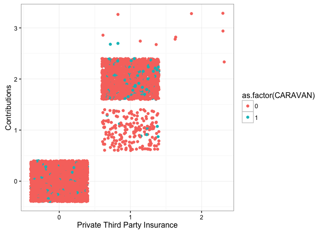

# CapstoneProject
Vivek Appadurai  
February 20, 2016  

## Loading Libraries


```r
library(dplyr)
library(ggplot2)
library(scales)
library(reshape2)
library(knitr)
library(gridExtra)
library(ROCR)
library(e1071)
library(brglm)
library(logistf)
```

## Reading Data


```r
variableInfo <- read.table("Names.txt", 
                           header = T, 
                           sep = "\t", 
                           fill = NA, 
                           quote = "",
                           stringsAsFactors = FALSE)
L0 <- read.table("L0.txt", header = T, sep = "\t", fill = NA, quote = "")
L1 <- read.table("L1.txt", header = F, sep = "\t", fill = NA, quote = "")
L2 <- read.table("L2.txt", header = F, sep = "\t", fill = NA, quote = "")
L3 <- read.table("L3.txt", header = F, sep = "\t", fill = NA, quote = "")
L4 <- read.table("L4.txt", header = F, sep = "\t", fill = NA, quote = "")
ticDataTraining <- read.table("ticdata2000.txt", 
                              header = F, 
                              sep = "\t", 
                              fill = NA, 
                              quote = "", 
                              stringsAsFactors = FALSE)
ticDataTest <- read.table("ticeval2000.txt", 
                          header = F, 
                          sep = "\t", 
                          fill = NA, 
                          quote = "",
                          stringsAsFactors = FALSE)
targets <- read.table("tictgts2000.txt",
                              header = F,
                              stringsAsFactors = FALSE)
```

## Data Cleaning


```r
colNames <- variableInfo %>% select(Name) %>% unlist()
names(ticDataTraining) <- colNames
ticDataTraining$Set <- "Training"
ticDataTest$CARAVAN <- targets$V1
names(ticDataTest) <- colNames
ticDataTest$Set <- "Test"
ticData <- rbind(ticDataTraining, ticDataTest)
ticData <- left_join(ticData, L0, by = c("MOSTYPE"= "Value"))
ticData <- ticData %>% rename(MOSTYPE2 = Label)
names(L2) <- c("MOSHOOFD","MOSHOOFD2")
ticData <- left_join(ticData, L2)
```

```
## Joining by: "MOSHOOFD"
```

```r
ticDataTraining <- ticData %>% filter(Set == "Training")
ticDataTraining <- ticDataTraining %>% mutate(totalCaravanPolicies = sum(CARAVAN))
```

## Exploratory Data Analysis

Since the number of caravan policy holders within the training data is very low (348/5822 or apprxomiately 6%), 
its best to explore the assocaitions within the data by looking at the fraction of policy holders at each value 
for the varaibles along with the proportion of population at that particular value


#### Plotting Using Grid Arrange


```r
grid.arrange(plotHomesOwned, plotHouseHoldSize, PlotAvgAge, plotRomanCatholics, plotProtestants, plotOtherReligion,
             plotNoReligion, plotMarried, plotLivingTogether, plotOtherRelation, plotSingles, plotHouseholdNoChild,
             plotHouseholdWithChild, plotHouseholdHighEd, plotHouseholdMidEd, plotHouseholdLowEd, plotHighStatus,
             plotEntrepreneur, plotFarmer, plotMidManagement, plotSkilledLabor, plotUnskilledLabor, plotSocialA,
             plotSocialB1, plotSocialB2, plotSocialC, plotSocialD, plotRentHouse, plotOwnHome, plotOneCar, 
             plotTwoCars, plotNoCar, plotNHS, plotPHS, plotIncome30k, plotIncome30_45k, plotIncome45_75k, 
             plotIncome75k_122k, plotIncome123k, plotAvgIncome, plotPurchasingPower, plotNumThirdPartyIns,
             plotNumThirdPartyInsCont, plotNumThirdPartyInsFirm, plotNumThirdPartyInsFirmCont, plotNumThirdPartyInsAgri,
             plotNumThirdPartyInsAgriCont, plotCarPolicy, plotCarPolicyCont, plotVanPolicy, plotVanPolicyCont,
             plotScooterPolicy, plotScooterPolicyCont, plotLorryPolicy, plotLorryPolicyCont, plotTrailerPolicy,
             plotTrailerPolicyCont, plotTractorPolicy, plotTractorPolicyCont, plotAgriMachinePolicy,
             plotAgriMachinePolicyCont, plotMopedPolicy, plotMopedPolicyCont, plotLifePolicy, plotLifePolicyCont,
             plotPvtAccidentPolicy, plotPvtAccidentPolicyCont, plotFamAccidentPolicy, plotFamAccidentPolicyCont,
             plotDisabilityPolicy, plotDisabilityPolicyCont, plotFirePolicy, plotFirePolicyCont, plotSurfPolicy,
             plotSurfPolicyCont, plotBoatPolicy, plotBoatPolicyCont, plotBicyclePolicy, plotBicyclePolicyCont,
             plotPropertyPolicy, plotPropertyPolicyCont, plotSocialPolicy, plotSocialPolicyCont, ncol = 2)
```


#### Observations:

From the plots the following conditions imply a higher proportion of caravan policy owners than expected:

1. Zipcodes with a less number of low level educated people
2. Zipcodes with very high status people
3. Zipcodes with NO FARMERS
4. Zipcodes with low number of laborers (skilled & unskilled)
5. Zipcodes with low number of people belonging to social classes C & D
6. Zipcodes having a very high number of Home Owners
7. Zipcodes with low or no rented homes
8. Zipcodes having a high car ownership
9. Zipcodes having little to no population with income < 30k
10. Zipcodes with average income households
11. Zipcodes with high purchasing power >= 6
12. Individuals that have a private third party insurance
13. Individuals with high contributions to third party insurance
14. Individuals with one or more car policy
15. Individuals with high contributions to their car policies
16. Individuals with Fire Insurance Policy
17. Individuals making high contributions to fire insurance policies

The above factors are worth further investigation to draw more concrete trends


```r
ggplot(ticDataTraining, aes(x = APERSAUT, y = PPERSAUT, color = as.factor(CARAVAN))) +
    geom_jitter() + 
    xlab("Num. Car Policies") +
    ylab("Contributions") +
    theme_bw() +
    scale_x_continuous(breaks =seq(0, max(ticData$APERSAUT), 1))
```


The plot indicates that people who have a car policy tend to contribute significantly towards it.


```r
ggplot(ticDataTraining, aes(x = AWAPART, y = PWAPART, color = as.factor(CARAVAN))) +
    geom_jitter() + 
    xlab("Private Third Party Insurance") +
    ylab("Contributions") +
    theme_bw() +
    scale_x_continuous(breaks =seq(0, max(ticData$AWAPART), 1))
```




```r
ggplot(ticDataTraining, aes(x = ABRAND, y = PBRAND, color = as.factor(CARAVAN))) +
    geom_jitter() + 
    xlab("Num. Fire Policies") +
    ylab("Contributions") +
    theme_bw() +
    scale_x_continuous(breaks =seq(0, max(ticData$ABRAND), 1))
```


### Building a Logistic Regression Model


```r
ticDataTraining$CARAVAN <- as.factor(ticDataTraining$CARAVAN)
ticDataTest$CARAVAN <- as.factor(ticDataTest$CARAVAN)

ticDataLogitModel <- glm(data = ticDataTraining, CARAVAN ~ 
                             (APERSAUT == 1 & PPERSAUT > 5) +
#                             APERSAUT +
                             PPERSAUT +
#                             ABRAND +
                             PBRAND +
#                             AWAPART +
                             PWAPART +
                             (MKOOPKLA > 5) +
                             MOPLLAAG +
#                             MHKOOP +
#                             MHHUUR +
#                             MINKM30 +
#                             MAUT0 +
                             MRELGE +
#                             MBERARBO +
#                             MFALLEEN +
                             MAUT1,
                         family = binomial)

summary(ticDataLogitModel)
```

```
## 
## Call:
## glm(formula = CARAVAN ~ (APERSAUT == 1 & PPERSAUT > 5) + PPERSAUT + 
##     PBRAND + PWAPART + (MKOOPKLA > 5) + MOPLLAAG + MRELGE + MAUT1, 
##     family = binomial, data = ticDataTraining)
## 
## Deviance Residuals: 
##     Min       1Q   Median       3Q      Max  
## -0.9204  -0.3873  -0.2661  -0.1856   3.1332  
## 
## Coefficients:
##                                  Estimate Std. Error z value Pr(>|z|)    
## (Intercept)                      -4.82967    0.35113 -13.754  < 2e-16 ***
## APERSAUT == 1 & PPERSAUT > 5TRUE  0.42744    0.17051   2.507  0.01218 *  
## PPERSAUT                          0.16864    0.03395   4.967 6.79e-07 ***
## PBRAND                            0.11181    0.03539   3.159  0.00158 ** 
## PWAPART                           0.17379    0.06806   2.554  0.01066 *  
## MKOOPKLA > 5TRUE                  0.31412    0.13492   2.328  0.01990 *  
## MOPLLAAG                         -0.11205    0.02873  -3.900 9.63e-05 ***
## MRELGE                            0.09949    0.03554   2.799  0.00512 ** 
## MAUT1                             0.08292    0.04154   1.996  0.04591 *  
## ---
## Signif. codes:  0 '***' 0.001 '**' 0.01 '*' 0.05 '.' 0.1 ' ' 1
## 
## (Dispersion parameter for binomial family taken to be 1)
## 
##     Null deviance: 2635.5  on 5821  degrees of freedom
## Residual deviance: 2369.7  on 5813  degrees of freedom
## AIC: 2387.7
## 
## Number of Fisher Scoring iterations: 6
```

```r
anova(ticDataLogitModel, test="Chisq")
```

```
## Analysis of Deviance Table
## 
## Model: binomial, link: logit
## 
## Response: CARAVAN
## 
## Terms added sequentially (first to last)
## 
## 
##                              Df Deviance Resid. Df Resid. Dev  Pr(>Chi)
## NULL                                          5821     2635.5          
## APERSAUT == 1 & PPERSAUT > 5  1  120.075      5820     2515.5 < 2.2e-16
## PPERSAUT                      1   28.775      5819     2486.7 8.130e-08
## PBRAND                        1   34.821      5818     2451.9 3.615e-09
## PWAPART                       1    8.368      5817     2443.5 0.0038183
## MKOOPKLA > 5                  1   37.920      5816     2405.6 7.371e-10
## MOPLLAAG                      1   17.650      5815     2387.9 2.655e-05
## MRELGE                        1   14.212      5814     2373.7 0.0001633
## MAUT1                         1    4.007      5813     2369.7 0.0453064
##                                 
## NULL                            
## APERSAUT == 1 & PPERSAUT > 5 ***
## PPERSAUT                     ***
## PBRAND                       ***
## PWAPART                      ** 
## MKOOPKLA > 5                 ***
## MOPLLAAG                     ***
## MRELGE                       ***
## MAUT1                        *  
## ---
## Signif. codes:  0 '***' 0.001 '**' 0.01 '*' 0.05 '.' 0.1 ' ' 1
```

```r
ticDataTrainingPrediction <- predict(ticDataLogitModel, type = "response")
summary(ticDataTrainingPrediction)
```

```
##     Min.  1st Qu.   Median     Mean  3rd Qu.     Max. 
## 0.003632 0.020060 0.039580 0.059770 0.081620 0.345300
```

```r
table(ticDataTraining$CARAVAN, ticDataTrainingPrediction > 0.14)
```

```
##    
##     FALSE TRUE
##   0  5043  431
##   1   234  114
```

```r
tapply(ticDataTrainingPrediction, ticDataTraining$CARAVAN, mean)
```

```
##          0          1 
## 0.05644395 0.11214319
```

```r
ticDataTraining$Prediction <- ticDataTrainingPrediction

ticDataTestPrediction <- predict(ticDataLogitModel, newdata = ticDataTest, type= "response")
table(ticDataTest$CARAVAN, ticDataTestPrediction > 0.11)
```

```
##    
##     FALSE TRUE
##   0  3258  504
##   1   140   98
```

```r
tapply(ticDataTestPrediction, ticDataTest$CARAVAN, mean)
```

```
##          0          1 
## 0.05660694 0.10534733
```

```r
ggplot(ticDataTraining, aes(x = CARAVAN, y = Prediction, fill = CARAVAN)) +
    geom_boxplot() +
    scale_y_continuous(breaks = seq(0,1,0.05)) +
    theme_bw()
```


