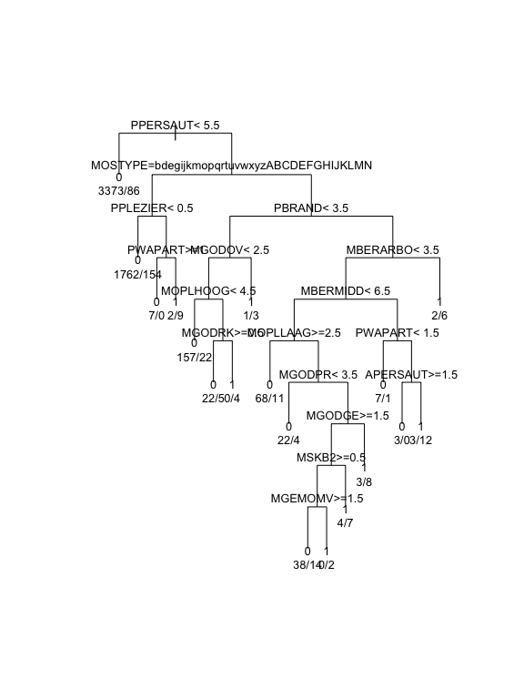

# CapstoneProject
Vivek Appadurai  
February 20, 2016  

## Loading Libraries


```r
library(dplyr)
library(ggplot2)
library(knitr)
library(gridExtra)
library(pROC)
library(leaps)
library(MASS)
library(e1071)
library(mlbench)
library(caret)
library(randomForest)
library(C50)
```

## Reading Data


```r
variableInfo <- read.table("Names.txt", 
                           header = T, 
                           sep = "\t", 
                           fill = NA, 
                           quote = "",
                           stringsAsFactors = FALSE)
L0 <- read.table("L0.txt", header = T, sep = "\t", fill = NA, quote = "")
L1 <- read.table("L1.txt", header = F, sep = "\t", fill = NA, quote = "")
L2 <- read.table("L2.txt", header = F, sep = "\t", fill = NA, quote = "")
L3 <- read.table("L3.txt", header = F, sep = "\t", fill = NA, quote = "")
L4 <- read.table("L4.txt", header = F, sep = "\t", fill = NA, quote = "")
ticDataTraining <- read.table("ticdata2000.txt", 
                              header = F, 
                              sep = "\t", 
                              fill = NA, 
                              quote = "", 
                              stringsAsFactors = FALSE)
ticDataTest <- read.table("ticeval2000.txt", 
                          header = F, 
                          sep = "\t", 
                          fill = NA, 
                          quote = "",
                          stringsAsFactors = FALSE)
targets <- read.table("tictgts2000.txt",
                              header = F,
                              stringsAsFactors = FALSE)
```

## Data Cleaning


```r
colNames <- as.vector(variableInfo$Name)
names(ticDataTraining) <- colNames
ticDataTraining$Set <- "Training"
ticDataTest <- cbind(ticDataTest, targets)
names(ticDataTest) <- colNames
ticDataTest$Set <- "Test"
ticData <- rbind(ticDataTraining, ticDataTest)
ticData <- left_join(ticData, L0, by = c("MOSTYPE"= "Value"))
ticData <- ticData %>% rename(MOSTYPE2 = Label)
names(L2) <- c("MOSHOOFD","MOSHOOFD2")
ticData <- left_join(ticData, L2)
```

```
## Joining by: "MOSHOOFD"
```

```r
ticDataTraining <- ticData %>% filter(Set == "Training")
ticDataTraining <- ticDataTraining %>% mutate(totalCaravanPolicies = sum(CARAVAN))
```

## Exploratory Data Analysis

Since the number of caravan policy holders within the training data is very low (348/5822 or apprxomiately 6%), 
its best to explore the assocaitions within the data by looking at the fraction of policy holders at each value 
for the varaibles along with the proportion of population at that particular value


#### Plotting Using Grid Arrange


```r
grid.arrange(plotHomesOwned, plotHouseHoldSize, PlotAvgAge, plotRomanCatholics, plotProtestants, plotOtherReligion,
             plotNoReligion, plotMarried, plotLivingTogether, plotOtherRelation, plotSingles, plotHouseholdNoChild,
             plotHouseholdWithChild, plotHouseholdHighEd, plotHouseholdMidEd, plotHouseholdLowEd, plotHighStatus,
             plotEntrepreneur, plotFarmer, plotMidManagement, plotSkilledLabor, plotUnskilledLabor, plotSocialA,
             plotSocialB1, plotSocialB2, plotSocialC, plotSocialD, plotRentHouse, plotOwnHome, plotOneCar, 
             plotTwoCars, plotNoCar, plotNHS, plotPHS, plotIncome30k, plotIncome30_45k, plotIncome45_75k, 
             plotIncome75k_122k, plotIncome123k, plotAvgIncome, plotPurchasingPower, plotNumThirdPartyIns,
             plotNumThirdPartyInsCont, plotNumThirdPartyInsFirm, plotNumThirdPartyInsFirmCont, plotNumThirdPartyInsAgri,
             plotNumThirdPartyInsAgriCont, plotCarPolicy, plotCarPolicyCont, plotVanPolicy, plotVanPolicyCont,
             plotScooterPolicy, plotScooterPolicyCont, plotLorryPolicy, plotLorryPolicyCont, plotTrailerPolicy,
             plotTrailerPolicyCont, plotTractorPolicy, plotTractorPolicyCont, plotAgriMachinePolicy,
             plotAgriMachinePolicyCont, plotMopedPolicy, plotMopedPolicyCont, plotLifePolicy, plotLifePolicyCont,
             plotPvtAccidentPolicy, plotPvtAccidentPolicyCont, plotFamAccidentPolicy, plotFamAccidentPolicyCont,
             plotDisabilityPolicy, plotDisabilityPolicyCont, plotFirePolicy, plotFirePolicyCont, plotSurfPolicy,
             plotSurfPolicyCont, plotBoatPolicy, plotBoatPolicyCont, plotBicyclePolicy, plotBicyclePolicyCont,
             plotPropertyPolicy, plotPropertyPolicyCont, plotSocialPolicy, plotSocialPolicyCont, ncol = 2)
```

#### Observations:

From the plots the following conditions imply a higher proportion of caravan policy owners than expected:

1. Zipcodes with a less number of low level educated people
2. Zipcodes with very high status people
3. Zipcodes with NO FARMERS
4. Zipcodes with low number of laborers (skilled & unskilled)
5. Zipcodes with low number of people belonging to social classes C & D
6. Zipcodes having a very high number of Home Owners
7. Zipcodes with low or no rented homes
8. Zipcodes having a high car ownership
9. Zipcodes having little to no population with income < 30k
10. Zipcodes with average income households
11. Zipcodes with high purchasing power >= 6
12. Individuals that have a private third party insurance
13. Individuals with high contributions to third party insurance
14. Individuals with one or more car policy
15. Individuals with high contributions to their car policies
16. Individuals with Fire Insurance Policy
17. Individuals making high contributions to fire insurance policies

The above factors are worth further investigation to draw more concrete trends


```r
ggplot(ticDataTraining, aes(x = APERSAUT, y = PPERSAUT, color = as.factor(CARAVAN))) +
    geom_jitter() + 
    xlab("Num. Car Policies") +
    ylab("Contributions") +
    theme_bw() +
    scale_x_continuous(breaks =seq(0, max(ticData$APERSAUT), 1))
```


The plot indicates that people who have a car policy tend to contribute significantly towards it.


```r
ggplot(ticDataTraining, aes(x = AWAPART, y = PWAPART, color = as.factor(CARAVAN))) +
    geom_jitter() + 
    xlab("Private Third Party Insurance") +
    ylab("Contributions") +
    theme_bw() +
    scale_x_continuous(breaks =seq(0, max(ticData$AWAPART), 1))
```


```r
ggplot(ticDataTraining, aes(x = ABRAND, y = PBRAND, color = as.factor(CARAVAN))) +
    geom_jitter() + 
    xlab("Num. Fire Policies") +
    ylab("Contributions") +
    theme_bw() +
    scale_x_continuous(breaks =seq(0, max(ticData$ABRAND), 1))
```


### Automatic Variable Selection, Forward and Backward


```r
ticDataTraining$CARAVAN <- as.factor(ticDataTraining$CARAVAN)
ticDataTest$CARAVAN <- as.factor(ticDataTest$CARAVAN)
ticDataTraining <- ticDataTraining[,1:86]
str(ticDataTraining)
```

```
## Classes 'tbl_df' and 'data.frame':	5822 obs. of  86 variables:
##  $ MOSTYPE : int  33 37 37 9 40 23 39 33 33 11 ...
##  $ MAANTHUI: int  1 1 1 1 1 1 2 1 1 2 ...
##  $ MGEMOMV : int  3 2 2 3 4 2 3 2 2 3 ...
##  $ MGEMLEEF: int  2 2 2 3 2 1 2 3 4 3 ...
##  $ MOSHOOFD: int  8 8 8 3 10 5 9 8 8 3 ...
##  $ MGODRK  : int  0 1 0 2 1 0 2 0 0 3 ...
##  $ MGODPR  : int  5 4 4 3 4 5 2 7 1 5 ...
##  $ MGODOV  : int  1 1 2 2 1 0 0 0 3 0 ...
##  $ MGODGE  : int  3 4 4 4 4 5 5 2 6 2 ...
##  $ MRELGE  : int  7 6 3 5 7 0 7 7 6 7 ...
##  $ MRELSA  : int  0 2 2 2 1 6 2 2 0 0 ...
##  $ MRELOV  : int  2 2 4 2 2 3 0 0 3 2 ...
##  $ MFALLEEN: int  1 0 4 2 2 3 0 0 3 2 ...
##  $ MFGEKIND: int  2 4 4 3 4 5 3 5 3 2 ...
##  $ MFWEKIND: int  6 5 2 4 4 2 6 4 3 6 ...
##  $ MOPLHOOG: int  1 0 0 3 5 0 0 0 0 0 ...
##  $ MOPLMIDD: int  2 5 5 4 4 5 4 3 1 4 ...
##  $ MOPLLAAG: int  7 4 4 2 0 4 5 6 8 5 ...
##  $ MBERHOOG: int  1 0 0 4 0 2 0 2 1 2 ...
##  $ MBERZELF: int  0 0 0 0 5 0 0 0 1 0 ...
##  $ MBERBOER: int  1 0 0 0 4 0 0 0 0 0 ...
##  $ MBERMIDD: int  2 5 7 3 0 4 4 2 1 3 ...
##  $ MBERARBG: int  5 0 0 1 0 2 1 5 8 3 ...
##  $ MBERARBO: int  2 4 2 2 0 2 5 2 1 3 ...
##  $ MSKA    : int  1 0 0 3 9 2 0 2 1 1 ...
##  $ MSKB1   : int  1 2 5 2 0 2 1 1 1 2 ...
##  $ MSKB2   : int  2 3 0 1 0 2 4 2 0 1 ...
##  $ MSKC    : int  6 5 4 4 0 4 5 5 8 4 ...
##  $ MSKD    : int  1 0 0 0 0 2 0 2 1 2 ...
##  $ MHHUUR  : int  1 2 7 5 4 9 6 0 9 0 ...
##  $ MHKOOP  : int  8 7 2 4 5 0 3 9 0 9 ...
##  $ MAUT1   : int  8 7 7 9 6 5 8 4 5 6 ...
##  $ MAUT2   : int  0 1 0 0 2 3 0 4 2 1 ...
##  $ MAUT0   : int  1 2 2 0 1 3 1 2 3 2 ...
##  $ MZFONDS : int  8 6 9 7 5 9 9 6 7 6 ...
##  $ MZPART  : int  1 3 0 2 4 0 0 3 2 3 ...
##  $ MINKM30 : int  0 2 4 1 0 5 4 2 7 2 ...
##  $ MINK3045: int  4 0 5 5 0 2 3 5 2 3 ...
##  $ MINK4575: int  5 5 0 3 9 3 3 3 1 3 ...
##  $ MINK7512: int  0 2 0 0 0 0 0 0 0 1 ...
##  $ MINK123M: int  0 0 0 0 0 0 0 0 0 0 ...
##  $ MINKGEM : int  4 5 3 4 6 3 3 3 2 4 ...
##  $ MKOOPKLA: int  3 4 4 4 3 3 5 3 3 7 ...
##  $ PWAPART : int  0 2 2 0 0 0 0 0 0 2 ...
##  $ PWABEDR : int  0 0 0 0 0 0 0 0 0 0 ...
##  $ PWALAND : int  0 0 0 0 0 0 0 0 0 0 ...
##  $ PPERSAUT: int  6 0 6 6 0 6 6 0 5 0 ...
##  $ PBESAUT : int  0 0 0 0 0 0 0 0 0 0 ...
##  $ PMOTSCO : int  0 0 0 0 0 0 0 0 0 0 ...
##  $ PVRAAUT : int  0 0 0 0 0 0 0 0 0 0 ...
##  $ PAANHANG: int  0 0 0 0 0 0 0 0 0 0 ...
##  $ PTRACTOR: int  0 0 0 0 0 0 0 0 0 0 ...
##  $ PWERKT  : int  0 0 0 0 0 0 0 0 0 0 ...
##  $ PBROM   : int  0 0 0 0 0 0 0 3 0 0 ...
##  $ PLEVEN  : int  0 0 0 0 0 0 0 0 0 0 ...
##  $ PPERSONG: int  0 0 0 0 0 0 0 0 0 0 ...
##  $ PGEZONG : int  0 0 0 0 0 0 0 0 0 0 ...
##  $ PWAOREG : int  0 0 0 0 0 0 0 0 0 0 ...
##  $ PBRAND  : int  5 2 2 2 6 0 0 0 0 3 ...
##  $ PZEILPL : int  0 0 0 0 0 0 0 0 0 0 ...
##  $ PPLEZIER: int  0 0 0 0 0 0 0 0 0 0 ...
##  $ PFIETS  : int  0 0 0 0 0 0 0 0 0 0 ...
##  $ PINBOED : int  0 0 0 0 0 0 0 0 0 0 ...
##  $ PBYSTAND: int  0 0 0 0 0 0 0 0 0 0 ...
##  $ AWAPART : int  0 2 1 0 0 0 0 0 0 1 ...
##  $ AWABEDR : int  0 0 0 0 0 0 0 0 0 0 ...
##  $ AWALAND : int  0 0 0 0 0 0 0 0 0 0 ...
##  $ APERSAUT: int  1 0 1 1 0 1 1 0 1 0 ...
##  $ ABESAUT : int  0 0 0 0 0 0 0 0 0 0 ...
##  $ AMOTSCO : int  0 0 0 0 0 0 0 0 0 0 ...
##  $ AVRAAUT : int  0 0 0 0 0 0 0 0 0 0 ...
##  $ AAANHANG: int  0 0 0 0 0 0 0 0 0 0 ...
##  $ ATRACTOR: int  0 0 0 0 0 0 0 0 0 0 ...
##  $ AWERKT  : int  0 0 0 0 0 0 0 0 0 0 ...
##  $ ABROM   : int  0 0 0 0 0 0 0 1 0 0 ...
##  $ ALEVEN  : int  0 0 0 0 0 0 0 0 0 0 ...
##  $ APERSONG: int  0 0 0 0 0 0 0 0 0 0 ...
##  $ AGEZONG : int  0 0 0 0 0 0 0 0 0 0 ...
##  $ AWAOREG : int  0 0 0 0 0 0 0 0 0 0 ...
##  $ ABRAND  : int  1 1 1 1 1 0 0 0 0 1 ...
##  $ AZEILPL : int  0 0 0 0 0 0 0 0 0 0 ...
##  $ APLEZIER: int  0 0 0 0 0 0 0 0 0 0 ...
##  $ AFIETS  : int  0 0 0 0 0 0 0 0 0 0 ...
##  $ AINBOED : int  0 0 0 0 0 0 0 0 0 0 ...
##  $ ABYSTAND: int  0 0 0 0 0 0 0 0 0 0 ...
##  $ CARAVAN : Factor w/ 2 levels "0","1": 1 1 1 1 1 1 1 1 1 1 ...
```

```r
reg_Backward <- regsubsets(CARAVAN ~., data = ticDataTraining, method = "backward")
summary(reg_Backward)
```

```
## Subset selection object
## Call: regsubsets.formula(CARAVAN ~ ., data = ticDataTraining, method = "backward")
## 85 Variables  (and intercept)
##          Forced in Forced out
## MOSTYPE      FALSE      FALSE
## MAANTHUI     FALSE      FALSE
## MGEMOMV      FALSE      FALSE
## MGEMLEEF     FALSE      FALSE
## MOSHOOFD     FALSE      FALSE
## MGODRK       FALSE      FALSE
## MGODPR       FALSE      FALSE
## MGODOV       FALSE      FALSE
## MGODGE       FALSE      FALSE
## MRELGE       FALSE      FALSE
## MRELSA       FALSE      FALSE
## MRELOV       FALSE      FALSE
## MFALLEEN     FALSE      FALSE
## MFGEKIND     FALSE      FALSE
## MFWEKIND     FALSE      FALSE
## MOPLHOOG     FALSE      FALSE
## MOPLMIDD     FALSE      FALSE
## MOPLLAAG     FALSE      FALSE
## MBERHOOG     FALSE      FALSE
## MBERZELF     FALSE      FALSE
## MBERBOER     FALSE      FALSE
## MBERMIDD     FALSE      FALSE
## MBERARBG     FALSE      FALSE
## MBERARBO     FALSE      FALSE
## MSKA         FALSE      FALSE
## MSKB1        FALSE      FALSE
## MSKB2        FALSE      FALSE
## MSKC         FALSE      FALSE
## MSKD         FALSE      FALSE
## MHHUUR       FALSE      FALSE
## MHKOOP       FALSE      FALSE
## MAUT1        FALSE      FALSE
## MAUT2        FALSE      FALSE
## MAUT0        FALSE      FALSE
## MZFONDS      FALSE      FALSE
## MZPART       FALSE      FALSE
## MINKM30      FALSE      FALSE
## MINK3045     FALSE      FALSE
## MINK4575     FALSE      FALSE
## MINK7512     FALSE      FALSE
## MINK123M     FALSE      FALSE
## MINKGEM      FALSE      FALSE
## MKOOPKLA     FALSE      FALSE
## PWAPART      FALSE      FALSE
## PWABEDR      FALSE      FALSE
## PWALAND      FALSE      FALSE
## PPERSAUT     FALSE      FALSE
## PBESAUT      FALSE      FALSE
## PMOTSCO      FALSE      FALSE
## PVRAAUT      FALSE      FALSE
## PAANHANG     FALSE      FALSE
## PTRACTOR     FALSE      FALSE
## PWERKT       FALSE      FALSE
## PBROM        FALSE      FALSE
## PLEVEN       FALSE      FALSE
## PPERSONG     FALSE      FALSE
## PGEZONG      FALSE      FALSE
## PWAOREG      FALSE      FALSE
## PBRAND       FALSE      FALSE
## PZEILPL      FALSE      FALSE
## PPLEZIER     FALSE      FALSE
## PFIETS       FALSE      FALSE
## PINBOED      FALSE      FALSE
## PBYSTAND     FALSE      FALSE
## AWAPART      FALSE      FALSE
## AWABEDR      FALSE      FALSE
## AWALAND      FALSE      FALSE
## APERSAUT     FALSE      FALSE
## ABESAUT      FALSE      FALSE
## AMOTSCO      FALSE      FALSE
## AVRAAUT      FALSE      FALSE
## AAANHANG     FALSE      FALSE
## ATRACTOR     FALSE      FALSE
## AWERKT       FALSE      FALSE
## ABROM        FALSE      FALSE
## ALEVEN       FALSE      FALSE
## APERSONG     FALSE      FALSE
## AGEZONG      FALSE      FALSE
## AWAOREG      FALSE      FALSE
## ABRAND       FALSE      FALSE
## AZEILPL      FALSE      FALSE
## APLEZIER     FALSE      FALSE
## AFIETS       FALSE      FALSE
## AINBOED      FALSE      FALSE
## ABYSTAND     FALSE      FALSE
## 1 subsets of each size up to 8
## Selection Algorithm: backward
##          MOSTYPE MAANTHUI MGEMOMV MGEMLEEF MOSHOOFD MGODRK MGODPR MGODOV
## 1  ( 1 ) " "     " "      " "     " "      " "      " "    " "    " "   
## 2  ( 1 ) " "     " "      " "     " "      " "      " "    " "    " "   
## 3  ( 1 ) " "     " "      " "     " "      " "      " "    " "    " "   
## 4  ( 1 ) " "     " "      " "     " "      " "      " "    " "    " "   
## 5  ( 1 ) " "     " "      " "     " "      " "      " "    " "    " "   
## 6  ( 1 ) " "     " "      " "     " "      " "      " "    " "    " "   
## 7  ( 1 ) " "     " "      " "     " "      " "      " "    " "    " "   
## 8  ( 1 ) " "     " "      " "     " "      " "      " "    " "    " "   
##          MGODGE MRELGE MRELSA MRELOV MFALLEEN MFGEKIND MFWEKIND MOPLHOOG
## 1  ( 1 ) " "    " "    " "    " "    " "      " "      " "      " "     
## 2  ( 1 ) " "    " "    " "    " "    " "      " "      " "      " "     
## 3  ( 1 ) " "    " "    " "    " "    " "      " "      " "      " "     
## 4  ( 1 ) " "    " "    " "    " "    " "      " "      " "      " "     
## 5  ( 1 ) " "    "*"    " "    " "    " "      " "      " "      " "     
## 6  ( 1 ) " "    "*"    " "    " "    " "      " "      " "      " "     
## 7  ( 1 ) " "    "*"    " "    " "    " "      " "      " "      " "     
## 8  ( 1 ) " "    "*"    " "    " "    " "      " "      " "      " "     
##          MOPLMIDD MOPLLAAG MBERHOOG MBERZELF MBERBOER MBERMIDD MBERARBG
## 1  ( 1 ) " "      " "      " "      " "      " "      " "      " "     
## 2  ( 1 ) " "      " "      " "      " "      " "      " "      " "     
## 3  ( 1 ) " "      "*"      " "      " "      " "      " "      " "     
## 4  ( 1 ) " "      "*"      " "      " "      " "      " "      " "     
## 5  ( 1 ) " "      "*"      " "      " "      " "      " "      " "     
## 6  ( 1 ) " "      "*"      " "      " "      " "      " "      " "     
## 7  ( 1 ) " "      "*"      " "      " "      " "      " "      " "     
## 8  ( 1 ) " "      "*"      " "      " "      "*"      " "      " "     
##          MBERARBO MSKA MSKB1 MSKB2 MSKC MSKD MHHUUR MHKOOP MAUT1 MAUT2
## 1  ( 1 ) " "      " "  " "   " "   " "  " "  " "    " "    " "   " "  
## 2  ( 1 ) " "      " "  " "   " "   " "  " "  " "    " "    " "   " "  
## 3  ( 1 ) " "      " "  " "   " "   " "  " "  " "    " "    " "   " "  
## 4  ( 1 ) " "      " "  " "   " "   " "  " "  " "    " "    " "   " "  
## 5  ( 1 ) " "      " "  " "   " "   " "  " "  " "    " "    " "   " "  
## 6  ( 1 ) " "      " "  " "   " "   " "  " "  " "    " "    " "   " "  
## 7  ( 1 ) " "      " "  " "   " "   " "  " "  " "    " "    " "   " "  
## 8  ( 1 ) " "      " "  " "   " "   " "  " "  " "    " "    " "   " "  
##          MAUT0 MZFONDS MZPART MINKM30 MINK3045 MINK4575 MINK7512 MINK123M
## 1  ( 1 ) " "   " "     " "    " "     " "      " "      " "      " "     
## 2  ( 1 ) " "   " "     " "    " "     " "      " "      " "      " "     
## 3  ( 1 ) " "   " "     " "    " "     " "      " "      " "      " "     
## 4  ( 1 ) " "   " "     " "    " "     " "      " "      " "      " "     
## 5  ( 1 ) " "   " "     " "    " "     " "      " "      " "      " "     
## 6  ( 1 ) " "   " "     " "    " "     " "      " "      " "      " "     
## 7  ( 1 ) " "   " "     " "    " "     " "      " "      " "      " "     
## 8  ( 1 ) " "   " "     " "    " "     " "      " "      " "      " "     
##          MINKGEM MKOOPKLA PWAPART PWABEDR PWALAND PPERSAUT PBESAUT PMOTSCO
## 1  ( 1 ) " "     " "      " "     " "     " "     "*"      " "     " "    
## 2  ( 1 ) " "     " "      " "     " "     " "     "*"      " "     " "    
## 3  ( 1 ) " "     " "      " "     " "     " "     "*"      " "     " "    
## 4  ( 1 ) " "     " "      " "     " "     " "     "*"      " "     " "    
## 5  ( 1 ) " "     " "      " "     " "     " "     "*"      " "     " "    
## 6  ( 1 ) " "     " "      " "     " "     "*"     "*"      " "     " "    
## 7  ( 1 ) " "     " "      " "     " "     "*"     "*"      " "     " "    
## 8  ( 1 ) " "     " "      " "     " "     "*"     "*"      " "     " "    
##          PVRAAUT PAANHANG PTRACTOR PWERKT PBROM PLEVEN PPERSONG PGEZONG
## 1  ( 1 ) " "     " "      " "      " "    " "   " "    " "      " "    
## 2  ( 1 ) " "     " "      " "      " "    " "   " "    " "      " "    
## 3  ( 1 ) " "     " "      " "      " "    " "   " "    " "      " "    
## 4  ( 1 ) " "     " "      " "      " "    " "   " "    " "      " "    
## 5  ( 1 ) " "     " "      " "      " "    " "   " "    " "      " "    
## 6  ( 1 ) " "     " "      " "      " "    " "   " "    " "      " "    
## 7  ( 1 ) " "     " "      " "      " "    " "   " "    " "      " "    
## 8  ( 1 ) " "     " "      " "      " "    " "   " "    " "      " "    
##          PWAOREG PBRAND PZEILPL PPLEZIER PFIETS PINBOED PBYSTAND AWAPART
## 1  ( 1 ) " "     " "    " "     " "      " "    " "     " "      " "    
## 2  ( 1 ) " "     " "    " "     " "      " "    " "     " "      " "    
## 3  ( 1 ) " "     " "    " "     " "      " "    " "     " "      " "    
## 4  ( 1 ) " "     "*"    " "     " "      " "    " "     " "      " "    
## 5  ( 1 ) " "     "*"    " "     " "      " "    " "     " "      " "    
## 6  ( 1 ) " "     "*"    " "     " "      " "    " "     " "      " "    
## 7  ( 1 ) " "     "*"    " "     " "      " "    " "     " "      " "    
## 8  ( 1 ) " "     "*"    " "     " "      " "    " "     " "      " "    
##          AWABEDR AWALAND APERSAUT ABESAUT AMOTSCO AVRAAUT AAANHANG
## 1  ( 1 ) " "     " "     " "      " "     " "     " "     " "     
## 2  ( 1 ) " "     " "     " "      " "     " "     " "     " "     
## 3  ( 1 ) " "     " "     " "      " "     " "     " "     " "     
## 4  ( 1 ) " "     " "     " "      " "     " "     " "     " "     
## 5  ( 1 ) " "     " "     " "      " "     " "     " "     " "     
## 6  ( 1 ) " "     " "     " "      " "     " "     " "     " "     
## 7  ( 1 ) " "     " "     " "      " "     " "     " "     " "     
## 8  ( 1 ) " "     " "     " "      " "     " "     " "     " "     
##          ATRACTOR AWERKT ABROM ALEVEN APERSONG AGEZONG AWAOREG ABRAND
## 1  ( 1 ) " "      " "    " "   " "    " "      " "     " "     " "   
## 2  ( 1 ) " "      " "    " "   " "    " "      " "     " "     " "   
## 3  ( 1 ) " "      " "    " "   " "    " "      " "     " "     " "   
## 4  ( 1 ) " "      " "    " "   " "    " "      " "     " "     " "   
## 5  ( 1 ) " "      " "    " "   " "    " "      " "     " "     " "   
## 6  ( 1 ) " "      " "    " "   " "    " "      " "     " "     " "   
## 7  ( 1 ) " "      " "    " "   " "    " "      " "     " "     " "   
## 8  ( 1 ) " "      " "    " "   " "    " "      " "     " "     " "   
##          AZEILPL APLEZIER AFIETS AINBOED ABYSTAND
## 1  ( 1 ) " "     " "      " "    " "     " "     
## 2  ( 1 ) " "     "*"      " "    " "     " "     
## 3  ( 1 ) " "     "*"      " "    " "     " "     
## 4  ( 1 ) " "     "*"      " "    " "     " "     
## 5  ( 1 ) " "     "*"      " "    " "     " "     
## 6  ( 1 ) " "     "*"      " "    " "     " "     
## 7  ( 1 ) " "     "*"      " "    " "     "*"     
## 8  ( 1 ) " "     "*"      " "    " "     "*"
```

```r
reg_Forward <- regsubsets(CARAVAN ~., data = ticDataTraining, method = "forward")
summary(reg_Forward)
```

```
## Subset selection object
## Call: regsubsets.formula(CARAVAN ~ ., data = ticDataTraining, method = "forward")
## 85 Variables  (and intercept)
##          Forced in Forced out
## MOSTYPE      FALSE      FALSE
## MAANTHUI     FALSE      FALSE
## MGEMOMV      FALSE      FALSE
## MGEMLEEF     FALSE      FALSE
## MOSHOOFD     FALSE      FALSE
## MGODRK       FALSE      FALSE
## MGODPR       FALSE      FALSE
## MGODOV       FALSE      FALSE
## MGODGE       FALSE      FALSE
## MRELGE       FALSE      FALSE
## MRELSA       FALSE      FALSE
## MRELOV       FALSE      FALSE
## MFALLEEN     FALSE      FALSE
## MFGEKIND     FALSE      FALSE
## MFWEKIND     FALSE      FALSE
## MOPLHOOG     FALSE      FALSE
## MOPLMIDD     FALSE      FALSE
## MOPLLAAG     FALSE      FALSE
## MBERHOOG     FALSE      FALSE
## MBERZELF     FALSE      FALSE
## MBERBOER     FALSE      FALSE
## MBERMIDD     FALSE      FALSE
## MBERARBG     FALSE      FALSE
## MBERARBO     FALSE      FALSE
## MSKA         FALSE      FALSE
## MSKB1        FALSE      FALSE
## MSKB2        FALSE      FALSE
## MSKC         FALSE      FALSE
## MSKD         FALSE      FALSE
## MHHUUR       FALSE      FALSE
## MHKOOP       FALSE      FALSE
## MAUT1        FALSE      FALSE
## MAUT2        FALSE      FALSE
## MAUT0        FALSE      FALSE
## MZFONDS      FALSE      FALSE
## MZPART       FALSE      FALSE
## MINKM30      FALSE      FALSE
## MINK3045     FALSE      FALSE
## MINK4575     FALSE      FALSE
## MINK7512     FALSE      FALSE
## MINK123M     FALSE      FALSE
## MINKGEM      FALSE      FALSE
## MKOOPKLA     FALSE      FALSE
## PWAPART      FALSE      FALSE
## PWABEDR      FALSE      FALSE
## PWALAND      FALSE      FALSE
## PPERSAUT     FALSE      FALSE
## PBESAUT      FALSE      FALSE
## PMOTSCO      FALSE      FALSE
## PVRAAUT      FALSE      FALSE
## PAANHANG     FALSE      FALSE
## PTRACTOR     FALSE      FALSE
## PWERKT       FALSE      FALSE
## PBROM        FALSE      FALSE
## PLEVEN       FALSE      FALSE
## PPERSONG     FALSE      FALSE
## PGEZONG      FALSE      FALSE
## PWAOREG      FALSE      FALSE
## PBRAND       FALSE      FALSE
## PZEILPL      FALSE      FALSE
## PPLEZIER     FALSE      FALSE
## PFIETS       FALSE      FALSE
## PINBOED      FALSE      FALSE
## PBYSTAND     FALSE      FALSE
## AWAPART      FALSE      FALSE
## AWABEDR      FALSE      FALSE
## AWALAND      FALSE      FALSE
## APERSAUT     FALSE      FALSE
## ABESAUT      FALSE      FALSE
## AMOTSCO      FALSE      FALSE
## AVRAAUT      FALSE      FALSE
## AAANHANG     FALSE      FALSE
## ATRACTOR     FALSE      FALSE
## AWERKT       FALSE      FALSE
## ABROM        FALSE      FALSE
## ALEVEN       FALSE      FALSE
## APERSONG     FALSE      FALSE
## AGEZONG      FALSE      FALSE
## AWAOREG      FALSE      FALSE
## ABRAND       FALSE      FALSE
## AZEILPL      FALSE      FALSE
## APLEZIER     FALSE      FALSE
## AFIETS       FALSE      FALSE
## AINBOED      FALSE      FALSE
## ABYSTAND     FALSE      FALSE
## 1 subsets of each size up to 8
## Selection Algorithm: forward
##          MOSTYPE MAANTHUI MGEMOMV MGEMLEEF MOSHOOFD MGODRK MGODPR MGODOV
## 1  ( 1 ) " "     " "      " "     " "      " "      " "    " "    " "   
## 2  ( 1 ) " "     " "      " "     " "      " "      " "    " "    " "   
## 3  ( 1 ) " "     " "      " "     " "      " "      " "    " "    " "   
## 4  ( 1 ) " "     " "      " "     " "      " "      " "    " "    " "   
## 5  ( 1 ) " "     " "      " "     " "      " "      " "    " "    " "   
## 6  ( 1 ) " "     " "      " "     " "      " "      " "    " "    " "   
## 7  ( 1 ) " "     " "      " "     " "      " "      " "    " "    " "   
## 8  ( 1 ) " "     " "      " "     " "      " "      " "    " "    " "   
##          MGODGE MRELGE MRELSA MRELOV MFALLEEN MFGEKIND MFWEKIND MOPLHOOG
## 1  ( 1 ) " "    " "    " "    " "    " "      " "      " "      " "     
## 2  ( 1 ) " "    " "    " "    " "    " "      " "      " "      " "     
## 3  ( 1 ) " "    " "    " "    " "    " "      " "      " "      " "     
## 4  ( 1 ) " "    " "    " "    " "    " "      " "      " "      " "     
## 5  ( 1 ) " "    " "    " "    " "    " "      " "      " "      " "     
## 6  ( 1 ) " "    "*"    " "    " "    " "      " "      " "      " "     
## 7  ( 1 ) " "    "*"    " "    " "    " "      " "      " "      " "     
## 8  ( 1 ) " "    "*"    " "    " "    " "      " "      " "      " "     
##          MOPLMIDD MOPLLAAG MBERHOOG MBERZELF MBERBOER MBERMIDD MBERARBG
## 1  ( 1 ) " "      " "      " "      " "      " "      " "      " "     
## 2  ( 1 ) " "      " "      " "      " "      " "      " "      " "     
## 3  ( 1 ) " "      " "      " "      " "      " "      " "      " "     
## 4  ( 1 ) " "      " "      " "      " "      " "      " "      " "     
## 5  ( 1 ) " "      "*"      " "      " "      " "      " "      " "     
## 6  ( 1 ) " "      "*"      " "      " "      " "      " "      " "     
## 7  ( 1 ) " "      "*"      " "      " "      " "      " "      " "     
## 8  ( 1 ) " "      "*"      " "      " "      " "      " "      " "     
##          MBERARBO MSKA MSKB1 MSKB2 MSKC MSKD MHHUUR MHKOOP MAUT1 MAUT2
## 1  ( 1 ) " "      " "  " "   " "   " "  " "  " "    " "    " "   " "  
## 2  ( 1 ) " "      " "  " "   " "   " "  " "  " "    " "    " "   " "  
## 3  ( 1 ) " "      " "  " "   " "   " "  " "  " "    " "    " "   " "  
## 4  ( 1 ) " "      " "  " "   " "   " "  " "  " "    " "    " "   " "  
## 5  ( 1 ) " "      " "  " "   " "   " "  " "  " "    " "    " "   " "  
## 6  ( 1 ) " "      " "  " "   " "   " "  " "  " "    " "    " "   " "  
## 7  ( 1 ) " "      " "  " "   " "   " "  " "  " "    " "    " "   " "  
## 8  ( 1 ) " "      " "  " "   " "   " "  " "  " "    " "    " "   " "  
##          MAUT0 MZFONDS MZPART MINKM30 MINK3045 MINK4575 MINK7512 MINK123M
## 1  ( 1 ) " "   " "     " "    " "     " "      " "      " "      " "     
## 2  ( 1 ) " "   " "     " "    " "     " "      " "      " "      " "     
## 3  ( 1 ) " "   " "     " "    " "     " "      " "      " "      " "     
## 4  ( 1 ) " "   " "     " "    " "     " "      " "      " "      " "     
## 5  ( 1 ) " "   " "     " "    " "     " "      " "      " "      " "     
## 6  ( 1 ) " "   " "     " "    " "     " "      " "      " "      " "     
## 7  ( 1 ) " "   " "     " "    " "     " "      " "      " "      " "     
## 8  ( 1 ) " "   " "     " "    " "     " "      " "      " "      " "     
##          MINKGEM MKOOPKLA PWAPART PWABEDR PWALAND PPERSAUT PBESAUT PMOTSCO
## 1  ( 1 ) " "     " "      " "     " "     " "     "*"      " "     " "    
## 2  ( 1 ) " "     " "      " "     " "     " "     "*"      " "     " "    
## 3  ( 1 ) " "     "*"      " "     " "     " "     "*"      " "     " "    
## 4  ( 1 ) " "     "*"      "*"     " "     " "     "*"      " "     " "    
## 5  ( 1 ) " "     "*"      "*"     " "     " "     "*"      " "     " "    
## 6  ( 1 ) " "     "*"      "*"     " "     " "     "*"      " "     " "    
## 7  ( 1 ) " "     "*"      "*"     " "     " "     "*"      " "     " "    
## 8  ( 1 ) " "     "*"      "*"     " "     " "     "*"      " "     " "    
##          PVRAAUT PAANHANG PTRACTOR PWERKT PBROM PLEVEN PPERSONG PGEZONG
## 1  ( 1 ) " "     " "      " "      " "    " "   " "    " "      " "    
## 2  ( 1 ) " "     " "      " "      " "    " "   " "    " "      " "    
## 3  ( 1 ) " "     " "      " "      " "    " "   " "    " "      " "    
## 4  ( 1 ) " "     " "      " "      " "    " "   " "    " "      " "    
## 5  ( 1 ) " "     " "      " "      " "    " "   " "    " "      " "    
## 6  ( 1 ) " "     " "      " "      " "    " "   " "    " "      " "    
## 7  ( 1 ) " "     " "      " "      " "    " "   " "    " "      " "    
## 8  ( 1 ) " "     " "      " "      " "    " "   " "    " "      " "    
##          PWAOREG PBRAND PZEILPL PPLEZIER PFIETS PINBOED PBYSTAND AWAPART
## 1  ( 1 ) " "     " "    " "     " "      " "    " "     " "      " "    
## 2  ( 1 ) " "     " "    " "     " "      " "    " "     " "      " "    
## 3  ( 1 ) " "     " "    " "     " "      " "    " "     " "      " "    
## 4  ( 1 ) " "     " "    " "     " "      " "    " "     " "      " "    
## 5  ( 1 ) " "     " "    " "     " "      " "    " "     " "      " "    
## 6  ( 1 ) " "     " "    " "     " "      " "    " "     " "      " "    
## 7  ( 1 ) " "     "*"    " "     " "      " "    " "     " "      " "    
## 8  ( 1 ) " "     "*"    " "     " "      " "    " "     " "      " "    
##          AWABEDR AWALAND APERSAUT ABESAUT AMOTSCO AVRAAUT AAANHANG
## 1  ( 1 ) " "     " "     " "      " "     " "     " "     " "     
## 2  ( 1 ) " "     " "     " "      " "     " "     " "     " "     
## 3  ( 1 ) " "     " "     " "      " "     " "     " "     " "     
## 4  ( 1 ) " "     " "     " "      " "     " "     " "     " "     
## 5  ( 1 ) " "     " "     " "      " "     " "     " "     " "     
## 6  ( 1 ) " "     " "     " "      " "     " "     " "     " "     
## 7  ( 1 ) " "     " "     " "      " "     " "     " "     " "     
## 8  ( 1 ) " "     " "     " "      " "     " "     " "     " "     
##          ATRACTOR AWERKT ABROM ALEVEN APERSONG AGEZONG AWAOREG ABRAND
## 1  ( 1 ) " "      " "    " "   " "    " "      " "     " "     " "   
## 2  ( 1 ) " "      " "    " "   " "    " "      " "     " "     " "   
## 3  ( 1 ) " "      " "    " "   " "    " "      " "     " "     " "   
## 4  ( 1 ) " "      " "    " "   " "    " "      " "     " "     " "   
## 5  ( 1 ) " "      " "    " "   " "    " "      " "     " "     " "   
## 6  ( 1 ) " "      " "    " "   " "    " "      " "     " "     " "   
## 7  ( 1 ) " "      " "    " "   " "    " "      " "     " "     " "   
## 8  ( 1 ) " "      " "    " "   " "    " "      " "     " "     " "   
##          AZEILPL APLEZIER AFIETS AINBOED ABYSTAND
## 1  ( 1 ) " "     " "      " "    " "     " "     
## 2  ( 1 ) " "     "*"      " "    " "     " "     
## 3  ( 1 ) " "     "*"      " "    " "     " "     
## 4  ( 1 ) " "     "*"      " "    " "     " "     
## 5  ( 1 ) " "     "*"      " "    " "     " "     
## 6  ( 1 ) " "     "*"      " "    " "     " "     
## 7  ( 1 ) " "     "*"      " "    " "     " "     
## 8  ( 1 ) " "     "*"      " "    " "     "*"
```

### Naive Bayes Classifier


```r
ticDataTraining.NB <- naiveBayes(data = ticDataTraining, CARAVAN ~ MOSTYPE + APERSAUT + PPERSAUT +
                                     PBRAND + MKOOPKLA)
ticDataTraining.NB$apriori
```

```
## Y
##    0    1 
## 5474  348
```

```r
nb_prediction <- predict(ticDataTraining.NB, ticDataTraining)
summary(nb_prediction)
```

```
##    0    1 
## 5756   66
```

```r
table(pred = nb_prediction, ticDataTraining$CARAVAN)
```

```
##     
## pred    0    1
##    0 5424  332
##    1   50   16
```
### Random Forest Classifier


```r
ticDataTraining.RF <- randomForest(CARAVAN ~ ., 
                                   data = ticDataTraining, 
                                   nTree = 100,
                                   importance = TRUE)

varImpPlot(ticDataTraining.RF)
```


```r
trainingPredictions <- data.frame(predict(ticDataTraining.RF, ticDataTraining, type = "prob"))
ticDataTraining <- cbind(ticDataTraining, trainingPredictions)

ticDataTest <- ticDataTest[, !(colnames(ticDataTest) %in% c("Set"))]
testPredictions <- data.frame(predict(ticDataTraining.RF, newdata = ticDataTest, type = "prob"))

ticDataTest <- cbind(ticDataTest, testPredictions)

ggplot(ticDataTraining, aes(x = CARAVAN, y = X0, color = CARAVAN)) + geom_boxplot() + theme_bw()
```


```r
ggplot(ticDataTraining, aes(x = CARAVAN, y = X1, color = CARAVAN)) + geom_boxplot() + theme_bw()
```


```r
ggplot(ticDataTest, aes(x = CARAVAN, y = X0, color = CARAVAN)) + geom_boxplot() + theme_bw()
```


```r
ggplot(ticDataTest, aes(x = CARAVAN, y = X1, color = CARAVAN)) + geom_boxplot() + theme_bw()
```


### Building a Logistic Regression Model


```r
ticDataTraining$CARAVAN <- as.factor(ticDataTraining$CARAVAN)
ticDataTest$CARAVAN <- as.factor(ticDataTest$CARAVAN)

ticDataLogitModel <- glm(data = ticDataTraining, CARAVAN ~ 
                             MRELGE +
                             MOPLLAAG +
                             MBERBOER +
                             MKOOPKLA +
                             PWALAND +
                             PWAPART +
                             PPERSAUT +
                             PBRAND +
                             APLEZIER +
                             ABYSTAND,
                         family = binomial)

summary(ticDataLogitModel)
```

```
## 
## Call:
## glm(formula = CARAVAN ~ MRELGE + MOPLLAAG + MBERBOER + MKOOPKLA + 
##     PWALAND + PWAPART + PPERSAUT + PBRAND + APLEZIER + ABYSTAND, 
##     family = binomial, data = ticDataTraining)
## 
## Deviance Residuals: 
##     Min       1Q   Median       3Q      Max  
## -1.5394  -0.3801  -0.2600  -0.1810   3.1463  
## 
## Coefficients:
##             Estimate Std. Error z value Pr(>|z|)    
## (Intercept) -4.64557    0.32427 -14.326  < 2e-16 ***
## MRELGE       0.11724    0.03409   3.439 0.000584 ***
## MOPLLAAG    -0.10254    0.02893  -3.545 0.000393 ***
## MBERBOER    -0.19961    0.07603  -2.625 0.008655 ** 
## MKOOPKLA     0.06913    0.03390   2.039 0.041434 *  
## PWALAND     -0.34127    0.18259  -1.869 0.061623 .  
## PWAPART      0.11602    0.07226   1.606 0.108340    
## PPERSAUT     0.22713    0.02397   9.475  < 2e-16 ***
## PBRAND       0.14865    0.03831   3.880 0.000105 ***
## APLEZIER     2.04064    0.37439   5.451 5.02e-08 ***
## ABYSTAND     0.53728    0.29867   1.799 0.072033 .  
## ---
## Signif. codes:  0 '***' 0.001 '**' 0.01 '*' 0.05 '.' 0.1 ' ' 1
## 
## (Dispersion parameter for binomial family taken to be 1)
## 
##     Null deviance: 2635.5  on 5821  degrees of freedom
## Residual deviance: 2335.5  on 5811  degrees of freedom
## AIC: 2357.5
## 
## Number of Fisher Scoring iterations: 6
```

```r
anova(ticDataLogitModel, test="Chisq")
```

```
## Analysis of Deviance Table
## 
## Model: binomial, link: logit
## 
## Response: CARAVAN
## 
## Terms added sequentially (first to last)
## 
## 
##          Df Deviance Resid. Df Resid. Dev  Pr(>Chi)    
## NULL                      5821     2635.5              
## MRELGE    1   30.780      5820     2604.8 2.890e-08 ***
## MOPLLAAG  1   39.989      5819     2564.8 2.554e-10 ***
## MBERBOER  1   13.470      5818     2551.3 0.0002424 ***
## MKOOPKLA  1    7.598      5817     2543.7 0.0058429 ** 
## PWALAND   1    0.997      5816     2542.7 0.3179563    
## PWAPART   1   46.805      5815     2495.9 7.842e-12 ***
## PPERSAUT  1  115.138      5814     2380.8 < 2.2e-16 ***
## PBRAND    1   16.372      5813     2364.4 5.204e-05 ***
## APLEZIER  1   25.977      5812     2338.4 3.454e-07 ***
## ABYSTAND  1    2.936      5811     2335.5 0.0866288 .  
## ---
## Signif. codes:  0 '***' 0.001 '**' 0.01 '*' 0.05 '.' 0.1 ' ' 1
```

```r
ticDataTrainingPrediction <- predict(ticDataLogitModel, type = "response")
summary(ticDataTrainingPrediction)
```

```
##     Min.  1st Qu.   Median     Mean  3rd Qu.     Max. 
## 0.002136 0.019120 0.038620 0.059770 0.079160 0.944500
```

```r
table(ticDataTraining$CARAVAN, ticDataTrainingPrediction > 0.14)
```

```
##    
##     FALSE TRUE
##   0  5036  438
##   1   223  125
```

```r
tapply(ticDataTrainingPrediction, ticDataTraining$CARAVAN, mean)
```

```
##          0          1 
## 0.05583857 0.12166573
```

```r
ticDataTraining$Prediction <- ticDataTrainingPrediction
ROC_Plot <- roc(CARAVAN ~ Prediction, data = ticDataTraining)
plot(ROC_Plot)
```



```
## 
## Call:
## roc.formula(formula = CARAVAN ~ Prediction, data = ticDataTraining)
## 
## Data: Prediction in 5474 controls (CARAVAN 0) < 348 cases (CARAVAN 1).
## Area under the curve: 0.7585
```

```r
auc(ticDataTraining$CARAVAN, ticDataTraining$Prediction)
```

```
## Area under the curve: 0.7585
```

```r
ticDataTestPrediction <- predict(ticDataLogitModel, newdata = ticDataTest, type = "response")
table(ticDataTest$CARAVAN, ticDataTestPrediction > 0.11)
```

```
##    
##     FALSE TRUE
##   0  3287  475
##   1   146   92
```

```r
tapply(ticDataTestPrediction, ticDataTest$CARAVAN, mean)
```

```
##          0          1 
## 0.05504614 0.11048709
```

### Logit Model 2 Using Var importance table from Random Forest Classifier


```r
ticDataTraining$CARAVAN <- as.factor(ticDataTraining$CARAVAN)
ticDataTest$CARAVAN <- as.factor(ticDataTest$CARAVAN)

ticDataLogitModel <- glm(data = ticDataTraining, CARAVAN ~ 
 #                            MOSTYPE +
                             MKOOPKLA +
     PBRAND +
 #                            APERSAUT +
                             PWAPART +
                             PPERSAUT,
                         family = binomial)

summary(ticDataLogitModel)
```

```
## 
## Call:
## glm(formula = CARAVAN ~ MKOOPKLA + PBRAND + PWAPART + PPERSAUT, 
##     family = binomial, data = ticDataTraining)
## 
## Deviance Residuals: 
##     Min       1Q   Median       3Q      Max  
## -0.7873  -0.3991  -0.2734  -0.1936   3.0688  
## 
## Coefficients:
##             Estimate Std. Error z value Pr(>|z|)    
## (Intercept) -4.88285    0.19215 -25.412  < 2e-16 ***
## MKOOPKLA     0.18303    0.02836   6.454 1.09e-10 ***
## PBRAND       0.10500    0.03484   3.013  0.00258 ** 
## PWAPART      0.19224    0.06718   2.861  0.00422 ** 
## PPERSAUT     0.22880    0.02364   9.678  < 2e-16 ***
## ---
## Signif. codes:  0 '***' 0.001 '**' 0.01 '*' 0.05 '.' 0.1 ' ' 1
## 
## (Dispersion parameter for binomial family taken to be 1)
## 
##     Null deviance: 2635.5  on 5821  degrees of freedom
## Residual deviance: 2407.7  on 5817  degrees of freedom
## AIC: 2417.7
## 
## Number of Fisher Scoring iterations: 6
```

```r
anova(ticDataLogitModel, test="Chisq")
```

```
## Analysis of Deviance Table
## 
## Model: binomial, link: logit
## 
## Response: CARAVAN
## 
## Terms added sequentially (first to last)
## 
## 
##          Df Deviance Resid. Df Resid. Dev  Pr(>Chi)    
## NULL                      5821     2635.5              
## MKOOPKLA  1   52.905      5820     2582.6 3.501e-13 ***
## PBRAND    1   41.235      5819     2541.4 1.350e-10 ***
## PWAPART   1   21.254      5818     2520.2 4.022e-06 ***
## PPERSAUT  1  112.487      5817     2407.7 < 2.2e-16 ***
## ---
## Signif. codes:  0 '***' 0.001 '**' 0.01 '*' 0.05 '.' 0.1 ' ' 1
```

```r
ticDataTrainingPrediction <- predict(ticDataLogitModel, type = "response")
summary(ticDataTrainingPrediction)
```

```
##     Min.  1st Qu.   Median     Mean  3rd Qu.     Max. 
## 0.009015 0.021510 0.042960 0.059770 0.082270 0.266500
```

```r
table(ticDataTraining$CARAVAN, ticDataTrainingPrediction > 0.14)
```

```
##    
##     FALSE TRUE
##   0  5042  432
##   1   240  108
```

```r
tapply(ticDataTrainingPrediction, ticDataTraining$CARAVAN, mean)
```

```
##          0          1 
## 0.05700664 0.10329217
```

```r
ticDataTraining$Prediction <- ticDataTrainingPrediction
ROC_Plot <- roc(CARAVAN ~ Prediction, data = ticDataTraining)
plot(ROC_Plot)
```


```
## 
## Call:
## roc.formula(formula = CARAVAN ~ Prediction, data = ticDataTraining)
## 
## Data: Prediction in 5474 controls (CARAVAN 0) < 348 cases (CARAVAN 1).
## Area under the curve: 0.7285
```

```r
auc(ticDataTraining$CARAVAN, ticDataTraining$Prediction)
```

```
## Area under the curve: 0.7285
```

```r
ticDataTestPrediction <- predict(ticDataLogitModel, newdata = ticDataTest, type = "response")
table(ticDataTest$CARAVAN, ticDataTestPrediction > 0.11)
```

```
##    
##     FALSE TRUE
##   0  3218  544
##   1   140   98
```

```r
tapply(ticDataTestPrediction, ticDataTest$CARAVAN, mean)
```

```
##          0          1 
## 0.05747648 0.09949558
```
