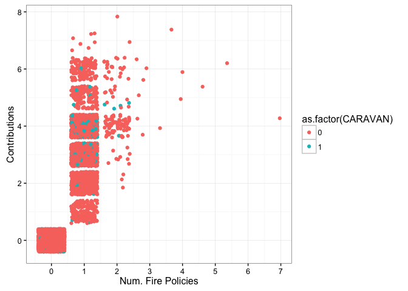

# CapstoneProject
Vivek Appadurai  
February 20, 2016  

## Loading Libraries


```r
library(dplyr)
library(ggplot2)
library(knitr)
library(gridExtra)
library(pROC)
library(leaps)
library(MASS)
library(e1071)
library(mlbench)
library(caret)
library(randomForest)
library(rpart)
library(ROCR)
```

## Reading Data


```r
variableInfo <- read.table("Names.txt", 
                           header = T, 
                           sep = "\t", 
                           fill = NA, 
                           quote = "",
                           stringsAsFactors = FALSE)

ticDataTraining <- read.table("ticdata2000.txt", 
                              header = F, 
                              sep = "\t", 
                              fill = NA, 
                              quote = "", 
                              stringsAsFactors = FALSE)

ticDataTest <- read.table("ticeval2000.txt", 
                          header = F, 
                          sep = "\t", 
                          fill = NA, 
                          quote = "",
                          stringsAsFactors = FALSE)

targets <- read.table("tictgts2000.txt",
                              header = F,
                              stringsAsFactors = FALSE)
```

## Data Cleaning


```r
colNames <- as.vector(variableInfo$Name)
names(ticDataTraining) <- colNames
ticDataTest <- cbind(ticDataTest, targets)
names(ticDataTest) <- colNames

ticDataTraining <- ticDataTraining %>% mutate(totalCaravanPolicies = sum(CARAVAN))
```

## Exploratory Data Analysis

Since the number of caravan policy holders within the training data is very low (348/5822 or apprxomiately 6%), 
its best to explore the assocaitions within the data by looking at the fraction of policy holders at each value 
for the varaibles along with the proportion of population at that particular value


#### Plotting Using Grid Arrange


```r
grid.arrange(plotHomesOwned, plotHouseHoldSize, PlotAvgAge, plotRomanCatholics, plotProtestants, plotOtherReligion,
             plotNoReligion, plotMarried, plotLivingTogether, plotOtherRelation, plotSingles, plotHouseholdNoChild,
             plotHouseholdWithChild, plotHouseholdHighEd, plotHouseholdMidEd, plotHouseholdLowEd, plotHighStatus,
             plotEntrepreneur, plotFarmer, plotMidManagement, plotSkilledLabor, plotUnskilledLabor, plotSocialA,
             plotSocialB1, plotSocialB2, plotSocialC, plotSocialD, plotRentHouse, plotOwnHome, plotOneCar, 
             plotTwoCars, plotNoCar, plotNHS, plotPHS, plotIncome30k, plotIncome30_45k, plotIncome45_75k, 
             plotIncome75k_122k, plotIncome123k, plotAvgIncome, plotPurchasingPower, plotNumThirdPartyIns,
             plotNumThirdPartyInsCont, plotNumThirdPartyInsFirm, plotNumThirdPartyInsFirmCont, plotNumThirdPartyInsAgri,
             plotNumThirdPartyInsAgriCont, plotCarPolicy, plotCarPolicyCont, plotVanPolicy, plotVanPolicyCont,
             plotScooterPolicy, plotScooterPolicyCont, plotLorryPolicy, plotLorryPolicyCont, plotTrailerPolicy,
             plotTrailerPolicyCont, plotTractorPolicy, plotTractorPolicyCont, plotAgriMachinePolicy,
             plotAgriMachinePolicyCont, plotMopedPolicy, plotMopedPolicyCont, plotLifePolicy, plotLifePolicyCont,
             plotPvtAccidentPolicy, plotPvtAccidentPolicyCont, plotFamAccidentPolicy, plotFamAccidentPolicyCont,
             plotDisabilityPolicy, plotDisabilityPolicyCont, plotFirePolicy, plotFirePolicyCont, plotSurfPolicy,
             plotSurfPolicyCont, plotBoatPolicy, plotBoatPolicyCont, plotBicyclePolicy, plotBicyclePolicyCont,
             plotPropertyPolicy, plotPropertyPolicyCont, plotSocialPolicy, plotSocialPolicyCont, ncol = 2)
```

#### Observations:

From the plots the following conditions imply a higher proportion of caravan policy owners than expected:

1. Zipcodes with a less number of low level educated people
2. Zipcodes with very high status people
3. Zipcodes with NO FARMERS
4. Zipcodes with low number of laborers (skilled & unskilled)
5. Zipcodes with low number of people belonging to social classes C & D
6. Zipcodes having a very high number of Home Owners
7. Zipcodes with low or no rented homes
8. Zipcodes having a high car ownership
9. Zipcodes having little to no population with income < 30k
10. Zipcodes with average income households
11. Zipcodes with high purchasing power >= 6
12. Individuals that have a private third party insurance
13. Individuals with high contributions to third party insurance
14. Individuals with one or more car policy
15. Individuals with high contributions to their car policies
16. Individuals with Fire Insurance Policy
17. Individuals making high contributions to fire insurance policies

The above factors are worth further investigation to draw more concrete trends


```r
ggplot(ticDataTraining, aes(x = APERSAUT, y = PPERSAUT, color = as.factor(CARAVAN))) +
    geom_jitter() + 
    xlab("Num. Car Policies") +
    ylab("Contributions") +
    theme_bw() +
    scale_x_continuous(breaks =seq(0, max(ticDataTraining$APERSAUT), 1))
```


The plot indicates that people who have a car policy tend to contribute significantly towards it.


```r
ggplot(ticDataTraining, aes(x = AWAPART, y = PWAPART, color = as.factor(CARAVAN))) +
    geom_jitter() + 
    xlab("Private Third Party Insurance") +
    ylab("Contributions") +
    theme_bw() +
    scale_x_continuous(breaks =seq(0, max(ticDataTraining$AWAPART), 1))
```


```r
ggplot(ticDataTraining, aes(x = ABRAND, y = PBRAND, color = as.factor(CARAVAN))) +
    geom_jitter() + 
    xlab("Num. Fire Policies") +
    ylab("Contributions") +
    theme_bw() +
    scale_x_continuous(breaks =seq(0, max(ticDataTraining$ABRAND), 1))
```



### Automatic Variable Selection, Forward and Backward


```r
ticDataTraining <- ticDataTraining[,1:86]
ticDataTraining$MOSTYPE <- as.factor(ticDataTraining$MOSTYPE)
ticDataTest$MOSTYPE <- as.factor(ticDataTest$MOSTYPE)
ticDataTraining$MOSHOOFD <- as.factor(ticDataTraining$MOSHOOFD)
ticDataTest$MOSHOOFD <- as.factor(ticDataTest$MOSHOOFD)
ticDataTraining$CARAVAN <- as.factor(ticDataTraining$CARAVAN)
ticDataTest$CARAVAN <- as.factor(ticDataTest$CARAVAN)

reg_Backward <- regsubsets(CARAVAN ~., data = ticDataTraining, method = "backward")
```

```
## Warning in leaps.setup(x, y, wt = wt, nbest = nbest, nvmax = nvmax,
## force.in = force.in, : 9 linear dependencies found
```

```
## Reordering variables and trying again:
```

```r
reg_Forward <- regsubsets(CARAVAN ~., data = ticDataTraining, method = "forward")
```

```
## Warning in leaps.setup(x, y, wt = wt, nbest = nbest, nvmax = nvmax,
## force.in = force.in, : 9 linear dependencies found
```

```
## Reordering variables and trying again:
```

### SVM Classifier Using Linear and Radial Kernels


```r
ticData.SVM.Linear <- svm(CARAVAN ~ ., data = ticDataTraining, kernel = "linear", probability = TRUE)
ticData.SVM.Radial <- svm(CARAVAN ~ ., data = ticDataTraining, kernel = "radial", probability = TRUE)
ticData.SVM.Linear.Pred <- predict(ticData.SVM.Linear, newdata = ticDataTest[-86], probability = TRUE)
ticData.SVM.Radial.Pred <- predict(ticData.SVM.Radial, newdata = ticDataTest[-86], probability = TRUE)
```

### Naive Bayes Classifier


```r
ticData.NB <- naiveBayes(data = ticDataTraining, CARAVAN ~ ., laplace = 3)
ticData.NB.pred <- predict(ticData.NB, ticDataTest[-86], type = "raw")
```

### Decision Tree Classifier


```r
ticData.Tree <- rpart(CARAVAN ~ ., data = ticDataTraining, method = "class", 
                      control = rpart.control(minsplit=2, minbucket=1, cp=0.001))
ticData.PrunedTree <- prune(ticData.Tree, 0.0045, control = rpart.control(minsplit=2, minbucket=1))
plot(ticData.PrunedTree, uniform = TRUE, margin = 0.1)
text(ticData.PrunedTree, use.n = T, cex = 0.8)
```


```r
ticDataTraining.PredictTree <- predict(ticData.PrunedTree)
ticDataTest.PredictTree <- predict(ticData.PrunedTree, ticDataTest[-86])
```

### Random Forest Classifier


```r
ticData.RF <- randomForest(CARAVAN ~ ., 
                                   data = ticDataTraining, 
                                   nTree = 100,
                                   importance = TRUE,
                                   proximity = TRUE)

round(importance(ticData.RF),2)
```

```
##              0     1 MeanDecreaseAccuracy MeanDecreaseGini
## MOSTYPE   1.54 -1.41                 1.28            41.73
## MAANTHUI -0.04  1.65                 0.53             2.23
## MGEMOMV   4.93 -1.91                 4.63             5.31
## MGEMLEEF  5.88 -3.23                 4.97             6.46
## MOSHOOFD  8.21  0.82                 8.56            13.16
## MGODRK    2.74  0.41                 2.88             5.80
## MGODPR    6.04 -2.30                 5.62            10.43
## MGODOV    6.86 -1.87                 6.41             7.90
## MGODGE    3.25 -0.70                 3.09            11.10
## MRELGE    9.06 -3.02                 8.41             8.35
## MRELSA    3.51 -2.57                 2.89             5.51
## MRELOV    8.66 -4.83                 7.80             7.56
## MFALLEEN  8.46 -3.37                 8.11             7.62
## MFGEKIND  5.11 -2.06                 4.54             9.84
## MFWEKIND  9.48 -2.65                 8.78            10.88
## MOPLHOOG 11.18 -1.23                11.44             9.73
## MOPLMIDD  6.03 -1.08                 5.89            11.34
## MOPLLAAG  9.37 -1.82                 9.77            10.87
## MBERHOOG  5.71 -0.49                 5.80             9.11
## MBERZELF  5.58 -0.34                 5.55             5.03
## MBERBOER  6.21 -1.71                 5.80             3.83
## MBERMIDD  7.29  0.85                 7.77            11.41
## MBERARBG  8.37 -2.02                 8.29             9.99
## MBERARBO  7.61 -5.18                 6.58             9.46
## MSKA      9.37 -3.46                 9.09             8.84
## MSKB1     5.87 -2.08                 5.37             8.98
## MSKB2     7.64 -2.02                 7.02             9.26
## MSKC      8.24 -3.02                 8.10            10.04
## MSKD      7.98 -2.99                 7.19             6.44
## MHHUUR    6.94 -2.38                 6.67             9.52
## MHKOOP    8.57 -2.31                 8.22             9.70
## MAUT1     7.29 -3.35                 6.77             8.28
## MAUT2     7.11 -2.67                 6.41             7.33
## MAUT0     8.81 -4.07                 8.52             7.56
## MZFONDS   8.21 -4.03                 7.77             8.78
## MZPART    7.88 -5.29                 7.17             8.75
## MINKM30   7.09 -1.91                 6.79             8.99
## MINK3045  7.11 -0.74                 7.09            10.30
## MINK4575  5.43 -2.26                 5.10             9.82
## MINK7512  7.39 -1.10                 7.22             8.01
## MINK123M  3.20 -1.54                 2.72             3.08
## MINKGEM   8.33 -0.20                 8.62             8.55
## MKOOPKLA  8.00  0.96                 8.53            10.21
## PWAPART   4.90  3.46                 5.91            11.42
## PWABEDR   1.02 -2.48                 0.43             1.04
## PWALAND   2.18 -0.45                 2.01             0.34
## PPERSAUT -3.28 16.73                 1.42            17.83
## PBESAUT  -1.62 -3.05                -2.45             0.73
## PMOTSCO  -0.23 -0.80                -0.47             3.63
## PVRAAUT   0.00  0.00                 0.00             0.02
## PAANHANG  2.11 -1.54                 1.80             1.38
## PTRACTOR  0.93 -0.33                 0.80             1.54
## PWERKT    1.00  0.00                 1.00             0.02
## PBROM     9.19 -3.53                 8.41             3.18
## PLEVEN   -1.60  0.10                -1.52             5.01
## PPERSONG  1.01  0.00                 1.01             0.18
## PGEZONG  -1.97  1.50                -1.39             1.86
## PWAOREG  -0.04  2.25                 0.55             1.66
## PBRAND    1.44  7.93                 3.97            19.45
## PZEILPL  -1.74  0.00                -1.74             0.20
## PPLEZIER  6.40 11.32                10.50             5.67
## PFIETS    1.66  0.55                 1.73             3.12
## PINBOED  -0.40 -0.08                -0.40             1.25
## PBYSTAND  0.65  1.45                 1.17             4.07
## AWAPART   1.82  3.12                 2.78             8.30
## AWABEDR  -0.95 -0.21                -1.02             0.96
## AWALAND   0.47  1.00                 0.57             0.27
## APERSAUT -5.88 12.44                -2.53            17.18
## ABESAUT   1.02 -0.49                 0.91             0.74
## AMOTSCO  -1.66 -0.07                -1.61             3.35
## AVRAAUT   0.00  0.00                 0.00             0.01
## AAANHANG  0.34  0.31                 0.39             1.22
## ATRACTOR  1.21  0.90                 1.48             0.86
## AWERKT    0.00  0.00                 0.00             0.02
## ABROM     8.09 -3.06                 7.39             2.37
## ALEVEN   -3.46  2.85                -2.33             6.10
## APERSONG  0.17  0.00                 0.17             0.18
## AGEZONG  -0.49  0.58                -0.18             1.32
## AWAOREG   1.21  2.91                 1.88             1.74
## ABRAND    0.65  0.27                 0.76             8.20
## AZEILPL  -1.00  0.00                -1.00             0.23
## APLEZIER  8.54 13.19                12.68             5.82
## AFIETS    1.11 -0.89                 0.81             4.31
## AINBOED   1.60 -0.94                 1.36             1.18
## ABYSTAND  1.69  2.39                 2.46             3.21
```

```r
ticData.RF.pred <- predict(ticData.RF, newdata = ticDataTest[-86], type = "prob")
```

### Building a Logistic Regression Model Using Variables from forward/backward variable selection


```r
ticDataLogitModel.FB.Var <- glm(data = ticDataTraining, CARAVAN ~ 
                             MRELGE +
                             MOPLLAAG +
                             MBERBOER +
                             MKOOPKLA +
                             PWALAND +
                             PWAPART +
                             PPERSAUT +
                             PBRAND +
                             APLEZIER +
                             ABYSTAND,
                         family = binomial)

summary(ticDataLogitModel.FB.Var)
```

```
## 
## Call:
## glm(formula = CARAVAN ~ MRELGE + MOPLLAAG + MBERBOER + MKOOPKLA + 
##     PWALAND + PWAPART + PPERSAUT + PBRAND + APLEZIER + ABYSTAND, 
##     family = binomial, data = ticDataTraining)
## 
## Deviance Residuals: 
##     Min       1Q   Median       3Q      Max  
## -1.5394  -0.3801  -0.2600  -0.1810   3.1463  
## 
## Coefficients:
##             Estimate Std. Error z value Pr(>|z|)    
## (Intercept) -4.64557    0.32427 -14.326  < 2e-16 ***
## MRELGE       0.11724    0.03409   3.439 0.000584 ***
## MOPLLAAG    -0.10254    0.02893  -3.545 0.000393 ***
## MBERBOER    -0.19961    0.07603  -2.625 0.008655 ** 
## MKOOPKLA     0.06913    0.03390   2.039 0.041434 *  
## PWALAND     -0.34127    0.18259  -1.869 0.061623 .  
## PWAPART      0.11602    0.07226   1.606 0.108340    
## PPERSAUT     0.22713    0.02397   9.475  < 2e-16 ***
## PBRAND       0.14865    0.03831   3.880 0.000105 ***
## APLEZIER     2.04064    0.37439   5.451 5.02e-08 ***
## ABYSTAND     0.53728    0.29867   1.799 0.072033 .  
## ---
## Signif. codes:  0 '***' 0.001 '**' 0.01 '*' 0.05 '.' 0.1 ' ' 1
## 
## (Dispersion parameter for binomial family taken to be 1)
## 
##     Null deviance: 2635.5  on 5821  degrees of freedom
## Residual deviance: 2335.5  on 5811  degrees of freedom
## AIC: 2357.5
## 
## Number of Fisher Scoring iterations: 6
```

```r
anova(ticDataLogitModel.FB.Var, test = "Chisq")
```

```
## Analysis of Deviance Table
## 
## Model: binomial, link: logit
## 
## Response: CARAVAN
## 
## Terms added sequentially (first to last)
## 
## 
##          Df Deviance Resid. Df Resid. Dev  Pr(>Chi)    
## NULL                      5821     2635.5              
## MRELGE    1   30.780      5820     2604.8 2.890e-08 ***
## MOPLLAAG  1   39.989      5819     2564.8 2.554e-10 ***
## MBERBOER  1   13.470      5818     2551.3 0.0002424 ***
## MKOOPKLA  1    7.598      5817     2543.7 0.0058429 ** 
## PWALAND   1    0.997      5816     2542.7 0.3179563    
## PWAPART   1   46.805      5815     2495.9 7.842e-12 ***
## PPERSAUT  1  115.138      5814     2380.8 < 2.2e-16 ***
## PBRAND    1   16.372      5813     2364.4 5.204e-05 ***
## APLEZIER  1   25.977      5812     2338.4 3.454e-07 ***
## ABYSTAND  1    2.936      5811     2335.5 0.0866288 .  
## ---
## Signif. codes:  0 '***' 0.001 '**' 0.01 '*' 0.05 '.' 0.1 ' ' 1
```

```r
ticData.Logit.FB.Pred <- predict(ticDataLogitModel.FB.Var, newdata = ticDataTest[-86], type = "response")
```

### Logit Model 2 Using Variable importance table from Random Forest Classifier


```r
ticDataLogitModel.RF.Var <- glm(data = ticDataTraining, CARAVAN ~ 
                             MOSTYPE +
                             MKOOPKLA +
                             PBRAND +
                             APERSAUT +
                             PWAPART +
                             PPERSAUT,
                         family = binomial)

summary(ticDataLogitModel.RF.Var)
```

```
## 
## Call:
## glm(formula = CARAVAN ~ MOSTYPE + MKOOPKLA + PBRAND + APERSAUT + 
##     PWAPART + PPERSAUT, family = binomial, data = ticDataTraining)
## 
## Deviance Residuals: 
##     Min       1Q   Median       3Q      Max  
## -0.9183  -0.3919  -0.2642  -0.1770   3.1818  
## 
## Coefficients:
##               Estimate Std. Error z value Pr(>|z|)    
## (Intercept)   -3.28789    2.48298  -1.324  0.18545    
## MOSTYPE2      -0.29252    0.80459  -0.364  0.71619    
## MOSTYPE3      -0.14718    0.71219  -0.207  0.83627    
## MOSTYPE4      -1.09918    1.01036  -1.088  0.27663    
## MOSTYPE5      -0.83886    1.70879  -0.491  0.62349    
## MOSTYPE6       0.06964    0.43492   0.160  0.87279    
## MOSTYPE7      -0.54002    0.88981  -0.607  0.54392    
## MOSTYPE8       0.35892    0.44901   0.799  0.42409    
## MOSTYPE9      -0.85158    1.29158  -0.659  0.50968    
## MOSTYPE10     -0.73360    0.46040  -1.593  0.11107    
## MOSTYPE11     -0.79308    0.74884  -1.059  0.28956    
## MOSTYPE12      0.37819    0.50620   0.747  0.45499    
## MOSTYPE13     -0.40194    0.71853  -0.559  0.57589    
## MOSTYPE15    -14.58408 1760.05879  -0.008  0.99339    
## MOSTYPE16    -15.24145  949.21601  -0.016  0.98719    
## MOSTYPE17    -15.57129 1281.65024  -0.012  0.99031    
## MOSTYPE18    -14.98577  879.39062  -0.017  0.98640    
## MOSTYPE19    -15.49185 2250.94446  -0.007  0.99451    
## MOSTYPE20     -0.13385    1.98290  -0.068  0.94618    
## MOSTYPE21    -15.09940 1001.40416  -0.015  0.98797    
## MOSTYPE22     -1.14799    1.91877  -0.598  0.54964    
## MOSTYPE23     -1.98517    1.63275  -1.216  0.22404    
## MOSTYPE24     -1.39614    1.92557  -0.725  0.46842    
## MOSTYPE25     -1.59390    2.26596  -0.703  0.48180    
## MOSTYPE26     -1.45627    2.39568  -0.608  0.54327    
## MOSTYPE27     -1.60755    2.39901  -0.670  0.50280    
## MOSTYPE28    -15.03856  763.95252  -0.020  0.98429    
## MOSTYPE29     -1.68373    1.71811  -0.980  0.32709    
## MOSTYPE30     -1.21062    1.96219  -0.617  0.53725    
## MOSTYPE31     -1.44060    2.20883  -0.652  0.51427    
## MOSTYPE32     -0.73567    2.19665  -0.335  0.73769    
## MOSTYPE33     -0.79068    1.56938  -0.504  0.61439    
## MOSTYPE34     -0.80328    0.76657  -1.048  0.29469    
## MOSTYPE35     -1.01850    1.03422  -0.985  0.32472    
## MOSTYPE36     -0.47862    1.58526  -0.302  0.76271    
## MOSTYPE37     -0.22672    1.27586  -0.178  0.85896    
## MOSTYPE38     -0.49501    1.31942  -0.375  0.70753    
## MOSTYPE39     -0.70893    0.99738  -0.711  0.47721    
## MOSTYPE40    -15.45689  449.28245  -0.034  0.97256    
## MOSTYPE41     -1.67492    1.33799  -1.252  0.21063    
## MKOOPKLA      -0.02319    0.30662  -0.076  0.93972    
## PBRAND         0.10340    0.03706   2.790  0.00527 ** 
## APERSAUT       0.07149    0.17501   0.409  0.68289    
## PWAPART        0.19843    0.07004   2.833  0.00461 ** 
## PPERSAUT       0.21320    0.04147   5.141 2.74e-07 ***
## ---
## Signif. codes:  0 '***' 0.001 '**' 0.01 '*' 0.05 '.' 0.1 ' ' 1
## 
## (Dispersion parameter for binomial family taken to be 1)
## 
##     Null deviance: 2635.5  on 5821  degrees of freedom
## Residual deviance: 2342.9  on 5777  degrees of freedom
## AIC: 2432.9
## 
## Number of Fisher Scoring iterations: 16
```

```r
anova(ticDataLogitModel.RF.Var, test = "Chisq")
```

```
## Analysis of Deviance Table
## 
## Model: binomial, link: logit
## 
## Response: CARAVAN
## 
## Terms added sequentially (first to last)
## 
## 
##          Df Deviance Resid. Df Resid. Dev  Pr(>Chi)    
## NULL                      5821     2635.5              
## MOSTYPE  39  123.169      5782     2512.4 1.168e-10 ***
## MKOOPKLA  1    0.447      5781     2511.9 0.5035663    
## PBRAND    1   38.972      5780     2472.9 4.298e-10 ***
## APERSAUT  1   87.158      5779     2385.8 < 2.2e-16 ***
## PWAPART   1   13.158      5778     2372.6 0.0002863 ***
## PPERSAUT  1   29.782      5777     2342.8 4.834e-08 ***
## ---
## Signif. codes:  0 '***' 0.001 '**' 0.01 '*' 0.05 '.' 0.1 ' ' 1
```

```r
ticData.Logit.RF.Pred <- predict(ticDataLogitModel.RF.Var, newdata = ticDataTest[-86], type = "response")
```

### Comparing the Classifier Models:


```r
c.legend <- c("Decision Tree AUC = ", 
              "Random Forest AUC = ", 
              "Naive Bayes AUC = ",
              "SVM Linear AUC = ",
              "SVM Radial AUC = ",
              "Logit with Fwd/Back Variable Selection AUC = ",
              "Logit with Random Forest Variable Selection AUC = ")

# ROC For Decision Tree

pred <- prediction(ticDataTest.PredictTree[,2], ticDataTest$CARAVAN)
perf <- performance(pred, "tpr", "fpr")
plot(perf, col = "red", lwd = 2)
c.legend[1] <- paste(c.legend[1], round((performance(pred, 'auc')@y.values)[[1]],3))

# ROC For Random Forest

pred <- prediction(ticData.RF.pred[,2], ticDataTest$CARAVAN)
perf <- performance(pred, "tpr", "fpr")
plot(perf, add = TRUE, col = "green", lwd = 2)
c.legend[2] <- paste(c.legend[2], round((performance(pred, 'auc')@y.values)[[1]],3))

#ROC For Naive Bayes

pred <- prediction(ticData.NB.pred[,2], ticDataTest$CARAVAN)
perf <- performance(pred, "tpr", "fpr")
plot(perf, add = TRUE, col = "blue", lwd = 2)
c.legend[3] <- paste(c.legend[3], round((performance(pred, 'auc')@y.values)[[1]],3))

#ROC For SVM Linear Kernel

pred <- prediction(attr(ticData.SVM.Linear.Pred, "probabilities")[,1], ticDataTest$CARAVAN)
perf <- performance(pred, "tpr", "fpr")
plot(perf, add = TRUE, col = "purple", lwd = 2)
c.legend[4] <- paste(c.legend[4], round((performance(pred, 'auc')@y.values)[[1]],3))

#ROC For SVM Radial Kernel

pred <- prediction(attr(ticData.SVM.Radial.Pred, "probabilities")[,2], ticDataTest$CARAVAN)
perf <- performance(pred, "tpr", "fpr")
plot(perf, add = TRUE, col = "black", lwd = 2)
c.legend[5] <- paste(c.legend[5], round((performance(pred, 'auc')@y.values)[[1]],3))

#ROC For Logit with Forward/Backward variable selection

pred <- prediction(ticData.Logit.FB.Pred, ticDataTest$CARAVAN)
perf <- performance(pred, "tpr", "fpr")
plot(perf, add = TRUE, col = "cyan", lwd = 2)
c.legend[6] <- paste(c.legend[6], round((performance(pred, 'auc')@y.values)[[1]],3))

#ROC For Logit with Random Forest variable selection

pred <- prediction(ticData.Logit.RF.Pred, ticDataTest$CARAVAN)
perf <- performance(pred, "tpr", "fpr")
plot(perf, add = TRUE, col = "pink", lwd = 2)
c.legend[7] <- paste(c.legend[7], round((performance(pred, 'auc')@y.values)[[1]],3))

legend("bottomright", 
       c.legend, 
       lty = c(1,1,1,1,1,1,1), 
       lwd = c(2,2,2,2,2,2,2), 
       col = c("red", "green", "blue", "purple", "black", "cyan", "pink"),
       pch=21, cex = 1)
```


