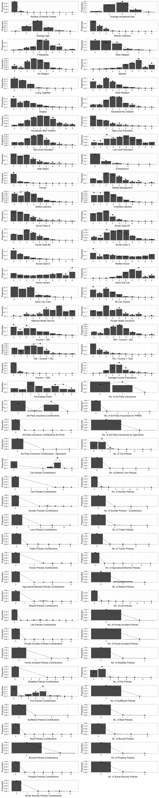
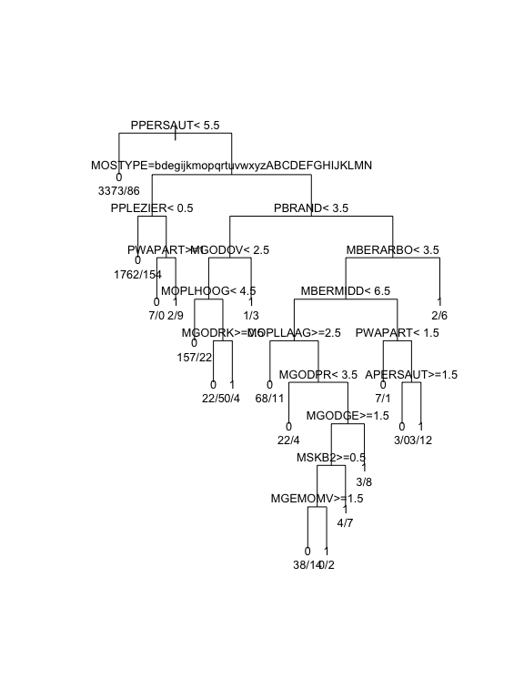
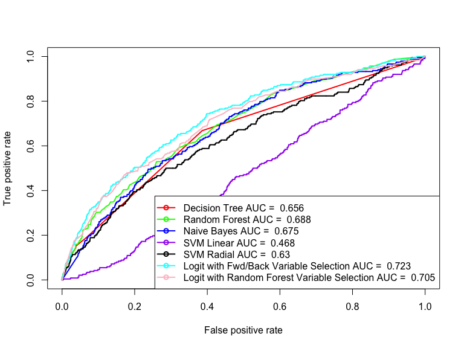

**Employing Classification Models to Predict Potential Customers for a Caravan Insurance Policy**
===================
**SPRINGBOARD.COM | FOUNDATIONS OF DATA SCIENCE**
**CAPSTONE PROJECT by VIVEK APPADURAI**
** <appadurai.vivek@gmail.com>**

1. PROBLEM DEFINITION:
------------------------------------
Direct mailings or advertisement by postal mail has been a valuable and effective technique used by businesses as a relatively inexpensive way to solicit potential customers for a product or service. However a high percentage of the mailings sent by a spray and pray approach tend to be treated as junk mail, thereby wasting the company's resources as well as being environmentally irresponsible unless recycled properly.

If the businesses develop a better understanding of the demographic, ethnic and economic characteristics of their potential customers, the target population can be narrowed down, thereby saving money and reducing waste.

Caravans or Trailers as they are popularly known in the United States are towed by cars and are a popular recreational purchase in the Netherlands, where according to the website [stuffdutchpeoplelike.com][3] people have a fondness for camping in style. The COIL 2000 dataset, owned by the Dutch data mining company,  Sentient Machine Research is based on real world business data containing demographic and socioeconomic factors from 5,822 customers and the challenge is to understand the characteristics of present Caravan Insurance Policy owners and further predict the potential customers from a test set of 4,000.

----------

2. DATA ACQUISITION & DEFINITION:
----------------------------------------------------
The dataset was released as part of the [CoIL 2000 challenge][1] organized by the Computational Intelligence and Learning cluster in 2000 with a view to promoting the application of data mining and computational approaches to real world problems. The dataset has since been released to the [UCI Machine Learning Archive][2] for educational, bench-marking and research purposes.

The dataset is divided into training and test sets, the training set consists of 5,822 customer entries and the test set consists of 4,000 customer entries. The dataset is multivariate, consisting of 86 fields. Columns 1-43 are the demographic characteristics of a customer, including their religion, income, social class, education and employment levels as derived from their residence zip codes. Customers living in the same zip code tend to have the same demographic characteristics. Columns 44-85 consist of the product ownership characteristics of the customers, including information on car, boat, bicycle and surf board ownership, social security, third party health insurance, number of car, boat, fire or recreational insurance policies and the contributions made towards each. Column 86 is the prediction variable, which is binary indicating whether the person owns a caravan insurance policy.

> 1 MOSTYPE Customer Subtype see L0   
> 2 MAANTHUI Number of houses 1 ? 10    
> 3 MGEMOMV Avg size household 1 ? 6     
> 4 MGEMLEEF Avg age see L1    
> 5 MOSHOOFD Customer main type see L2   
> 6 MGODRK Roman catholic see L3    
> 7 MGODPR Protestant ...    
> 8 MGODOV Other religion    
> 9 MGODGE No religion   
> 10 MRELGE Married   
> 11 MRELSA Living together    
> 12 MRELOV Other relation     
> 13 MFALLEEN Singles    
> 14 MFGEKIND Household without children    
> 15 MFWEKIND Household with children     
> 16 MOPLHOOG High level education    
> 17 MOPLMIDD Medium level education    
> 18 MOPLLAAG Lower level education    
> 19 MBERHOOG High status    
> 20 MBERZELF Entrepreneur    
> 21 MBERBOER Farmer    
> 22 MBERMIDD Middle management     
> 23 MBERARBG Skilled labourers    
> 24 MBERARBO Unskilled labourers    
> 25 MSKA Social class A    
> 26 MSKB1 Social class B1    
> 27 MSKB2 Social class B2    
> 28 MSKC Social class C     
> 29 MSKD Social class D    
> 30 MHHUUR Rented house    
> 31 MHKOOP Home owners    
> 32 MAUT1 1 car    
> 33 MAUT2 2 cars    
> 34 MAUT0 No car    
> 35 MZFONDS National Health Service    
> 36 MZPART Private health insurance    
> 37 MINKM30 Income < 30.000    
> 38 MINK3045 Income 30-45.000    
> 39 MINK4575 Income 45-75.000    
> 40 MINK7512 Income 75-122.000     
> 41 MINK123M Income >123.000     
> 42 MINKGEM Average income     
> 43 MKOOPKLA Purchasing power class       
> 44 PWAPART Contribution private third party insurance see L4      
> 45 PWABEDR Contribution third party insurance (firms) ...      
> 46 PWALAND Contribution third party insurane (agriculture)     
> 47 PPERSAUT Contribution car policies     
> 48 PBESAUT Contribution delivery van policies     
> 49 PMOTSCO Contribution motorcycle/scooter policies     
> 50 PVRAAUT Contribution lorry policies      
> 51 PAANHANG Contribution trailer policies     
> 52 PTRACTOR Contribution tractor policies      
> 53 PWERKT Contribution agricultural machines policies     
> 54 PBROM Contribution moped policies     
> 55 PLEVEN Contribution life insurances     
> 56 PPERSONG Contribution private accident insurance policies     
> 57 PGEZONG Contribution family accidents insurance policies     
> 58 PWAOREG Contribution disability insurance policies      
> 59 PBRAND Contribution fire policies     
> 60 PZEILPL Contribution surfboard policies     
> 61 PPLEZIER Contribution boat policies     
> 62 PFIETS Contribution bicycle policies     
> 63 PINBOED Contribution property insurance policies     
> 64 PBYSTAND Contribution social security insurance policies     
> 65 AWAPART Number of private third party insurance 1 - 12     
> 66 AWABEDR Number of third party insurance (firms) ...     
> 67 AWALAND Number of third party insurane (agriculture)     
> 68 APERSAUT Number of car policies     
> 69 ABESAUT Number of delivery van policies     
> 70 AMOTSCO Number of motorcycle/scooter policies     
> 71 AVRAAUT Number of lorry policies      
> 72 AAANHANG Number of trailer policies      
> 73 ATRACTOR Number of tractor policies     
> 74 AWERKT Number of agricultural machines policies     
> 75 ABROM Number of moped policies     
> 76 ALEVEN Number of life insurances     
> 77 APERSONG Number of private accident insurance policies     
> 78 AGEZONG Number of family accidents insurance policies     
> 79 AWAOREG Number of disability insurance policies     
> 80 ABRAND Number of fire policies     
> 81 AZEILPL Number of surfboard policies     
> 82 APLEZIER Number of boat policies      
> 83 AFIETS Number of bicycle policies     
> 84 AINBOED Number of property insurance policies      
> 85 ABYSTAND Number of social security insurance policies     
> 86 CARAVAN Number of mobile home policies 0 - 1     

3. PRELIMINARY DATA CLEANING AND EXPLORATORY ANALYSIS:
-------------------------------------
The data itself was very clean and the only bit of wrangling required was done using a join function from the [dplyr][4] package to intersect the demographic variables customer subtype and main type with their expanded values as shown below for illustration:

> 1 Successful hedonists     
> 2 Driven Growers     
> 3 Average Family     
> 4 Career Loners     
> 5 Living well    
> 6 Cruising Seniors    
> 7 Retired and Religeous     
> 8 Family with grown ups     
> 9 Conservative families     
> 10 Farmers     

A preliminary glance of the data suggests that only 348 (approximately 6%) out of the 5,822  customers in the training set own a caravan insurance policy, suggesting that instead of looking for correlation between the independent variables and the dependent outcome, a better measure of the dataset can be found by checking for the proportion of caravan policy holders at each factor level for each variable. A new variable number indicating the number of caravan policy holders for each factor level within the independent variables was derived and used for generating plots using [dplyr][4] and [gplot2][5], [gridExtra][6] packages in R.

From the preliminary analysis, it can be observed that customers who own cars, have fire insurance and third party insurance policies while making high contributions to each of them is a very good candidate to purchase a caravan insurance policy. It can also be observed that home owners are more likely to purchase caravan insurance policies than customers living in rental homes. Laborers and people of lower social classes are not good potential candidates to market this insurance policy.

4. CREATING PREDICTIVE MODELS:
-----------------------------

Since this is a classification problem, the following modeling algorithms were chosen for the data:

> 1. Logistic Regression with forward/backward variable selection     
> 2. Logistic Regression with Random Forest Classifier variables     
> 3. Decision Trees     
> 4. Naive Bayes Classifier     
> 5. Random Forest     
> 6. Support Vector Machine with Linear and Radial Kernels     

For the logistic regression model, a more intensive variable selection process appeared necessary to go along with and cross validate the intuition that was developed during the preliminary data analysis phase and increase the model's predictive accuracy. For this purpose, a forward and backward variable selection procedure was implemented on the dataset, which confirmed our initial intuition from the exploratory analysis that married customers with a high purchasing power class who make large contributions towards car, third party health and fire insurance policies share a strong inclination towards owning a caravan insurance policy and farmers, people contributing towards third party insurance for agricultural equipment and the lower level educated populace are the type of customers to avoid for this marketing campaign.

Along with these intuitive variables, the variable selection method also indicated that customers who contribute strongly towards social security and boat insurance policies have a higher chance of being interested in purchasing caravan insurance policies which makes sense as customers that have the time and purchasing capability for leisurely activities are prone to purchasing and insuring their recreational vehicles.

The decision tree classifier also supports our initial intuition that contribution towards car insurance policy has the highest predictive power amongst our variables towards predicting whether the customer owns a caravan insurance policy followed by contributions towards boat and fire insurance policies.

The Random Forest model indicates a higher predictive power towards contributions to fire policies, followed by contributions to car insurance policies and more importantly the number of car insurance policies, which makes sense considering that someone who owns multiple car policies and makes the bare minimum contributions to all of the might not necessarily have the same spending capabilities or disposable income to spend on leisurely activities as someone who owns a single car and makes a large contribution towards insuring it.

> Variable     0     1 MeanDecreaseAccuracy MeanDecreaseGini     
> PBRAND    2.46  8.58                 4.86            19.61     
> PPERSAUT -3.23 17.77                 2.43            18.45     
> APERSAUT -4.22 11.56                -0.92            16.53     
> MKOOPKLA  6.02  2.00                 6.79            10.21     
> PWAPART   3.49  2.17                 4.14            11.29     

5. MODEL PERFORMANCE COMPARISON:
-------------------------------

Each of the six models were fitted to the training set and further applied on the test set of data from 4,000 customers. ROC curves were generated for each of the models with the area under curve values calculated and utilized towards annotating the figure legends.

A performance comparison of the models indicates that the logistic regression model with forward and backward variable selection has the best predictive performance for this data (AUC = 0.723), followed by the logistic regression model with variables chosen from the random forest classifier (AUC = 0.705). The Decision Tree, Naive Bayes and Random Forest Classifiers show a relatively similar performance while the Support Vector Machines fare the worst in terms of AUC from the ROC curves.

We choose to employ the logistic regression model with the forward and backward variable selection to the data at task and adjusting the threshold probability for a 15% false positive rate, we can accurately predict 104/238 (approximately 44%) of the caravan policy buyers correctly in the test set.

>>    FALSE TRUE     
>>   0  3202  560      
>>   1   134  104     

6. CONCLUSION:
-------------

We used exploratory data analysis, automated variable selection and data modeling approaches to select 664 potential customers out of 4,000 for a direct mailer promotion advertising a caravan insurance policy. We compared different classification techniques and chose the logistic regression model coupled with forward and backward variable selection as the best performing model for this dataset.

As a result of our analysis, we advise the marketing team to concentrate on individuals that are married, home owners who also own a car, fire, boat or third party health insurance policies and contribute heavily towards them as potential customers. Individuals that own a single car policy and contribute heavily towards insuring it are more likely to buy the caravan insurance policy than individuals with multiple polices who make small contributions towards each one. We suggest the marketing team to ignore farmers and those who insure farming equipment, people from a low level education demographic and single people or those living in rental homes.

[1]: http://liacs.leidenuniv.nl/~puttenpwhvander/library/cc2000/report2.html     
[2]: https://archive.ics.uci.edu/ml/datasets/Insurance+Company+Benchmark+(COIL+2000)     
[3]: http://stuffdutchpeoplelike.com/2011/07/02/camping-caravan-vacations/     
[4]: https://cran.r-project.org/web/packages/dplyr/index.html     
[5]: http://ggplot2.org     
[6]: https://cran.r-project.org/web/packages/gridExtra/gridExtra.pdf     
