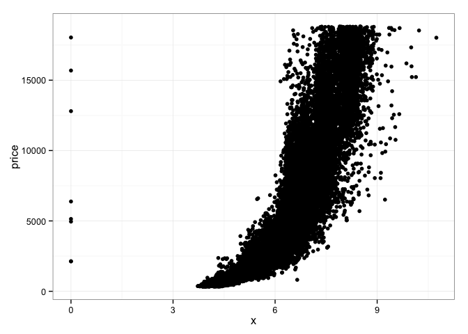
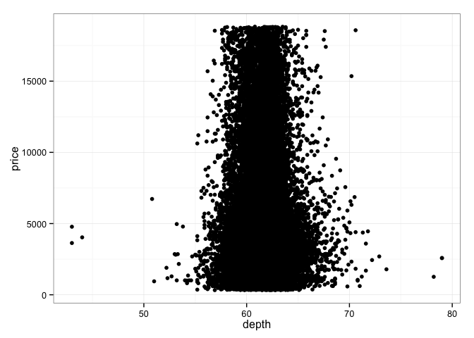
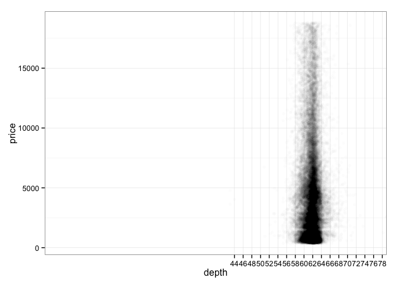
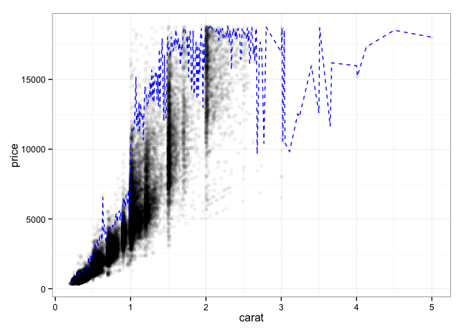
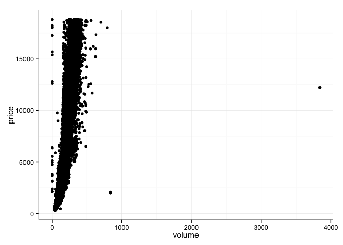
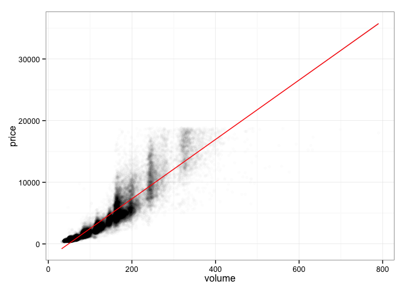
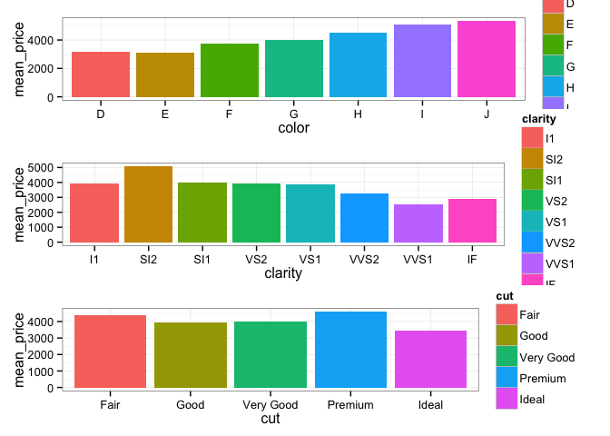
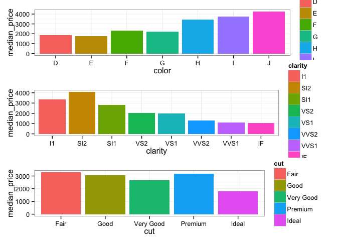

# EDA Two Variable Exercise
Vivek Appadurai  
February 17, 2016  

# R Markdown Document to Explore Diamonds Dataset with two variables

### Using dplyr and ggplot2 packages for data maniulation and plotting

Using the Diamonds Dataset


```r
library(dplyr)
library(ggplot2)
library(gridExtra)
data(diamonds)
```

### Scatter plot of price vs X


```r
ggplot(diamonds, aes(x = x, y = price)) + 
    geom_point() + 
    theme_bw()
```



Observatations:

1. Few outliers at x = 0
2. There appears to be an exponential increase in diamond price with value of x

### Calculating correlation coeffiecients for x, y and z with price indicates high positive correlations


```r
cor(diamonds$x, diamonds$price)
```

```
## [1] 0.8844352
```

```r
cor(diamonds$y, diamonds$price)
```

```
## [1] 0.8654209
```

```r
cor(diamonds$z, diamonds$price)
```

```
## [1] 0.8612494
```

### Scatter Plot of price vs depth


```r
ggplot(diamonds, aes(x = depth, y = price)) + 
    geom_point() + 
    theme_bw()
```



```r
ggplot(data = diamonds, aes(x = depth, y = price)) + 
    geom_point(alpha = 1/100) + 
    scale_x_discrete(breaks = seq(0,max(diamonds$depth), 2)) + theme_bw()
```



Depth appears to range between 58 and 64

### Low, negative correlation between depth and price suggesting lack of an insightful relationship


```r
cor(diamonds$depth, diamonds$price)
```

```
## [1] -0.0106474
```

### Scatter plot of price vs Carat, limited to the 99th percentile of both variables


```r
ggplot(diamonds, aes(x = carat, y = price)) + 
    geom_point(alpha = 1/20) + 
    theme_bw() + 
    geom_line(stat = "summary", fun.x = quantile, prob = 0.99, fun.y = quantile, prob = 0.99, linetype = 2, color = "blue")
```



### Creating a colume variable in diamonds using dplyr mutate
### Scatter plot of price vs Volume
### Calculating correlation between price and volume


```r
diamonds <- diamonds %>% 
    mutate(volume = x*y*z)

ggplot(diamonds, aes(x = volume, y = price)) + 
    geom_point() + 
    theme_bw()
```



```r
cor(diamonds$price, diamonds$volume)
```

```
## [1] 0.9023845
```

Observations:

1. Price appears to rise exponentially with volume
2. One very expensive diamond at a volume of 4000
3. Couple of cheap diamonds at around a volume of 900
4. Some diamonds have a zero volume
5. High positive correlation between price and volume

### Excluding the outliers and plotting price vs volume with the line of best fit indicating good correlation


```r
ggplot(subset(diamonds, volume > 0 & volume < 800), aes(x = volume, y = price)) + 
    geom_point(alpha = 1/100) + 
    theme_bw() + 
    geom_smooth(method = 'lm', color = "red")
```



### New dataframe to explore clarity and price


```r
diamondsByClarity <- diamonds %>% 
    arrange(clarity) %>% 
    group_by(clarity) %>% 
    summarise(mean_price = mean(price), median_price = median(price), min_price = min(price), max_price = max(price), n = n()) %>%
    arrange(clarity)
```

### Exploring prices by cut, clarity and color


```r
diamonds_by_clarity <- group_by(diamonds, clarity)
diamonds_mp_by_clarity <- summarise(diamonds_by_clarity, mean_price = mean(price), median_price = median(price))

diamonds_by_color <- group_by(diamonds, color)
diamonds_mp_by_color <- summarise(diamonds_by_color, mean_price = mean(price), median_price = median(price))

diamonds_by_cut <- group_by(diamonds, cut)
diamonds_mp_by_cut <- summarise(diamonds_by_cut, mean_price = mean(price), median_price = median(price))

color <- ggplot(diamonds_mp_by_color, aes(x = color, y = mean_price, fill = color)) + 
    geom_bar(stat = "identity") + 
    theme_bw()

clarity <- ggplot(diamonds_mp_by_clarity, aes(x = clarity, y = mean_price, fill = clarity)) + 
    geom_bar(stat = "identity") + 
    theme_bw()

cut <- ggplot(diamonds_mp_by_cut, aes(x = cut, y = mean_price, fill = cut)) + 
    geom_bar(stat = "identity") + 
    theme_bw()

grid.arrange(color, clarity, cut, ncol = 1)
```



Observations:

1. Mean price does not follow the trend of incremeants in desirability of cut, color or clarity

### Exploring the median prices instead


```r
color <- ggplot(diamonds_mp_by_color, aes(x = color, y = median_price, fill = color)) + 
    geom_bar(stat = "identity") + 
    theme_bw()

clarity <- ggplot(diamonds_mp_by_clarity, aes(x = clarity, y = median_price, fill = clarity)) + 
    geom_bar(stat = "identity") + 
    theme_bw()

cut <- ggplot(diamonds_mp_by_cut, aes(x = cut, y = median_price, fill = cut)) + 
    geom_bar(stat = "identity") + 
    theme_bw()

grid.arrange(color, clarity, cut, ncol = 1)
```



