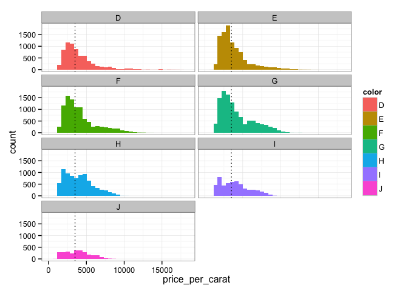

# EDA Single Variable Exercise
Vivek Appadurai  
February 17, 2016  

# R Markdown Document to Explore Price Per Carat of Diamonds Across Different Colors

### Using dplyr and ggplot2 packages for data maniulation and plotting

Using the Diamonds Dataset


```r
library(dplyr)
library(ggplot2)
data(diamonds)
```

### Glimpse of the diamonds dataset


```r
glimpse(diamonds)
```

```
## Observations: 53,940
## Variables: 10
## $ carat   (dbl) 0.23, 0.21, 0.23, 0.29, 0.31, 0.24, 0.24, 0.26, 0.22, ...
## $ cut     (fctr) Ideal, Premium, Good, Premium, Good, Very Good, Very ...
## $ color   (fctr) E, E, E, I, J, J, I, H, E, H, J, J, F, J, E, E, I, J,...
## $ clarity (fctr) SI2, SI1, VS1, VS2, SI2, VVS2, VVS1, SI1, VS2, VS1, S...
## $ depth   (dbl) 61.5, 59.8, 56.9, 62.4, 63.3, 62.8, 62.3, 61.9, 65.1, ...
## $ table   (dbl) 55, 61, 65, 58, 58, 57, 57, 55, 61, 61, 55, 56, 61, 54...
## $ price   (int) 326, 326, 327, 334, 335, 336, 336, 337, 337, 338, 339,...
## $ x       (dbl) 3.95, 3.89, 4.05, 4.20, 4.34, 3.94, 3.95, 4.07, 3.87, ...
## $ y       (dbl) 3.98, 3.84, 4.07, 4.23, 4.35, 3.96, 3.98, 4.11, 3.78, ...
## $ z       (dbl) 2.43, 2.31, 2.31, 2.63, 2.75, 2.48, 2.47, 2.53, 2.49, ...
```

### Checking for the number of distinct colors

Color G is most common 

Color J is least common


```r
diamonds %>%
    group_by(color) %>%
    summarize(count = n())
```

```
## Source: local data frame [7 x 2]
## 
##    color count
##   (fctr) (int)
## 1      D  6775
## 2      E  9797
## 3      F  9542
## 4      G 11292
## 5      H  8304
## 6      I  5422
## 7      J  2808
```

### Create an additional column in the diamonds dataset by calculating price per carat using dplyr mutate


```r
diamonds <- diamonds %>% 
    mutate(price_per_carat = price/carat)
```

### Generating a Boxplot to explore relationship between color and price per carat of diamonds

Color H appears to have the highest median price/carat

Colors D, E, F appear to have most outliers

Color G has the largest interquartile range



```
## Saving 7 x 5 in image
```

### Creating text summaries of price per carat based on color


```r
by(diamonds$price_per_carat, diamonds$color, summary)
```

```
## diamonds$color: D
##    Min. 1st Qu.  Median    Mean 3rd Qu.    Max. 
##    1128    2455    3411    3953    4749   17830 
## -------------------------------------------------------- 
## diamonds$color: E
##    Min. 1st Qu.  Median    Mean 3rd Qu.    Max. 
##    1078    2430    3254    3805    4508   14610 
## -------------------------------------------------------- 
## diamonds$color: F
##    Min. 1st Qu.  Median    Mean 3rd Qu.    Max. 
##    1168    2587    3494    4135    4947   13860 
## -------------------------------------------------------- 
## diamonds$color: G
##    Min. 1st Qu.  Median    Mean 3rd Qu.    Max. 
##    1139    2538    3490    4163    5500   12460 
## -------------------------------------------------------- 
## diamonds$color: H
##    Min. 1st Qu.  Median    Mean 3rd Qu.    Max. 
##    1051    2397    3819    4008    5127   10190 
## -------------------------------------------------------- 
## diamonds$color: I
##    Min. 1st Qu.  Median    Mean 3rd Qu.    Max. 
##    1152    2345    3780    3996    5197    9398 
## -------------------------------------------------------- 
## diamonds$color: J
##    Min. 1st Qu.  Median    Mean 3rd Qu.    Max. 
##    1081    2563    3780    3826    4928    8647
```
