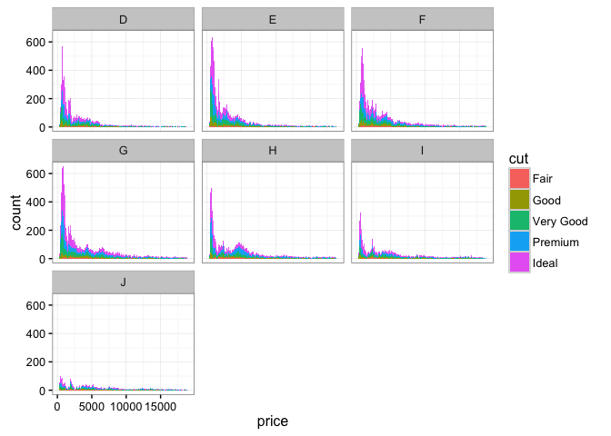
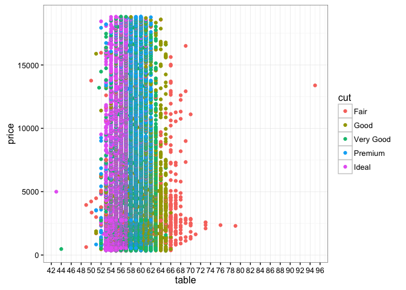
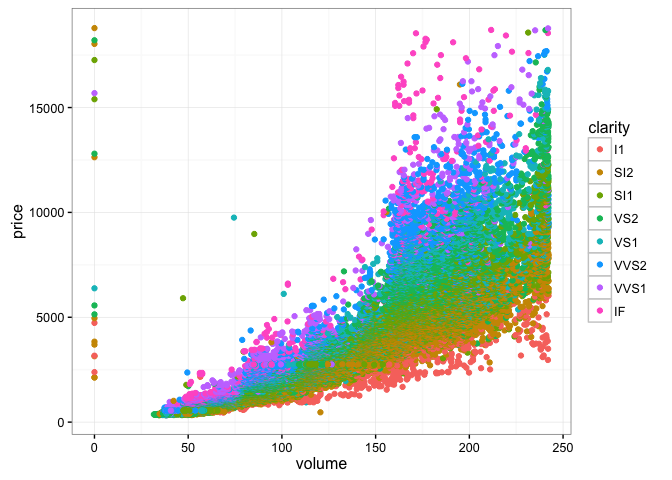
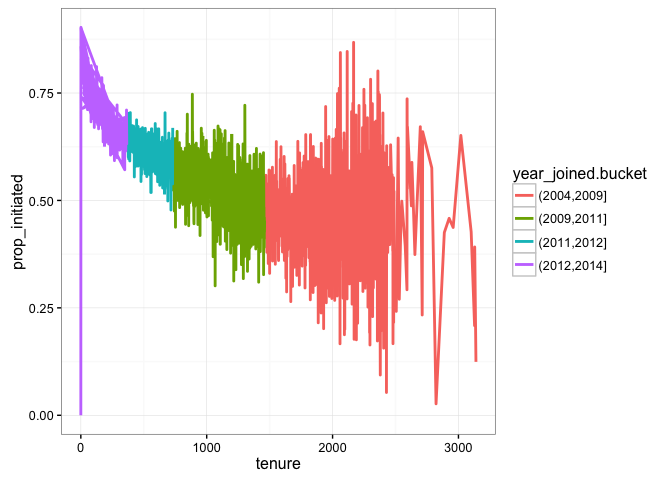
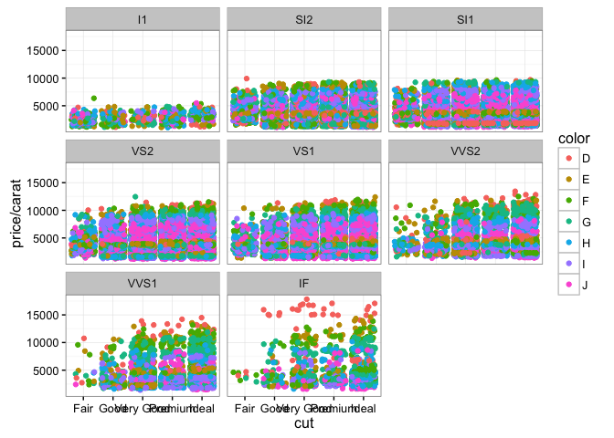

# EDA Multiple Variabel Exercise
Vivek Appadurai  
February 21, 2016  

### Loading Libraries


```r
library(ggplot2)
library(dplyr)
data(diamonds)
```

### Plotting histogram of diamond prices, faceted by color, filled by cut


```r
ggplot(diamonds, aes(x = price, fill = cut)) + 
    geom_histogram(binwidth = 100) + 
    facet_wrap(~ color) + 
    theme_bw()
```



### Plotting price vs table, fill by cut


```r
ggplot(diamonds, aes(x = table, y = price, color = cut)) + 
    geom_point() + 
    scale_x_continuous(breaks = seq(0, 100, 2)) +
    theme_bw()
```



### Creating a Volume Column, plotting price vs volume, colored by clarity, omitting top 1 percentile volume diamonds


```r
diamonds <- diamonds %>%
    mutate(volume = x * y * z)

ggplot(diamonds, aes(x = volume, y = price, color = clarity)) + 
    geom_point() + 
    scale_x_continuous(limits = quantile(diamonds$volume, c(0,0.9))) +
    theme_bw()
```



Creating a new variable prop_initiated in pseudo facebook dataframe using dplyr, mutate and ifelse statement


```r
pf <- read.delim('pseudo_facebook.tsv')
pf <- pf %>% 
    mutate(prop_initiated = ifelse(friend_count > 0, friendships_initiated / (friend_count), 0))
pf %>% head()
```

```
##    userid age dob_day dob_year dob_month gender tenure friend_count
## 1 2094382  14      19     1999        11   male    266            0
## 2 1192601  14       2     1999        11 female      6            0
## 3 2083884  14      16     1999        11   male     13            0
## 4 1203168  14      25     1999        12 female     93            0
## 5 1733186  14       4     1999        12   male     82            0
## 6 1524765  14       1     1999        12   male     15            0
##   friendships_initiated likes likes_received mobile_likes
## 1                     0     0              0            0
## 2                     0     0              0            0
## 3                     0     0              0            0
## 4                     0     0              0            0
## 5                     0     0              0            0
## 6                     0     0              0            0
##   mobile_likes_received www_likes www_likes_received prop_initiated
## 1                     0         0                  0              0
## 2                     0         0                  0              0
## 3                     0         0                  0              0
## 4                     0         0                  0              0
## 5                     0         0                  0              0
## 6                     0         0                  0              0
```

Creating a new year joined variable in pseudo facebook data, binning the data by years and plotting tenure vs proportion of friendships initiated, colored by year joined bin and smoothing


```r
pf <- pf %>% mutate(year_joined = floor(2014 - tenure/365))

pf$year_joined.bucket <- cut(pf$year_joined, breaks = c(2004, 2009, 2011, 2012, 2014))

ggplot(pf, aes(x = tenure, y = prop_initiated, color = year_joined.bucket)) +
    geom_smooth(stat = 'summary', fun.y = 'median') +
    theme_bw()
```

```
## Warning: Removed 2 rows containing non-finite values (stat_summary).
```



```r
pf %>% group_by(year_joined.bucket) %>%
    summarise(mean = mean(prop_initiated))
```

```
## Source: local data frame [5 x 2]
## 
##   year_joined.bucket      mean
##               (fctr)     (dbl)
## 1        (2004,2009] 0.4664651
## 2        (2009,2011] 0.5273247
## 3        (2011,2012] 0.5911398
## 4        (2012,2014] 0.6430155
## 5                 NA 0.6168644
```

Plotting cut vs price to carat ratio of diamonds, colored by diamond color, faceted by clarity, rotating axis labels for better visualization


```r
ggplot(diamonds, aes(x = cut, y = price/carat, color = color)) +
    geom_jitter() +
    facet_wrap(~ clarity) +
    theme(axis.text.x = element_text(angle = 90)) +
    theme_bw()
```


